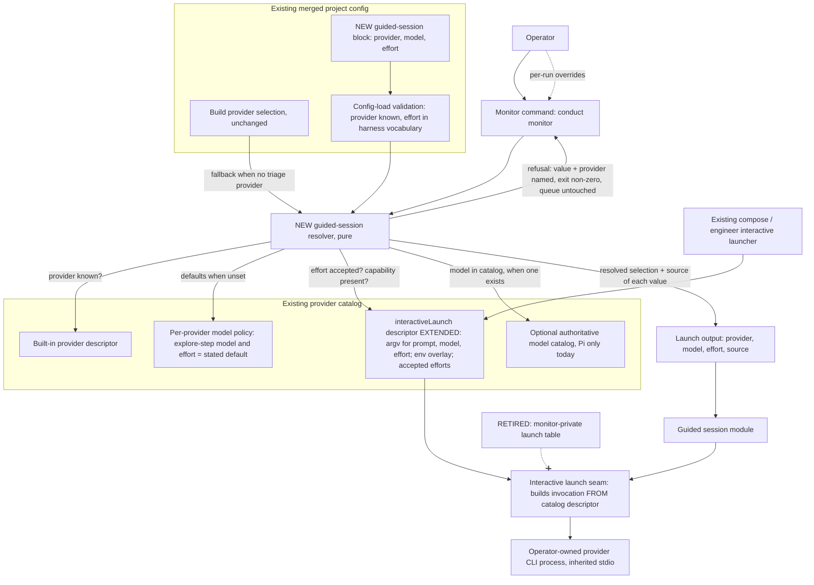
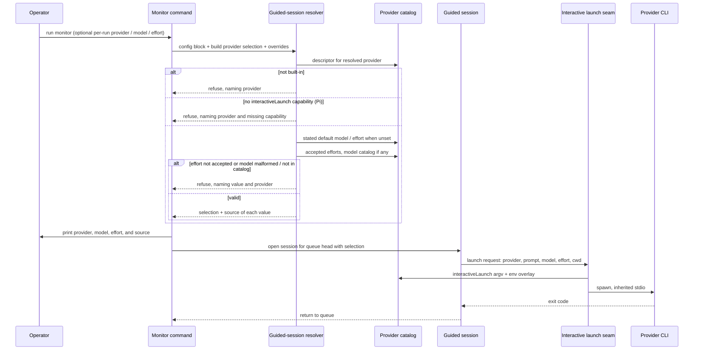

# Components: Monitor guided sessions — choose provider, model, and effort

**Last updated:** 2026-10-06
**Scope:** Proposed change for jstoup111/ai-conductor#2985; Medium tier. Adds guided-session
provider/model/effort selection to the existing foreground monitor command, and collapses the
monitor's private interactive launch table into the provider catalog's existing interactive-launch
descriptor, which compose/engineer already use. No new service, process, persistence, or spine
channel. Build provider/model/effort resolution is untouched.

## Diagram — components

## Diagram — guided launch sequence

## Legend

- **NEW**: introduced by this change. **EXTENDED**: an existing element that gains fields.
  **RETIRED**: removed by this change.
- The resolver applies the precedence per-run override > guided-session config > build provider
  selection + harness-stated default. A per-run provider override without model/effort overrides
  resets model and effort to that provider's defaults (PRD FR-6).
- Every refusal happens before any process is spawned, and leaves the monitor queue and halt state
  unchanged.
- The interactive launch seam continues to bypass the non-interactive build adapters, so a guided
  session never carries the daemon-session marker.

## Change Log

| Date | Change | Reason |
|------|--------|--------|
| 2026-10-06 | Initial generation | DECIDE for #2985 (approach B: catalog-owned interactive model/effort) |
| 2026-10-06 | Plan update: resolver is `engine/monitor/selection.ts`; config block is top-level `monitor`; seam lives in `execution/interactive-launch.ts` | Plan monitor-guided-sessions-no-way-to-choose-provider- |
