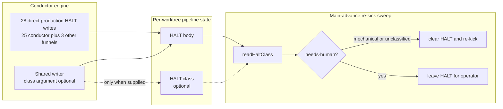
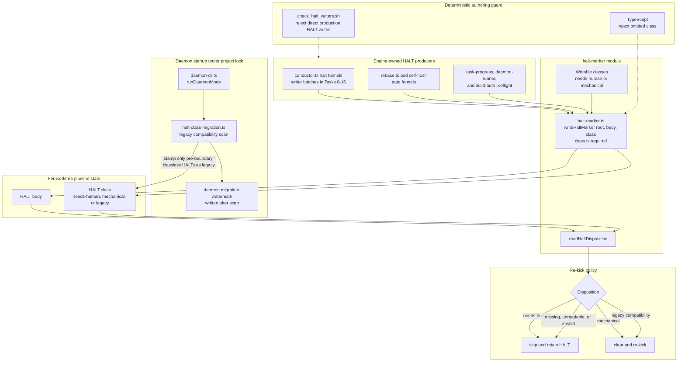
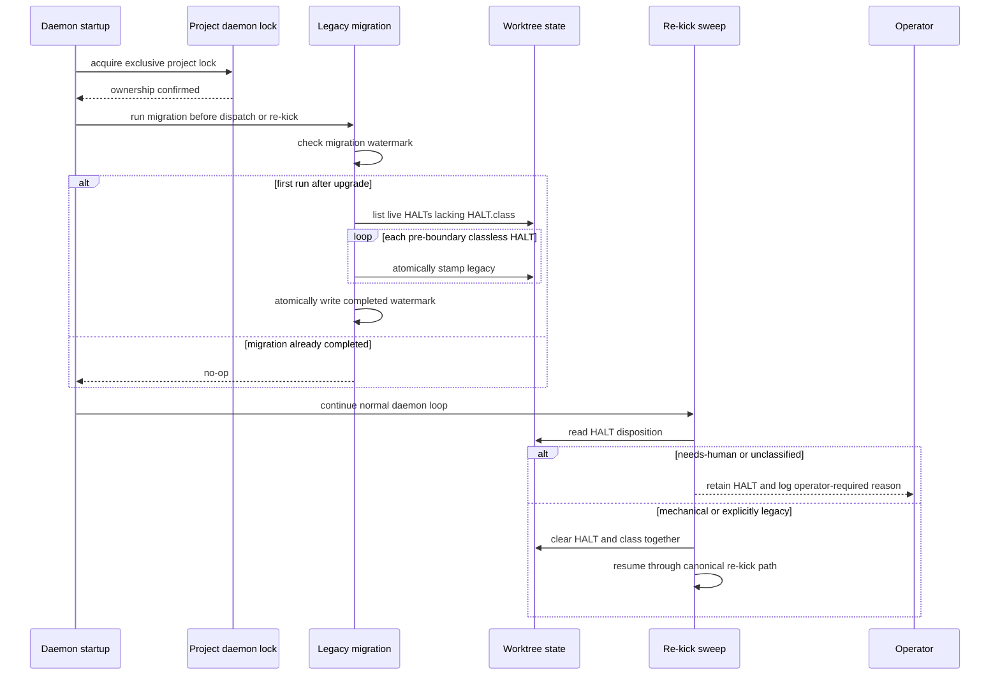

# Architecture: Total HALT classification with an explicit legacy boundary

**Last updated:** 2026-07-28
**Scope:** Conductor HALT writers, daemon startup compatibility migration, and re-kick classification policy for #1077.

## Current state

The unsafe seam is absence-as-compatibility: a bypassed writer, a failed class write, and a genuine pre-classification legacy marker all read as `unclassified`, so the sweep cannot distinguish corruption from history and re-kicks all three.

## Target component view

`legacy` is a read disposition and migration stamp, not a class new halt writers may select. New writers are restricted to `needs-human` or `mechanical`, so compatibility cannot become a permanent escape hatch.

## Startup and re-kick sequence

## Structural decisions represented

- The compatibility boundary is a one-time daemon migration under the already-held project lock. It stamps only HALTs that existed before the new writer contract and records completion durably before normal work begins.
- Migration is idempotent. A crash before the completion watermark causes the next exclusively locked startup to repeat the scan; no dispatch can create a new HALT between scan and watermark.
- A per-worktree stamp uses `legacy` explicitly. Absence never means legacy after migration.
- Failed legacy stamping is logged and remains fail-closed as `unclassified`; compatibility is best-effort, safety is not.
- The shared writer requires a class, while a static integrity check rejects direct production writes to `HALT`. These two mechanical gates enforce totality at the point of authoring.
- The two-file write cannot be fully atomic. Writing the HALT body without a readable class therefore degrades to operator-required, never automatic re-kick; a stale class must be cleared before a new body is written and when a HALT is cleared.

## Legend

- Solid arrows are runtime calls or persisted writes.
- Dashed arrows are build-time enforcement.
- `legacy` preserves only the pre-upgrade behavior of already-existing classless HALTs.

## Change Log

| Date | Change | Reason |
| --- | --- | --- |
| 2026-07-28 | Initial feature architecture | DECIDE for jstoup111/ai-conductor#1077 |
| 2026-07-28 | Added plan-level modules, writer batches, and integrity guard | Plan-update mode after the 17-task implementation plan |
