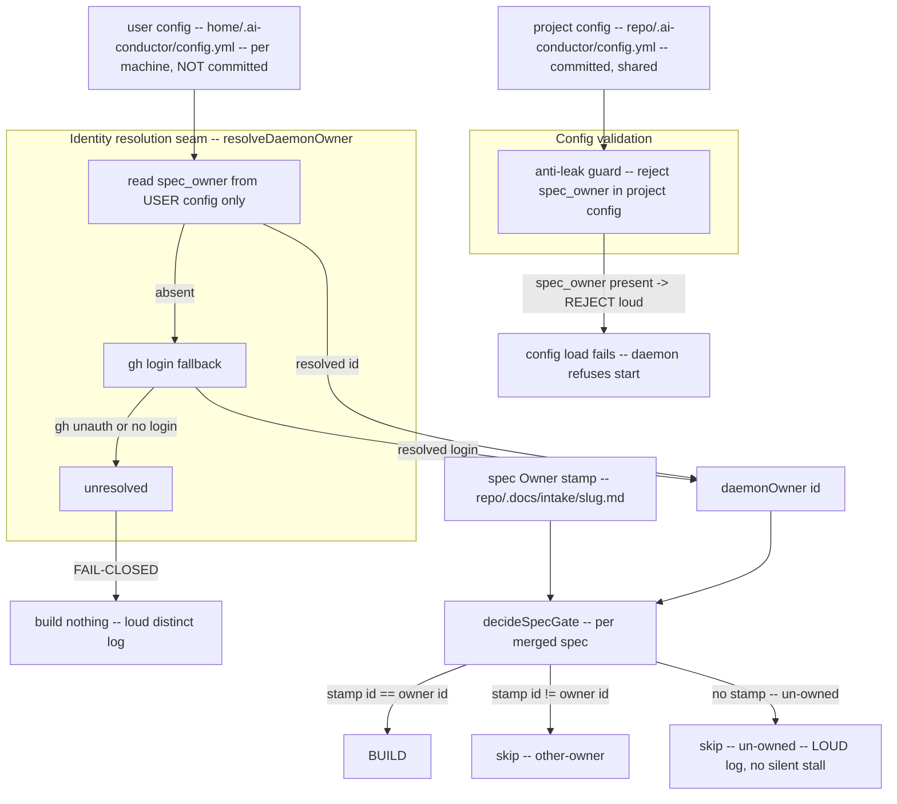
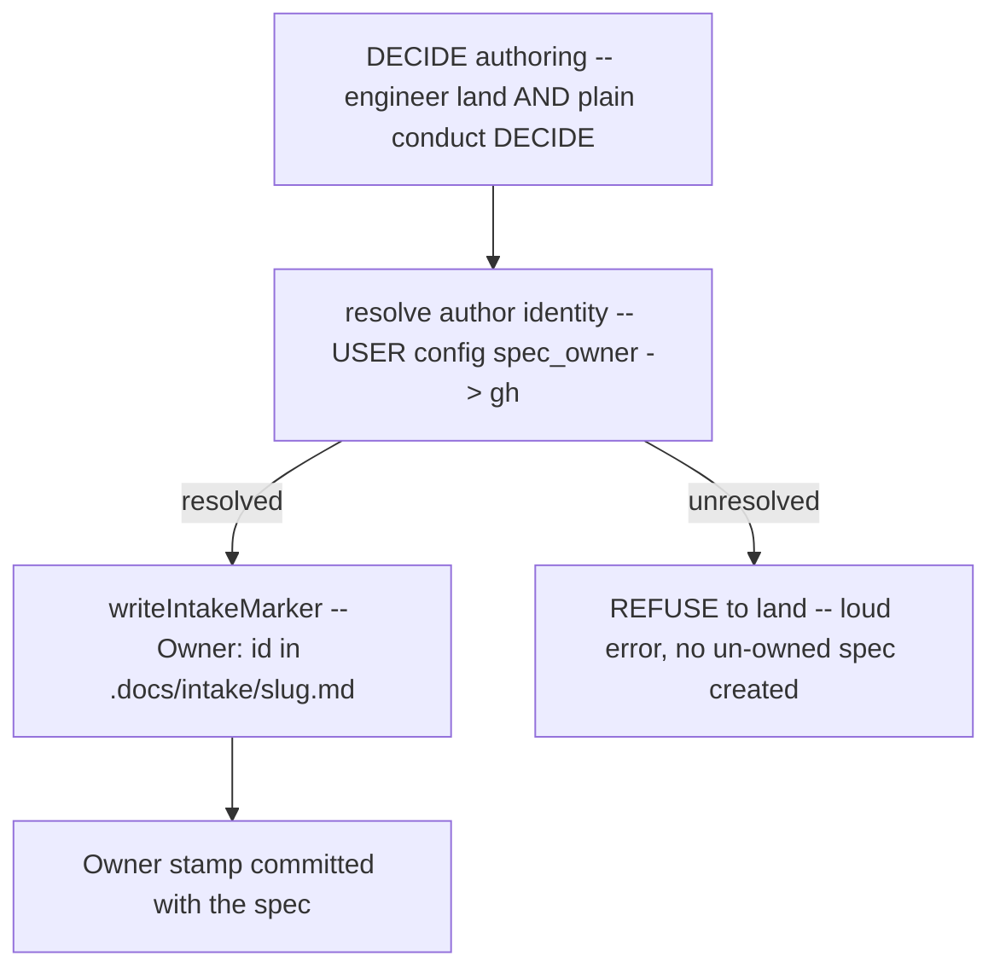

# Architecture: Multi-operator ownership hardening

Component view of operator-identity resolution after the hardening. The key structural
change: `spec_owner` is read only from **user** (machine) config, never from project
(repo) config, and unresolved identity is **fail-closed**.

## Identity resolution + gating flow

## Authoring (write) side

## Structural invariants

1. **Identity is machine-sourced.** `spec_owner` is read only from user config; the
   project-over-user merge is never consulted for it. Leak is impossible by construction.
2. **Anti-leak guard is fail-closed.** A `spec_owner` in a committed project config is a
   hard config-load rejection, not a warning.
3. **Unresolved identity is fail-closed** on both sides: the daemon builds nothing and
   logs loudly; authoring refuses to create an un-owned spec.
4. **Un-owned merged specs are surfaced loudly**, never silently skipped.
5. **Seam preserved.** All identity resolution stays behind `resolveDaemonOwner`, so a
   future `PlatformIdentity` (EKS/OIDC) resolver slots in ahead of the user-config read
   without touching the gate.
