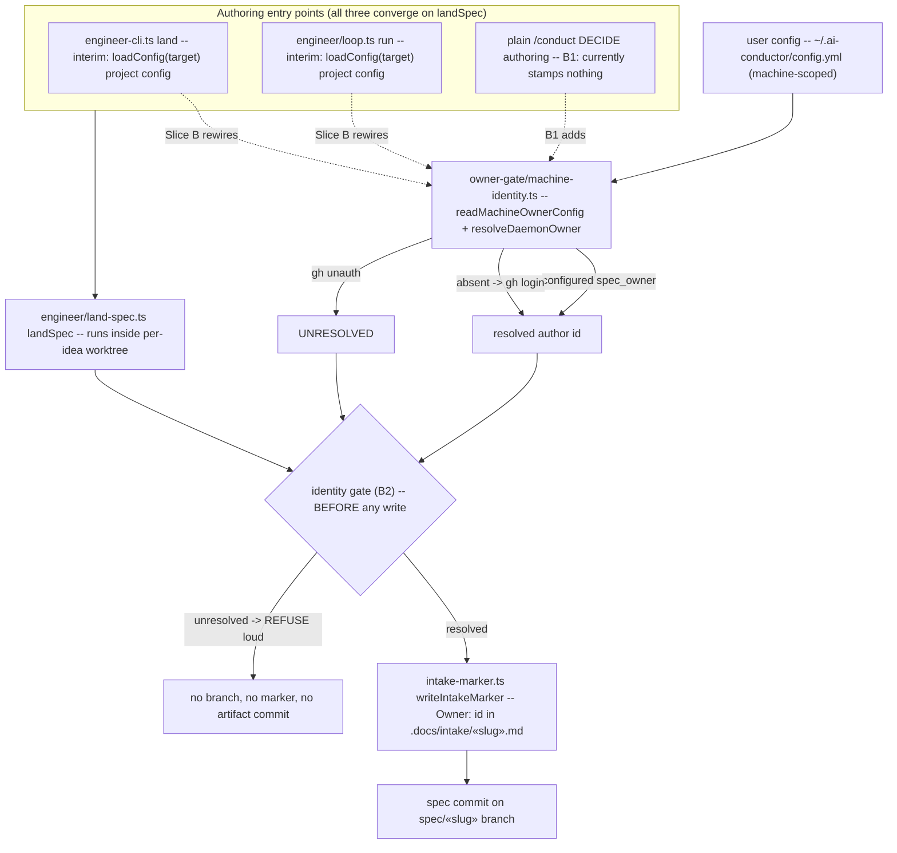

# Architecture: Multi-operator ownership — Slice B (authoring-side)

**Last updated:** 2026-07-02
**Scope:** Component view of the authoring-side identity flow after Slice B, anchored to
the post-#185 (worktree-isolation) module layout. Companion sequence:
`sequences/slice-b-fail-closed-land.md`. Parent end-state view:
`multi-operator-ownership-hardening.md` (PR #183).

## Diagram

## Legend

- Solid arrows: data/control flow after Slice B.
- Dashed arrows: the rewiring Slice B performs (replacing the interim
  `loadConfig(target)` project-config read that swallows the D2 guard failure to `{}`).
- The identity gate sits **ahead of every write** in `landSpec` — fail-closed means
  refusal happens before branch creation, marker write, or artifact commit.
- `machine-identity.ts` is the only identity source; the project config is never
  consulted for `spec_owner` (anti-leak, D2 — enforced by `validateConfig` since
  Slice A).

## Change Log

| Date | Change | Reason |
|------|--------|--------|
| 2026-07-02 | Initial generation | Slice B spec (issue #184), post-#185 anchoring |
