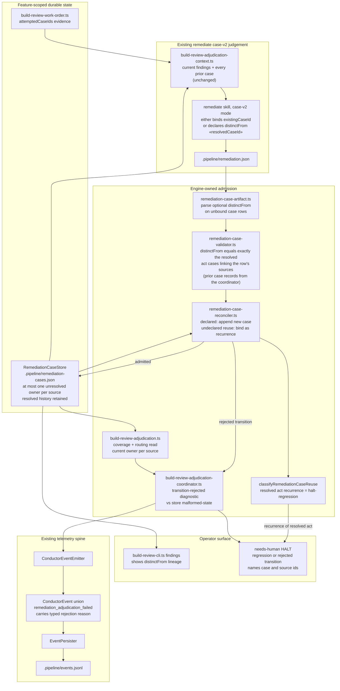

# Components: lifecycle-scoped source ownership for a new concern at a resolved anchor

**Last updated:** 2026-10-02
**Scope:** Proposed component boundaries for jstoup111/ai-conductor#2464: a case-v2 judgement may
open a new case at a source id already linked from a resolved case, but only by an explicit,
schema-constrained `distinctFrom` declaration naming that resolved case. An undeclared reuse is a
recurrence bound to the prior case and keeps the existing regression halt. The store's ownership
invariant becomes "at most one unresolved owner per source", every source→case reader selects the
current owner, and a rejected proposed transition is reported with its own typed reason instead of
`malformed-state`. Nothing new is added outside these seams.

## Diagram

## Legend

- **Judge** — the existing semantic judgement; it owns the "same concern or new concern?" call.
- **Admit** — deterministic engine admission; it validates the declaration's references but never
  compares rationale prose.
- **State** — feature-scoped durable files; history is never deleted or rewritten.
- `«resolvedCaseId»` — placeholder for a resolved case id from the prior-case context.

## Change Log

| Date | Change | Reason |
|------|--------|--------|
| 2026-10-02 | Initial generation | jstoup111/ai-conductor#2464 DECIDE |
| 2026-10-02 | Plan update: context unchanged; validator receives prior case records | Plan Tasks 4 and 10 |
