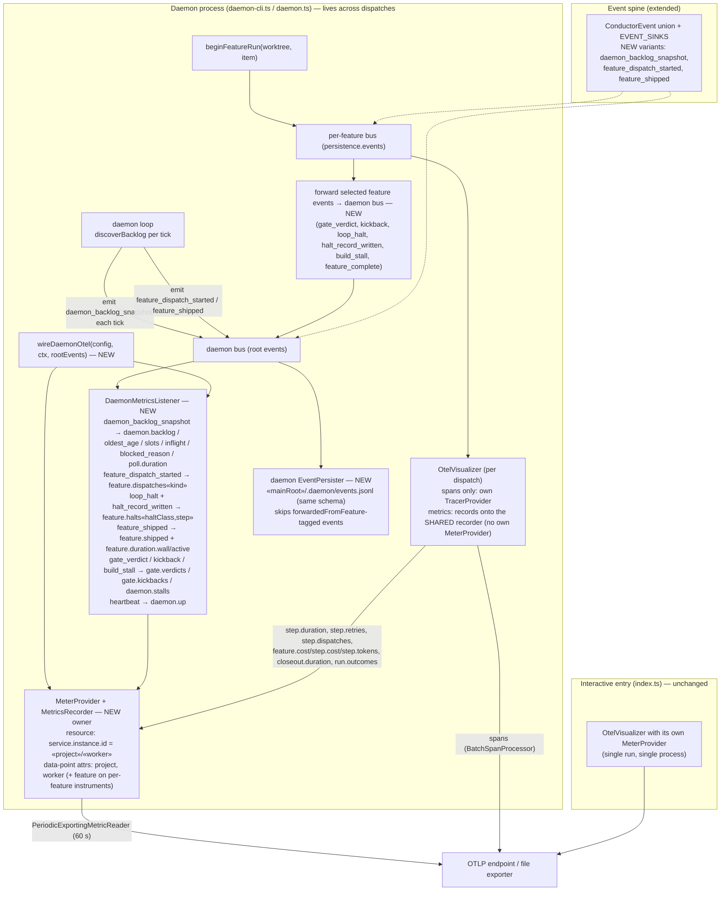

# Components: Daemon-owned meter and daemon-level metrics

**Last updated:** 2026-09-06
**Scope:** Where metrics are recorded after #1937 — one long-lived `MeterProvider` and
`MetricsRecorder` owned by the daemon process, shared by every per-dispatch OTel visualizer
(which keeps owning spans), plus the daemon-scoped listener that turns backlog snapshots,
dispatch starts, halts, ships, and gate verdicts into daemon-level and per-feature instruments.
Interactive `conduct` runs (no daemon) are unchanged.

## Diagram

## Legend

- **NEW owner** — the daemon constructs the one `MeterProvider`; it lives for the daemon's life, so
  every counter recorded on it is monotonic across re-dispatches. This is what fixes
  `conductor.run.outcomes` (stuck at 1.0) and `conductor.step.retries` (resets per dispatch).
- **Per-dispatch visualizer** — still one per feature dispatch on the feature bus, still owns the
  `TracerProvider` (spans are per-run by nature, `conductor.run.id` stays on the trace resource).
  It receives the shared `MetricsRecorder` handle from `beginFeatureRun` instead of building its
  own meter.
- **Forwarding** — the per-feature events the daemon-level listener needs are re-emitted onto the
  daemon bus (one listener per bus, adr-014 D1). Forwarded events are not re-persisted; the
  per-feature `events.jsonl` remains their ledger.
- **Identity** — `service.instance.id = «project»/«worker»`; `worker` defaults to hostname and is
  overridable by `otel.worker_name`. Backlog gauges report the same value from every worker of a
  project (query with `max by (project)`); slots/inflight are per-worker (`sum`).
- **Interactive path** — no daemon, no shared meter; the existing single-visualizer wiring is
  byte-for-byte unchanged in behavior.
- Disabled/absent OTel config → `wireDaemonOtel` returns null and `beginFeatureRun` passes no
  recorder; daemon behavior unchanged.

## Change Log

| Date | Change | Reason |
|------|--------|--------|
| 2026-09-06 | Initial generation | DECIDE for #1937 (daemon-level metrics) |
| 2026-09-06 | Added daemon EventPersister node | Plan update (architecture-review condition C6) |
