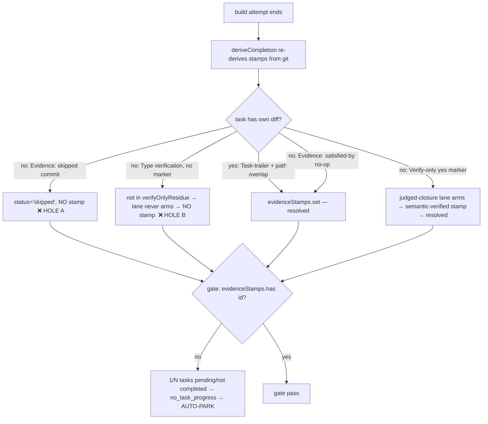

# Architecture: No-diff task evidence stamp

**Stem:** `no-diff-task-evidence-stamp` · **Issue:** #733 · **Tier:** M (lightweight)

## The completion-currency invariant and its two holes

`#463` made the `evidenceStamps` sidecar the **only** currency the build completion
gate accepts. `deriveCompletion` re-derives those stamps from git on every gate eval.
A task with a real code diff earns a stamp naturally (Task-trailer + path overlap).
A **no-diff** task (verification / already-satisfied contract) has no such diff, and
the two paths that should stamp it both miss:

- **Hole A** (`autoheal.ts:747-753`): the `Evidence: skipped` branch sets
  `status:'skipped'`, `completed:false`, and `continue`s — it never calls
  `evidenceStamps.set`. Meanwhile `countResolvedTasks` (`task-progress.ts:32`) already
  counts `skipped` as resolved, so the progress metric reaches N and stops moving while
  the gate stays unsatisfiable → deadlock. (Hits #721 task 2, #576 task 5.)
- **Hole B** (`conductor.ts:3289-3295`): `verifyOnlyResidue` is filtered by
  `parsePlanTaskVerifyOnly`, which recognizes only `**Verify-only:** yes`. A no-diff
  task authored `**Type:** verification` (the #718-batch convention) is never in that
  set, so the lane never arms, and the verifier's `satisfied` verdict — already written
  to `.pipeline/attribution-verdict.json` — is never consumed into a stamp. (Hits #241
  task 6, #149 task 4, #148 task 5, #576 task 5.)

## The fix — one file, two edits, zero new consumers

Both edits live in `autoheal.ts` and propagate through **existing** call sites unchanged:

- **Edit A — `deriveCompletionInternal` skip branch:** when an `Evidence: skipped`
  commit closes a task, also `evidenceStamps.set(id, { sha, form: 'evidence:skipped' })`.
  The gate at `artifacts.ts:1036` checks only `.has(id)`, so a skipped task now counts
  as resolved — reconciling gate and `countResolvedTasks`. `reconcileStatusFromStamps`
  leaves `skipped` rows untouched (`autoheal.ts:1600`), so no row is wrongly promoted to
  `completed`.
- **Edit B — `parsePlanTaskVerifyOnly`:** return `true` for a task whose `**Type:**`
  line contains the `verification` token (union with the existing `**Verify-only:** yes`).
  Because both the lane arming (`conductor.ts:3289`) and the citation path-relaxation
  (`attribution-lane.ts:511`) already consume this one function, a single edit arms the
  judged-closure lane **and** relaxes path-overlap for verification tasks — no change to
  either consumer.

## Invariants preserved

- **Derive-from-git, not self-report:** Edit A stamps only against a real
  `Evidence: skipped` **commit** on the branch — a bare `status:'skipped'` row in
  task-status.json with no such commit still earns nothing.
- **No whitewash:** Edit B only *arms* the lane; the verifier's citations still pass
  existence + ancestry + non-empty + not-bookkeeping validation
  (`attribution-validate.ts`) and the whitewash guard (non-empty citations + passing
  testEvidence, `attribution-verdict.ts:209-224`). A no-diff task with no honest,
  ancestor-reachable citation is still refused.
- **Own-diff tasks unaffected:** they stamp via the trailer/path path *before* the lane
  runs, so a code-bearing task mislabeled `Type: verification` never reaches the lane.
