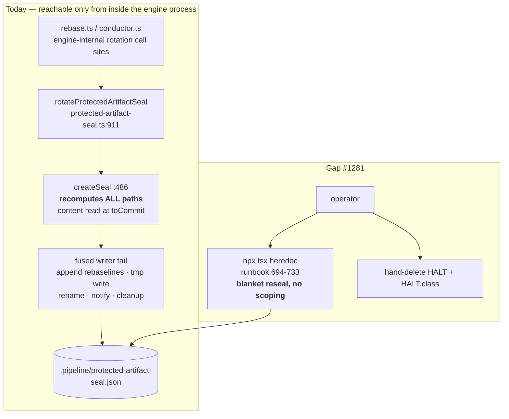
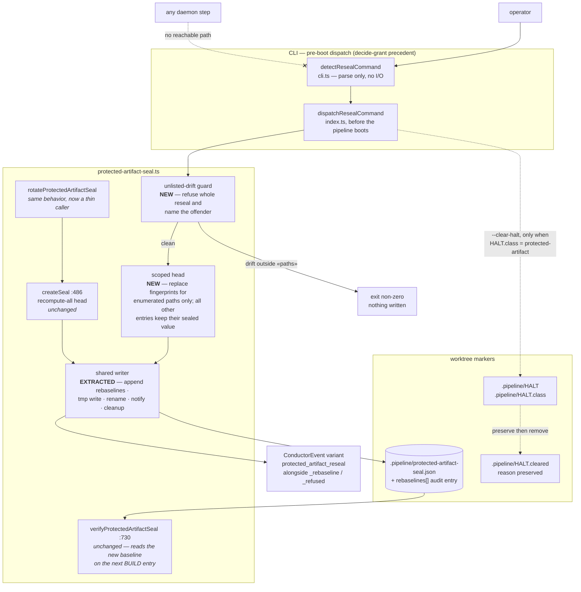
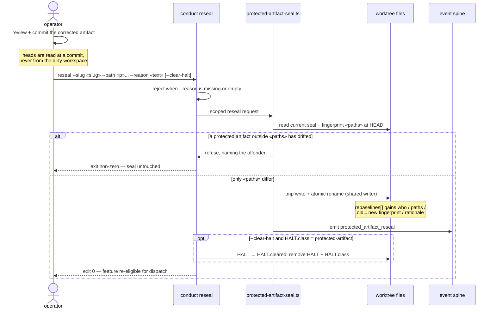

# Architecture: operator-audited reseal of a protected DECIDE artifact (#1281)

**Stem:** `no-operator-command-to-reseal-a-protected-decide-a`
**Tier:** M
**Track:** technical
**Last updated:** 2026-08-09

## Scope

Only the reseal slice. The seal's verification semantics (`inspectSeal`, base-inheritance
tolerance, self-amendment detection) are untouched, and no diagram of the wider daemon or pipeline
is restated here.

What changes:

1. `rotateProtectedArtifactSeal`'s writer tail is extracted into one shared writer, and the
   *seal-computation head* becomes a parameter. `rotate` keeps supplying the existing
   recompute-everything head, so its behavior is byte-identical.
2. A new **scoped** head re-fingerprints only an enumerated set of paths.
3. A new operator-only `conduct reseal` verb drives the scoped head, following the `decide-grant`
   precedent — dispatched before the pipeline boots, so no daemon step can reach it.
4. `--clear-halt` optionally retires the `.pipeline/HALT` that the seal produced.

## Current state — one head, one tail, fused

`rotateProtectedArtifactSeal` (`protected-artifact-seal.ts:911`) computes the next seal by calling
`createSeal()` (`:486`), which re-fingerprints **every** committed protected artifact at
`toCommit`. Its `paths` argument is recorded in the audit entry and constrains nothing. There is no
CLI surface at all: the only documented recovery is an `npx tsx` heredoc that imports this engine
function directly (`docs/runbooks/stalled-or-stuck-feature.md:694-733`).

## Target state — shared writer, two heads, one operator verb

## Reseal sequence

## Legend

| Notation | Meaning |
|---|---|
| **NEW** | Code that does not exist today |
| **EXTRACTED** | Existing logic moved, not rewritten — single-sourced between both heads |
| *unchanged* | Touched by no edit in this feature |
| Dotted edge | Conditional / optional path |
| `.-x` | An edge that deliberately does **not** exist |
| `«name»` | Placeholder for a runtime value |

## Open question for `/architecture-review`

The audit ride-along is settled in principle — a new `ConductorEvent` union variant beside
`protected_artifact_rebaseline` / `_refused` (`types/events.ts:250`, `event-sinks.ts:35`,
`daemon-cli.ts:2301`), with the durable baseline continuing to ride the seal's own `rebaselines[]`
(state read by name, event-spine exception C). **No bespoke audit sidecar.**

Unsettled: the **write location**. `conduct reseal` is a standalone CLI process with no live
emitter, and appending to the worktree's `.pipeline/events.jsonl` makes it a second writer to that
ledger. Event-spine exceptions A (no bus access) and B (one writer per ledger) both point at a
single-writer sibling ledger in the **same** schema, merged by `ts` — the
`adr-2026-08-08-pipeline-owned-closeout-timestamps` pattern. An ADR must settle this before
implementation.

## Change Log

| Date | Change | Reason |
|------|--------|--------|
| 2026-08-09 | Initial generation | DECIDE for #1281 — scoped operator reseal (approach A′) |
