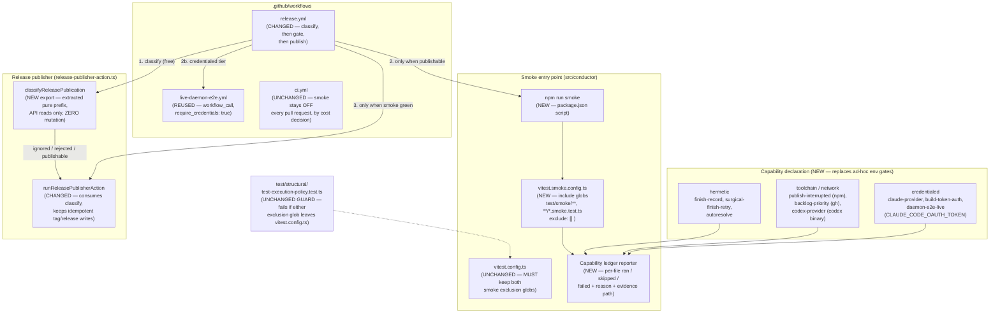
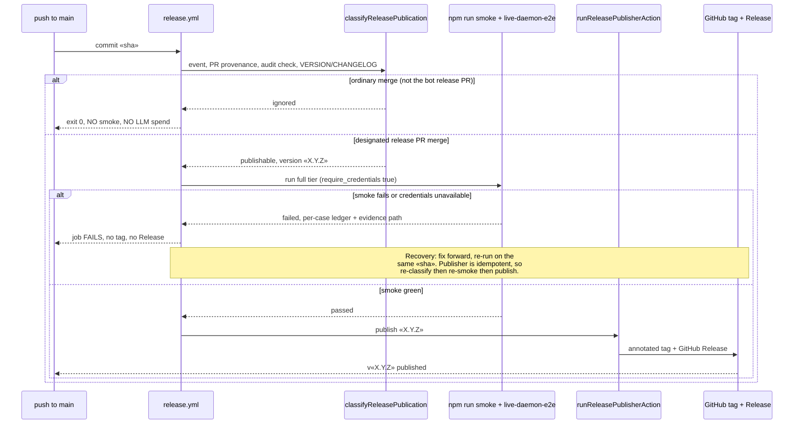

# Components: Release-Time Smoke and Eval Gate

**Last updated:** 2026-08-04
**Scope:** To-be view for `no-release-time-smoke-or-eval-gate-releases-cut-wi`
(jstoup111/ai-conductor#1259, Tier M, technical track). Adds a single auto-discovering
smoke entry point, per-file capability declaration with explicit skip reporting, a
classify/publish split in the release publisher, and a release-time smoke gate that
blocks tagging. Reuses the shipped `live-daemon-e2e.yml` (#1124, closed) rather than
rebuilding a live-agent tier.

## Diagram

## Sequence: one release, one paid smoke run

## Legend

- **`vitest.smoke.config.ts` (NEW)** — the single entry point's config. Its `include`
  globs mirror the default config's `exclude` globs, so any newly added smoke file is
  picked up with no list to edit. `exclude: []` is deliberate: Vitest merges `exclude`
  arrays additively, so this config must not extend the default one. Same pattern as the
  existing `vitest.live-smoke.config.ts`.
- **`vitest.config.ts` (UNCHANGED)** — keeps both smoke exclusion globs. This is not a
  stylistic choice: `test/structural/test-execution-policy.test.ts` re-reads the file and
  fails with `vitest.config.ts: default run includes smoke tests` if either glob is
  removed. The gate is additive; it never widens the default run.
- **Capability declaration (NEW)** — each smoke file declares what it needs (hermetic,
  toolchain/network, or credentialed) instead of carrying a bespoke env var. This
  replaces three incompatible polarities in use today: opt-in vars
  (`AUTORESOLVE_SMOKE_TEST`, `CODEX_CLI_SMOKE_TEST`, `PRIORITY_GH_SMOKE`), kill-switch
  vars (`MODEL_UNAVAILABLE_SMOKE=0`, `AUTH_FAILURE_SMOKE=0`, `BUILD_TOKEN_AUTH_SMOKE=0`,
  `DAEMON_E2E_LIVE_SMOKE=0`), and three files with no gate at all. A single opt-in
  variable would silently disable the kill-switch files, which are meant to run by
  default when credentials exist.
- **Capability ledger reporter (NEW)** — makes failures attributable and makes an
  uncredentialed run impossible to mistake for a pass. Reports every discovered file as
  ran / skipped / failed, with the unmet capability named and the evidence path printed.
  At release time an unmet capability is an error, not a skip.
- **`classifyReleasePublication` (NEW export)** — an extraction, not a redesign. The
  publisher already computes full publish authority from event, PR provenance, the
  head-bound `release-candidate-audit` check, and the committed `VERSION`/`CHANGELOG.md`
  before it mutates anything. Splitting that prefix out lets the workflow answer "would
  this push publish?" using API reads only.
- **The cost seam** — `release.yml` triggers on *every* push to `main`, and most of those
  are ordinary feature merges the publisher already returns `ignored` for. Running smoke
  before classify would charge an LLM run per merge. Classifying first reduces that to one
  paid run per release, which is the operator's binding constraint on this feature.
- **`live-daemon-e2e.yml` (REUSED)** — already carries `workflow_call`, a
  `require_credentials` input, and explicit credentialed-vs-skipped step-summary
  reporting. #1124 shipped and is closed; this feature wires it to a trigger rather than
  rebuilding it.
- **`ci.yml` (UNCHANGED)** — deliberately keeps smoke off pull requests. Earlier detection
  was weighed and rejected on cost: a credentialed live run on every PR is continuous
  token spend for a signal this feature only needs to be true at release.
- **Recoverability** — a smoke failure performs no mutation, so nothing must be undone.
  The publisher's existing skip-if-tag-exists and skip-if-release-exists behavior makes a
  re-run on the same commit safe and convergent.

## Change Log

| Date | Change | Reason |
|------|--------|--------|
| 2026-08-04 | Initial generation | To-be architecture for #1259 |
