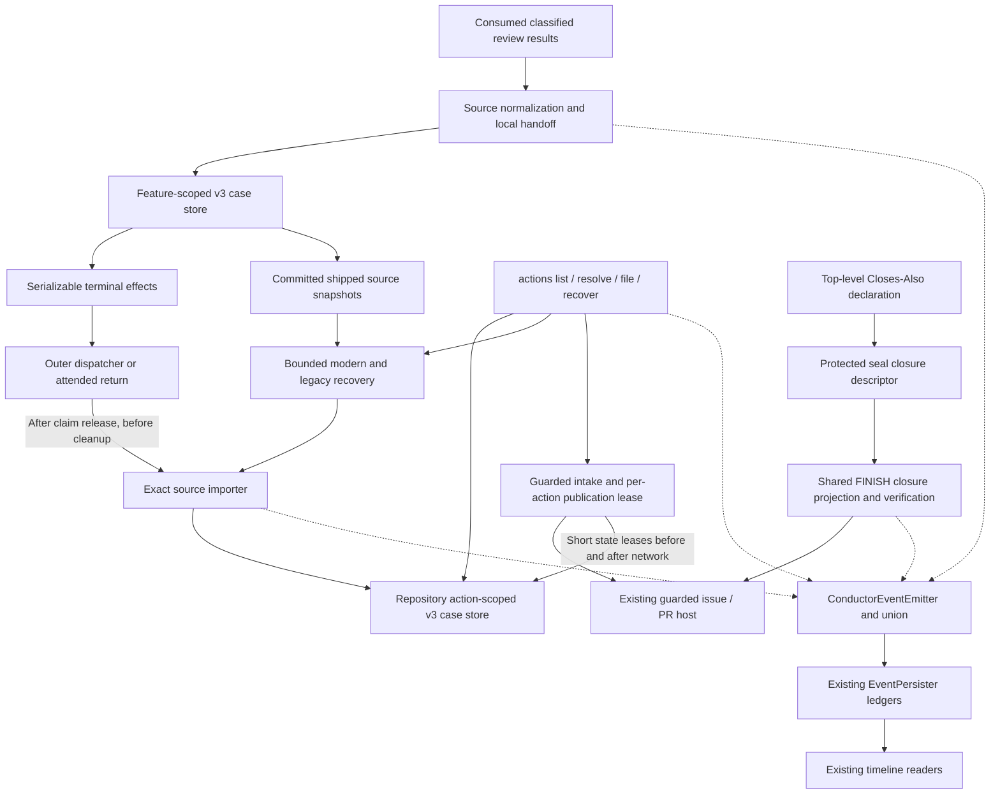

# Components: Durable post-ship actions

**Last updated:** 2026-09-30
**Scope:** Planned storage, execution and publication authority boundaries.
**Validation:** Logical flows and plan updates approved by the operator 2026-09-30.

## Diagram

## Legend

Solid arrows carry state or operations; dashed arrows carry occurrences. These components stay
inside the existing harness. The feature executor writes only its own case store; the outer return
owns repository imports. Source snapshots contain evidence, never mutable repository decisions.

Both store scopes use revision checks, a lease and atomic replacement. Operator resolution and
optional issue publication are independent fields. Exact source/case relationships reconcile replay;
matching prose does not merge cases. The per-action publication lease spans network I/O, while
short repository feature-state leases allow concurrent resolution.

The event union and readers remain one telemetry spine. Standalone invocations use a single-writer
EventPersister ledger under `.pipeline/review-action-events/«invocation-id».jsonl`, consumed by the
existing timeline. No watcher, parallel log schema or new deployment is introduced.

Tasks 1–12 own capture/storage/retention; 13–23 own operator operations; 24–26 and 40 own events;
27–39 own sealed closure authority and common FINISH.

[System context and flow index](non-blocking-review-findings-have-no-post-ship-cha.md)

## Change Log

| Date | Change | Reason |
|------|--------|--------|
| 2026-09-30 | Initial logical component proposal | Reuse existing cases while retaining actions beyond cleanup |
| 2026-09-30 | Make state scopes, outer collection and common FINISH explicit | Plan update; approved ADR |
