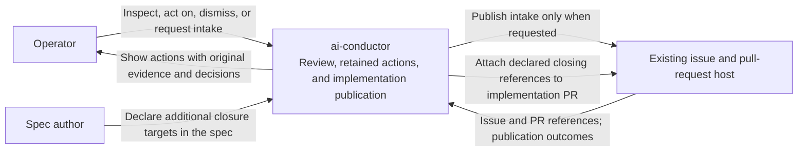

# System Context: Operator action inbox

**Last updated:** 2026-09-30
**Scope:** Approved feature boundaries and planned implementation for #1810.
**Validation:** Logical flows and plan updates approved by the operator 2026-09-30.

## Diagram

## Legend

- The inbox belongs to the existing harness. It adds no external service or separately operated
  daemon. Optional intake and merge-linked issue closure use the existing tracker boundary.
- The host controls actual issue closure on implementation merge. Spec publication carries
  references without closing instructions.
- Review retains its existing blocking authority. An action's presence or publication failure
  does not reopen BUILD or halt the originating feature.
- Local action inspection and resolution do not depend on tracker availability.

## Detail diagrams

- [Components and authority boundaries](non-blocking-review-findings-have-no-post-ship-cha-components.md)
- [Capture and continued shipping](sequences/non-blocking-review-findings-have-no-post-ship-cha-capture.md)
- [Operator resolution and optional intake](sequences/non-blocking-review-findings-have-no-post-ship-cha-operator.md)
- [Historical recovery](sequences/non-blocking-review-findings-have-no-post-ship-cha-recovery.md)
- [Additional issue closure](sequences/non-blocking-review-findings-have-no-post-ship-cha-closure.md)

No new deployable container or relational database is proposed. A separate container diagram and
relational ERD would add no boundary beyond the component view. The action's logical relationships
to its feature, source evidence, operator decision, and follow-up issue appear in that view.

## Approved design and plan bindings

[Approved ADR](../decisions/adr-2026-09-30-durable-post-ship-action-cases.md) selects v3
RemediationCaseStore scopes: feature-local source observations and repository-owned actions under
`.pipeline/review-actions/«canonical-stem»/remediation-cases.json`. Only the outer dispatcher or
attended return imports terminal payloads after claim release; workers do not write root state.
Committed source snapshots in shipped records support recovery after worktree cleanup.

The [implementation plan](../plans/non-blocking-review-findings-have-no-post-ship-cha.md) assigns
store/capture/retention to tasks 1–12, operator workflows to 13–23, events to 24–26 and 40, and
reviewed closure authority plus common FINISH completeness to 27–39. All occurrences use the
existing event union, persister and timeline readers. No diagram grants new blocking judgement.

## Change Log

| Date | Change | Reason |
|------|--------|--------|
| 2026-09-30 | Initial proposed system context and linked detail flows | Approved PRD for #1810 |
| 2026-09-30 | Bind approved architecture to implementation task owners | Plan update |
