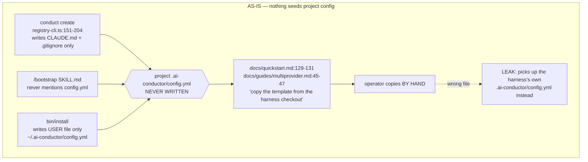
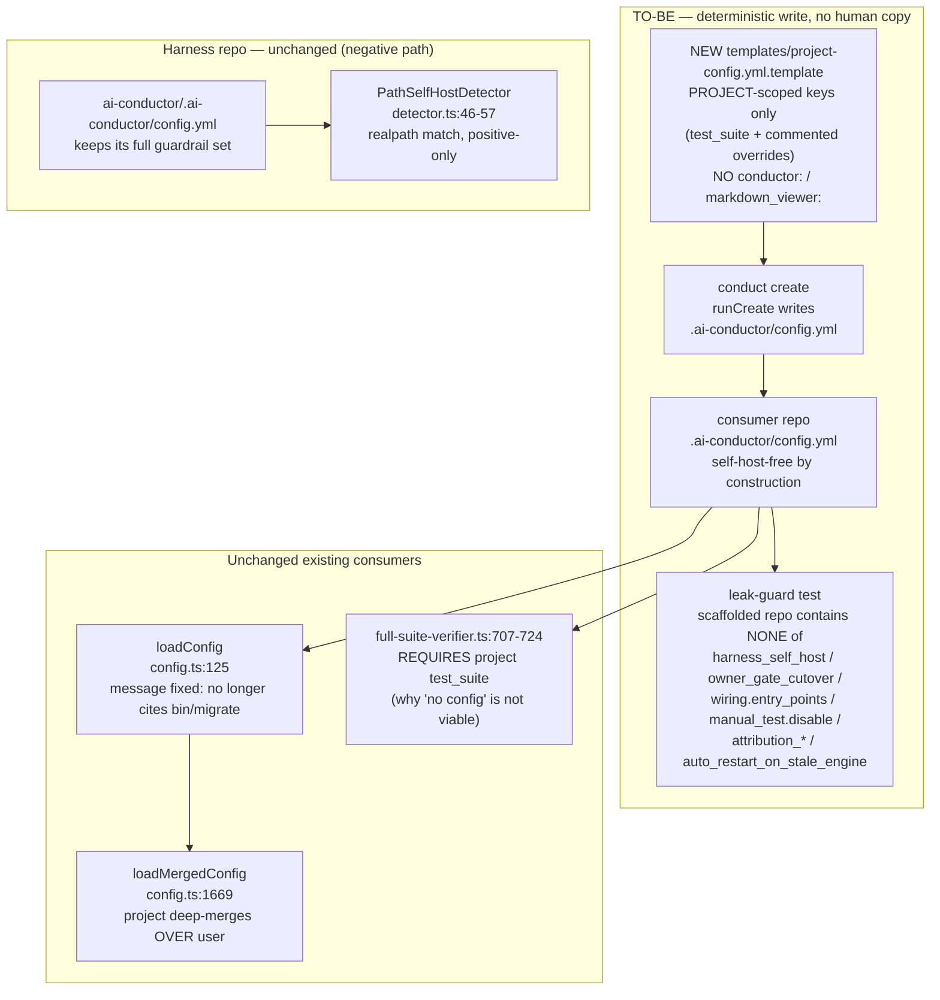

# Components: Deterministic project-config scaffolding (#683)

**Last updated:** 2026-07-27
**Scope:** The project-config seeding seam — `conduct create` (`registry-cli.ts` `runCreate`),
a new project-scoped template asset under `templates/`, the project-config loader's
missing-file message (`config.ts:125-147`), and the documentation surfaces that today instruct
operators to hand-copy a config out of the harness checkout
(`docs/quickstart.md`, `docs/guides/multiprovider.md`, `docs/reference/configuration.md`) plus
the false seeding claim in decision 016.

## Problem shape (as-is)

No code path writes a project `.ai-conductor/config.yml`. The documented route is a **manual
copy from the harness checkout** — a directory that also contains the live self-host config.
That manual step is the leak: the operator copies the wrong neighbouring file, or copies the
user-level-shaped template into a project file.

## Target shape (to-be)

## Key components

| Component | File | Change |
|---|---|---|
| Project-config template | `templates/project-config.yml.template` (new) | Project-scoped keys only; deliberately excludes the user-level `conductor:` and `markdown_viewer:` blocks that make the existing template unsuitable as a project seed |
| Scaffolder | `src/conductor/src/engine/registry-cli.ts` `runCreate` | Writes `.ai-conductor/config.yml` from the template alongside the existing `CLAUDE.md` + `.gitignore` |
| Loader message | `src/conductor/src/engine/config.ts:144` | Stop citing `bin/migrate`, which never creates a project config |
| Docs | `docs/quickstart.md`, `docs/guides/multiprovider.md`, `docs/reference/configuration.md` | Replace the hand-copy instruction with the scaffolded behavior |
| Decision 016 | `.docs/decisions/architecture-review-2026-06-29-pluggable-memory-source.md:93` | Correct the false "bootstrap seeds it" claim |
| Leak guard | `src/conductor/test/integration/registry-cli.test.ts` | Assert a scaffolded repo carries none of the self-host keys |

## Invariants

- The harness repo's own `.ai-conductor/config.yml` is never read as a seed source by any code path.
- The existing `templates/ai-conductor-config.yml.template` remains the **user-level** reference;
  it is not repurposed as the project seed.
- A genuine self-host build still resolves its full guardrail config — self-host detection is
  path-based (`detector.ts:46-57`) and independent of what the scaffolder writes.
- A consumer may still set any key by hand; the scaffolder only establishes the starting state.
