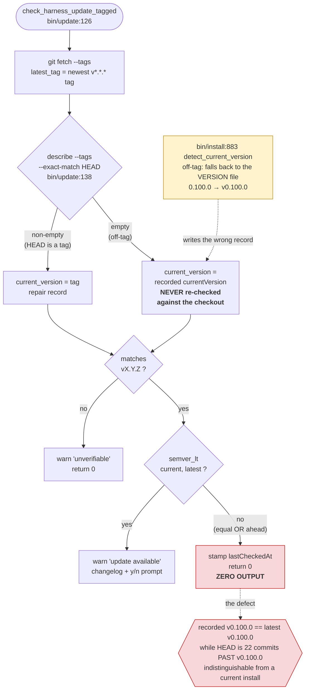
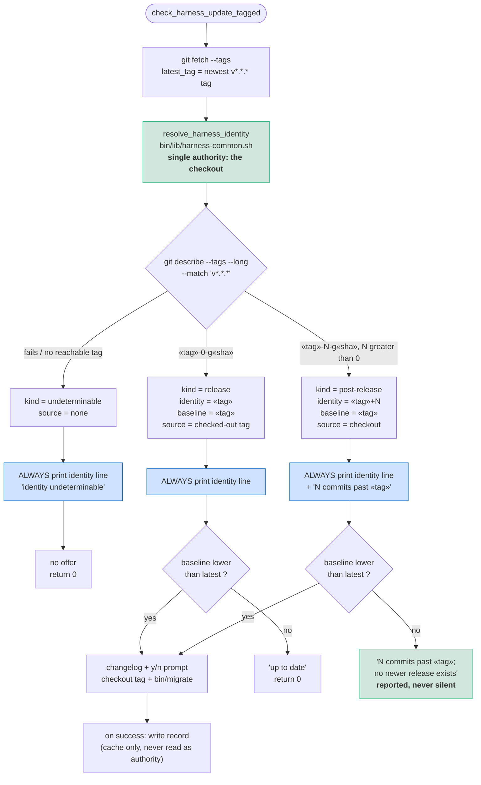
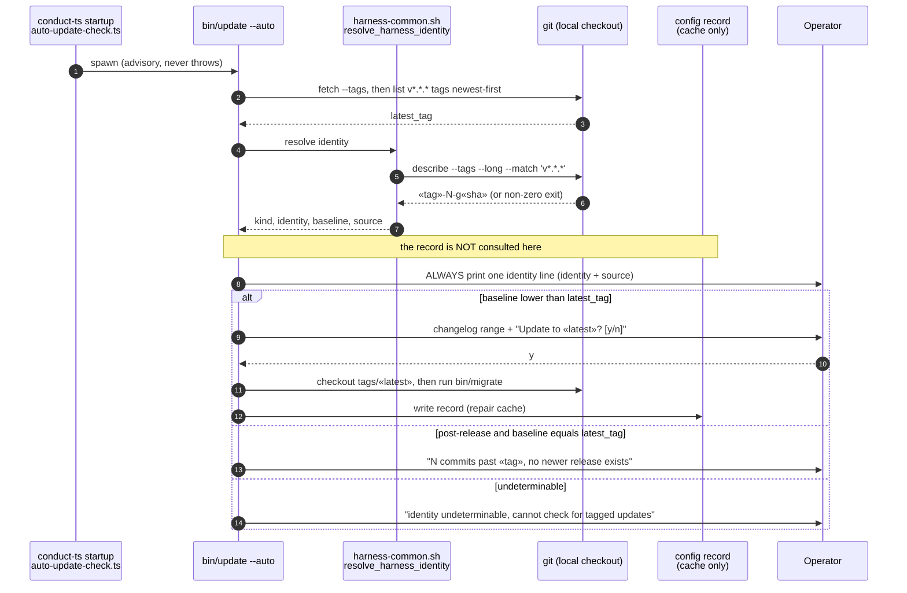
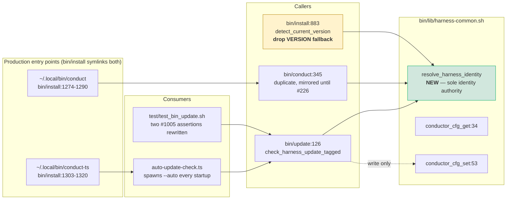

# Architecture: Off-tag checkout reports up to date forever (#1437)

**Last updated:** 2026-08-09
**Scope:** Replace the update check's two-branch version-identity resolution with a single
structured identity derived from the checkout on every run, so an install that has advanced
past its recorded release can never silently conclude it is current. Demotes the recorded
`currentVersion` from authority to cache, and removes the installer's `VERSION`-file guess
that produces the wrong record in the first place.

## Current state (the defect)



**The defect is not staleness — it is unfalsifiability.** The `else` branch adopts a value
that nothing ever compares against the thing it claims to describe. Once adopted, the only
gate is `semver_lt`, which cannot distinguish "equal because current" from "equal because the
record is wrong". Verified by direct reproduction: a scratch checkout two commits past
`v0.100.0` with `currentVersion=v0.100.0` and latest tag `v0.100.0` produced **no output and
exit 0**.

Two aggravating facts, both verified by reading:

- `bin/install:883` `detect_current_version` falls back to the `VERSION` file when off-tag,
  which directly contradicts `bin/update:133-136`'s own comment that `VERSION` "intentionally
  advances immediately after a release, so neither it nor a stale config value can identify
  the installed tagged release". The installer writes exactly the guess the update path
  refuses to make.
- `bin/conduct:345-374` carries a byte-identical duplicate of `check_harness_update_tagged`,
  pending removal by [#226](https://github.com/jstoup111/ai-conductor/issues/226). Both copies
  carry the defect and both must be fixed.

## Target state



The recorded `currentVersion` disappears from every decision edge. It is still **written** so
that #1400's legacy-to-block seed carries a correct value rather than freezing a wrong one
permanently — but no path reads it to decide anything.

## Identity resolution contract

> **Amended 2026-08-09 by #1437:** the resolution mechanism is now
> `git tag --merged HEAD -l 'v*.*.*' --sort=-v:refname | head -1` (highest **reachable**
> release tag) plus `git rev-list --count «baseline»..HEAD` (distance), **not**
> `git describe --tags --long`. Two verified reasons: `describe` returns the *nearest*
> ancestor tag rather than the highest reachable one, which understates the baseline in merge
> histories; and its default `--candidates=10` limit is already exceeded — the live checkout
> has 22 reachable v-tags. Both mechanisms agree on the current checkout (`v0.100.0`,
> distance 22), so this is a robustness refinement, not a behavior change. The `describe`
> column below is retained as the original assertion; read it as the equivalent
> baseline/distance pair. See `adr-2026-08-09-checkout-is-sole-version-identity-authority`.

| `git describe --tags --long --match 'v*.*.*'` | kind | identity (printed) | baseline (compared) | source (printed) |
| --- | --- | --- | --- | --- |
| `v0.4.0-0-gabc1234` | release | `v0.4.0` | `v0.4.0` | checked-out tag |
| `v0.3.0-1-gdef5678` | post-release | `v0.3.0+1` | `v0.3.0` | checkout |
| `v0.100.0-22-g2933e33` | post-release | `v0.100.0+22` | `v0.100.0` | checkout |
| non-zero exit / empty (shallow clone, no reachable tag) | undeterminable | `unknown` | — | none |

`identity` is never a claim to **be** the baseline release: `v0.100.0+22` states plainly that
the checkout is derived from `v0.100.0` and is not that release. This vocabulary is what the
current code lacks — it collapses the post-release state into either a false "I am `v0.100.0`"
or an unhelpful "unverifiable".

## Decision matrix

| kind | baseline vs latest | Output | Offer? |
| --- | --- | --- | --- |
| release | baseline < latest | identity line + update available | yes |
| release | baseline == latest | identity line + up to date | no |
| post-release | baseline < latest | identity line + drift note + update available | yes |
| post-release | baseline == latest | identity line + "N commits past «tag»; no newer release exists" | no |
| undeterminable | — | identity line + unverifiable | no |

The row in bold-faced contrast with today is **post-release / baseline == latest** — the live
observed state, which currently produces nothing at all.

> **Amended 2026-08-09 by #1437:** this matrix covers the **tagged** channel. The always-printed
> identity line now applies to the **main** channel as well (operator-confirmed):
> `check_harness_update_main` (`bin/update:184-232`) returns bare at `:193` when local and
> remote heads match, which is the same silence class on the channel the operator actually
> runs. Its identity line reports `main@«sha»` with its branch and behind-count, and it prints
> on every check including when up to date. Update-offer behavior on that channel is otherwise
> unchanged.

## Decision flow (sequence)



> **Amended 2026-08-17 by #1437:** this sequence shows only the `conduct-ts` → `bin/update --auto`
> runtime. It is one of **two** production runtimes, and omitting the second was read downstream as
> the `bin/conduct` copy being unreachable. The second runtime is rooted in `bin/conduct` itself:
>
> ```mermaid
> sequenceDiagram
>     autonumber
>     participant Op as Operator
>     participant Sym as ~/.local/bin/conduct<br/>(bin/install:1274-1290)
>     participant C as bin/conduct
>     participant H as harness-common.sh<br/>resolve_harness_identity
>     participant G as git (local checkout)
>
>     Op->>Sym: conduct «args»  (or conduct --update)
>     Sym->>C: exec bin/conduct
>     C->>C: check_harness_update  (top level, :2760; --update, :2720)
>     C->>C: dispatch channel (:336-358) → tagged (:356)
>     C->>H: check_harness_update_tagged (:193-274) resolves identity (:204-205)
>     H->>G: read checkout
>     G-->>H: kind, identity, baseline, distance, source
>     H-->>C: same tuple bin/update receives
>     C->>Op: same identity line and same decision branch as bin/update
> ```
>
> Neither runtime calls the other. `conduct` and `conduct-ts` are separately symlinked by
> `bin/install` (`:1274-1290` and `:1303-1320`); the only edge between them is the advisory
> heads-up at `bin/conduct:2745-2753`, which runs `conduct` → mention of `conduct-ts`, never the
> reverse. **No TypeScript caller for `bin/conduct:193-274` is owed, and adding one would invert
> the deployment boundary.**

## Duplicate placement — why the mirror stays in production scope

> **Amended 2026-08-17 by #1437:** added to close the entry-point question the component-placement
> diagram below left implicit.

`bin/conduct`'s tagged-update copy is not scaffolding, not a test fixture, and not a
later-feature stub. It is live behavior on a shipped CLI, so it carries the same correctness
obligation as `bin/update`, and the same defect if it drifts. That fixes three things:

1. **Scope.** The mirror stays inside this feature's changed production scope. It is not removed,
   not deferred to #226, and not exempted from the identity rewrite.
2. **Parity is the invariant, not resemblance.** Both copies must produce identical output and
   identical decision effects — including cache persistence — from identical checkout and config
   inputs, across the undeterminable, post-release, up-to-date, offer, and prompt branches.
3. **Delegation is the mechanism.** Neither copy may resolve a tag to an identity inline
   (`git describe`, `git tag --merged`, `rev-list --count`); both call `resolve_harness_identity`.
   This is Condition 1 of the approved review, and it is what makes #226's later deletion a removal
   of a call site rather than of logic.

**Owning surfaces for the BUILD kickback.** Implementation: `bin/update` and `bin/conduct`
(tagged-check bodies and their pre-resolver guards). Tests: `test/test_harness_integrity.sh`
check 24 (`:1459-1499`) for the static parity and delegation guards — which must be falsifiable
against the pre-diff `git describe` form, not merely satisfied by it; `test/test_bin_update.sh`
for behavioral fixtures including the no-reachable-release-tag case; and
`src/conductor/test/acceptance/off-tag-checkout-reports-up-to-date-forever-tagged.acceptance.test.ts`
for cross-caller parity driven from identical inputs. None of these owes a reachability change.

## Component placement



Placing `resolve_harness_identity` in `harness-common.sh` is what makes the `bin/conduct`
mirror a one-line call rather than a second copy of the logic, and lets `bin/install` reuse
the same rule instead of keeping its own contradictory one.

> **Amended 2026-08-17 by #1437:** the `Roots` subgraph above is added — both callers are rooted
> in their own installed CLI, and neither root reaches the other. The design-time citations in the
> `Callers` subgraph have since drifted with the implementation; the authoritative current
> locations are `bin/update:126` and `bin/conduct:193` for `check_harness_update_tagged`, and
> `bin/install:891` for `detect_current_version`. The original labels are preserved above as the
> design-time record.

## Boundary with #1400 / #1412 (in flight, do not entangle)

[#1400](https://github.com/jstoup111/ai-conductor/issues/1400) repoints the accessors at the
`conductor:` block in `~/.ai-conductor/config.yml`, seeds it from the legacy JSON, and renames
that JSON to `.migrated` — see `.docs/plans/update-check-config-single-source-of-truth.md`.
Its seed writes whatever the legacy file holds **over** the block, so a wrong `currentVersion`
recorded today would become permanent.

This change is **immune** to that, and the immunity is structural rather than coordinated: the
identity used for every decision is derived from the checkout at decision time, so it does not
matter which store the record lives in or what it contains. The two changes touch the same
files and must be sequenced by whoever merges second, but neither depends on the other's
semantics. This spec introduces **no new config key**, precisely so it adds nothing to #1400's
schema surface.

## Contract change (requires explicit acceptance)

`test/test_bin_update.sh:344-355` (`#1005 i17-unknown-identity`) asserts that a checkout
between releases with no recorded identity reports `unverifiable` and offers nothing. But
`make_repo:80-123` tags the **first** commit `v0.3.0`, so that checkout does have a reachable
ancestor tag. Under this design it resolves to `v0.3.0+1` and offers `v0.4.0`.

Those two assertions encode the old vocabulary's limitation, not a desired behavior, and are
rewritten here: "no recorded identity" stops being the trigger for `unverifiable`, and "no
reachable tag" becomes the trigger instead. The deliberate refusal to guess (desired outcome 4)
is preserved — it moves from an untestable condition to a precise one. A new test covers the
genuine undeterminable case with a tagless-ancestor checkout.

## Legend

- **Green** — new or corrected behavior introduced by this change.
- **Blue** — the always-printed identity line (desired outcome 2, operator-confirmed to apply
  to every invocation including `--auto`).
- **Red** — the current defect path.
- **Amber** — an existing component that produces the wrong input and is corrected here.
- `«...»` — a variable part of a label (tag, slug, sha).
- **baseline** — the release a checkout is derived from, used for version comparison.
  **identity** — what the install reports itself to be, which for a post-release checkout is
  explicitly not a release.

## Change Log

| Date | Change | Reason |
|------|--------|--------|
| 2026-08-09 | Initial generation | DECIDE for #1437; approach B (checkout is sole identity authority) confirmed by operator |
