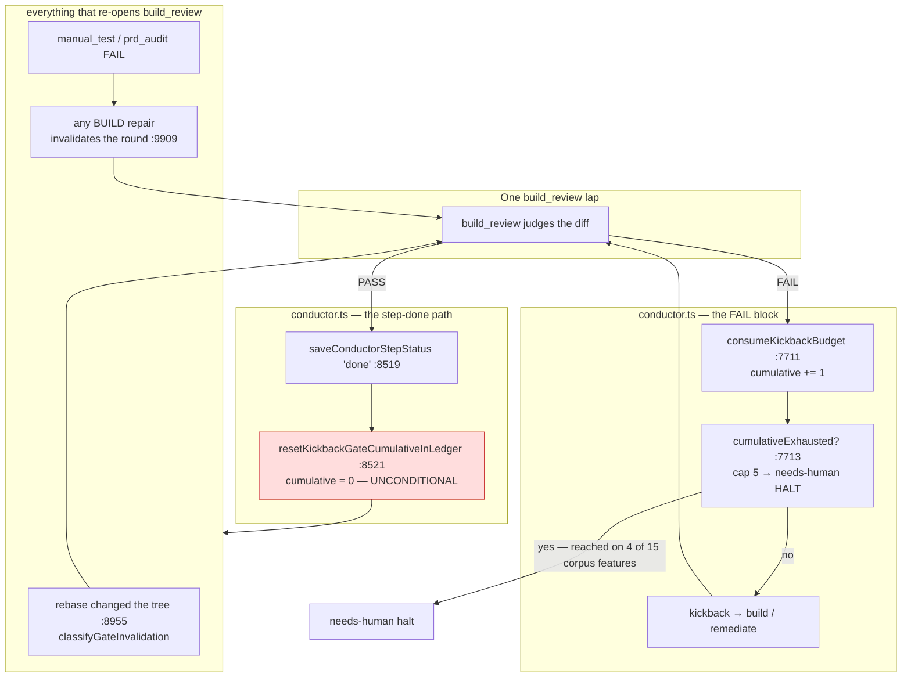
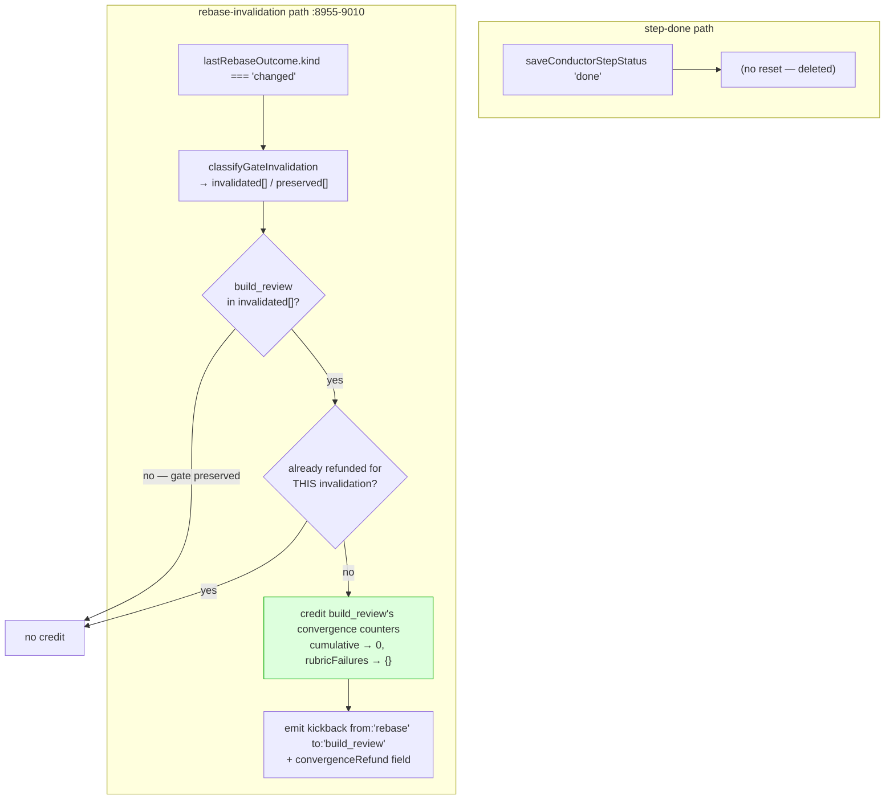
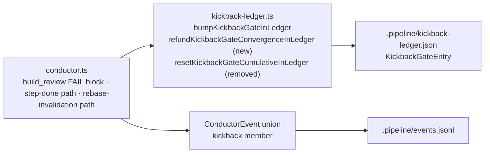

# Architecture: the invalidator refunds build_review convergence laps

**Last updated:** 2026-08-18
**Scope:** the `build_review` step-completion path and the rebase-invalidation path in
`conductor.ts`, the durable kickback ledger (`kickback-ledger.ts`), and the `kickback` member of the
`ConductorEvent` union. Covers jstoup111/ai-conductor#1694.
All line references are at worktree base `9b5ae42cc`.

## Diagram: why every bound is unreachable today (L3)

The defect is the unconditional edge `DONE → RESET`. `adr-2026-08-12` D2 authorized it for exactly
one of the three `REOPEN` causes — `REBASE`. The other two are the feature's own churn, and they are
the common case: any BUILD repair invalidates the prior verification round, so a `manual_test` or
`prd_audit` kickback routes through `build` and re-runs `build_review`. Every intervening PASS
returns the counter to zero.

## Diagram: the refund (L3, target state)

Three guards, each carrying its own failure if omitted:

| Guard | Omitted → | Source of the condition |
|---|---|---|
| gate is in `invalidated[]` | over-credits a rebase whose delta missed `build_review`'s declared surface | `conductor.ts:8966-8979` — `classifyGateInvalidation` returns a `preserved` set |
| one-shot per invalidation | a single rebase re-credits on every later lap, restoring today's defect | the refund is durable state; nothing else bounds re-reads |
| credit only `build_review`'s entry | leaks the exemption to gates that were never invalidated | the ledger's `gates` record is gate-generic |

## Component map (L2)

No new module, no new store, no new file. The refund replaces one exported ledger function with
another of the same shape and call depth; the rebase path gains one guarded call beside an emission
it already makes.

## State: the entry's convergence fields

| Field | Question | Reset by — today | Reset by — after this change |
|---|---|---|---|
| `count` | Was this lap a no-op over an unchanged tree? | any tree change or resolved-count increase | **unchanged** |
| `cumulative` | How many laps has this gate spent? | a `build_review` PASS | a rebase that invalidated this gate, once |
| `rubricFailures` | Is one rubric failing over and over? | a `build_review` PASS (`adr-2026-08-17` D5) | a rebase that invalidated this gate, once |
| mechanical-fault allowance (#1629, unmerged) | How many laps were lost to infrastructure faults? | a `build_review` PASS, as its D4 proposes | a rebase that invalidated this gate, once — per ADR D6 |

The rule is stated over the entry rather than over named fields: **no lap-counting field on the entry
is cleared by a PASS, and every one of them is credited by an invalidating rebase.** `count` is
excluded by construction — it is a no-op detector with its own approved per-tree reset, not a lap
counter.

`rubricFailures` is APPROVED and merged but **not yet implemented** on this base, and #1629's
allowance is APPROVED-in-an-open-spec-PR and unmerged. The clear and the credit are written over
whichever lap-counting fields the entry actually carries, so this change is correct in any landing
order — see conflict-check, which also records the amendment #1629's plan needs before it builds.

## Event surface

The `kickback` member gains one additive optional field carrying what was credited. It is emitted at
`conductor.ts:9005-9011`, the site that already emits `kickback from:'rebase' to:'build_review'`,
one-to-one with the credit. Per `adr-2026-08-12` D5 and `adr-2026-08-17` D8, the durable counters are
legal under the event-spine skill's exception C **only because the occurrence is emitted**; a refund
that mutated gitignored `.pipeline/` state silently would be the parallel channel §3's corollary
names. No new union member, no `refundedAt` stamp in any artifact.

## What is deliberately unchanged

`MAX_CUMULATIVE_KICKBACKS_BUILD_REVIEW` (5), `MAX_RUBRIC_FAILURES_BUILD_REVIEW` (4),
`MAX_KICKBACKS_PER_GATE` (2) and its per-tree reset rule, the `cumulative_kickback_bound` config
contract, D2's no-op escalation, the fresh-base disposition, every rubric's PASS/FAIL judgement,
finding identity, and the disposition store.
