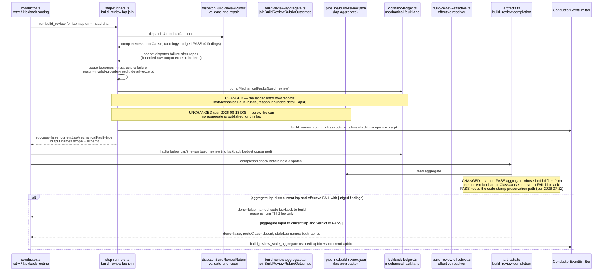

# Sequence: build_review lap publication on a contract-rejected rubric

**Last updated:** 2026-08-21
**Scope:** The build_review lap join and completion path when one rubric's judged result is
rejected after its repair turn (a mechanical fault) while the other rubrics judged clean —
showing where the current lap's aggregate is published, how the rejected rubric's concern is
preserved, and how completion distinguishes the current lap from a prior lap's aggregate.
Feature: `one-rubric-s-rejected-contract-discards-the-whole-` (#1740).

## Diagram

## Legend

- **Mechanical fault** — a rubric whose provider output never satisfied the judged contract
  (after one repair turn) or whose branch artifact is unreadable; recorded as
  `infrastructure-failure`, never as a reviewer verdict.
- **Allowance cap** — `MAX_MECHANICAL_FAULTS_BUILD_REVIEW` in `kickback-ledger.ts`; the
  mechanical lane re-dispatches build_review without consuming the build kickback budget.
- **CHANGED notes** mark the seams this feature alters: (1) the ledger entry carries a first-class
  record of the last mechanical fault; (2) completion compares a non-PASS aggregate's stored `lapId`
  to the current lap instead of relying on mtime freshness alone, and the stale condition is emitted
  on the spine. The lap join's no-publish rule (`adr-2026-08-18` D3) is deliberately unchanged.
- `«…»` are placeholders for runtime values.

## Change Log

| Date | Change | Reason |
|------|--------|--------|
| 2026-08-21 | Initial generation | #1740 — stale prior-lap aggregate replayed fixed findings; rejected rubric's concern lost |
| 2026-08-21 | Plan update: conform to adr-2026-08-18 D3 (no aggregate on a below-cap fault); ledger record + completion guard + spine event | architecture-review resolved the D3 conflict in favour of A′ |
