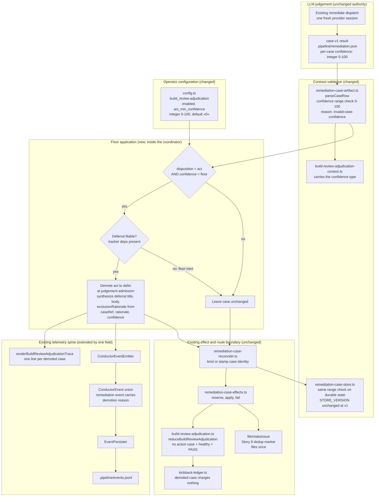

# Components: adjudicator confidence floor for build_review action

**Last updated:** 2026-09-06
**Scope:** Proposed component boundaries for jstoup111/ai-conductor#2383: percentage confidence on
the `case-v1` adjudicator record, and an operator floor that demotes a sub-floor `act` disposition
to `defer` before the case is persisted as an action case. Extends the settled adjudicator
architecture from #2033/#2087 in place; adds no new seam.

## Diagram

## Legend

- **Changed components** are `remediation-case-artifact.ts` (confidence becomes a validated
  integer), `config.ts` (new `act_min_confidence` key), and the coordinator's `act` path (the new
  Floor subgraph). Everything under Downstream is reached unchanged.
- **The floor is bookkeeping, not judgement.** The provider supplies the number; the engine never
  derives or adjusts it. The comparison is the only engine-side decision.
- **Demotion happens at judgement admission, before reconciliation.** It cannot happen at the
  effect-dispatch block: that block reads effect kinds the reconciler has already persisted, so a
  late rewrite would desync the proposed case from its stored record and trip existing fail-fast
  guards. Applying the floor deterministically before reconciliation is also what keeps the
  deferral's `effect.id` stable across laps, which is what the Story 8 marker dedups on — an
  inconsistently applied demotion would mint a new effect id per lap and file duplicate issues.
  A demoted case is persisted as a deferral case, so
  `reduceBuildReviewAdjudication` never sees a build-eligible action case for it. A lap whose
  every action was demoted therefore reaches the existing PASS branch
  (`build-review-adjudication.ts:85`) rather than deadlocking with nothing to fix.
- **`TRACKERQ` keeps the floor inert where deferrals cannot finalize.** An unfinished effect routes
  to HALT (`build-review-adjudication.ts:57`), and the tracker dependencies are conditional in
  `conductor.ts`. With no tracker the `act` proceeds as today, so the floor can never convert a
  passing or actionable lap into a halt.
- **`reject` and `defer` are untouched.** Only the `act` branch consults the floor.

## Change Log

| Date | Change | Reason |
|------|--------|--------|
| 2026-09-06 | Initial generation | Authored during DECIDE for jstoup111/ai-conductor#2383 |
| 2026-09-06 | Corrected demotion seam to judgement admission; added case store and adjudication context as changed components | Source trace during architecture-review found the effect-dispatch block consumes already-reconciled effect kinds, and two further surfaces validate or carry the confidence type |
