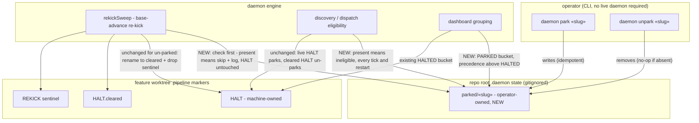
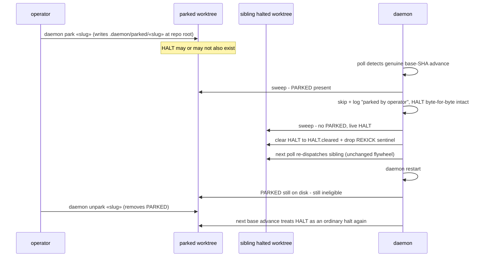

# Architecture: operator park — human park survives the re-kick sweep

**Last updated:** 2026-07-04
**Scope:** the seams changed by this feature — a new operator-owned PARKED marker beside the
existing HALT marker, park/unpark CLI verbs, the re-kick sweep's skip contract, dispatch
eligibility, and the dashboard's grouping precedence.

## Components

## Sequence: base advance with a parked feature

## Legend

- **PARKED** — a new operator-owned marker at repo-root `.daemon/parked/«slug»`
  (adr-2026-07-04-operator-park-marker: repo-root, not worktree, so pre-emptive parks of
  undispatched work hold and the park survives worktree teardown). Written and removed only by
  the park/unpark verbs; checked before any autonomous decision about the feature (sweep
  clear, dispatch, sentinel resume); check errors fail toward parked.
- **HALT** — the existing machine-owned marker; its writers (rebase re-conflict, gates,
  finish flow) are untouched and may rewrite it freely without affecting a park.
- **precedence** — PARKED outranks every existing dashboard group (HALTED, PROCESSED, GATED,
  IN-PROGRESS, WAITING, ELIGIBLE); interior order unchanged; a slug with both states shows
  once, as PARKED.
- **NEW** edges — behavior added by this feature; all other edges exist today.

## Change Log

| Date | Change | Reason |
|------|--------|--------|
| 2026-07-04 | Initial generation | Spec authoring for ai-conductor#236 (engineer DECIDE) |
| 2026-07-04 | Park storage moved to repo-root `.daemon/parked/«slug»`; precedence restated as PARKED-over-all (GATED included) | ADR approval + conflict-check resolution; /plan step 8b |
