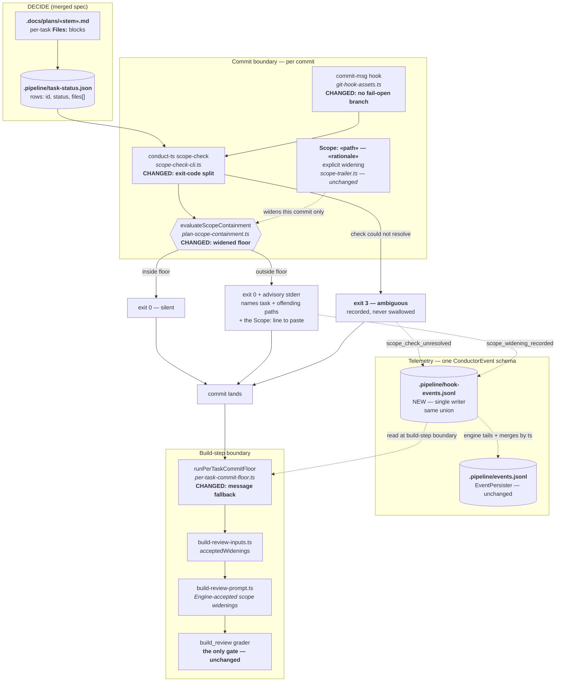

# Architecture: Non-blocking plan-scope containment recorder

**Date:** 2026-08-09
**Track:** Technical
**Tier:** M
**Related:** `.docs/track/out-of-plan-production-edits-reach-build-review-in.md`,
`.docs/complexity/out-of-plan-production-edits-reach-build-review-in.md`
**Builds on:** `.docs/architecture/pipeline-commits-files-outside-the-active-plan-bef.md`
(#1349, merged — landed the containment evaluator and the `Scope:` trailer, report-only)
**Source:** intake `jstoup111/ai-conductor#1390`

## Context

#1349 landed the whole containment path: `plan-scope-containment.ts` evaluates staged paths
against the active task's declared `files[]`, `scope-check-cli.ts` prints a refusal naming the
task and the offending paths, `Scope: «path» — «rationale»` trailers widen a single commit, and
`per-task-commit-floor.ts` harvests those widenings into `build_review`'s prompt. It shipped
report-only behind `build_review.scopeContainmentEnforced`, with a hook comment anticipating an
"enforcement flip".

**The flip is the wrong move, and this is the load-bearing finding.** `fileMatchesPlanPath` is
exact-or-suffix only, and the auto-allow list is just `['.docs/shipped/', '.pipeline/']`. A task
declaring `src/foo.ts` would therefore have its commit **refused** for also touching
`src/foo.test.ts`, a same-directory helper, or `CHANGELOG.md` — all routine, all necessary. An
enforcing flip on today's floor converts a late kickback into constant commit-time friction.

The operator's direction is accordingly: **never refuse; widen the floor; always record the
"why".** The gate stays exactly where it already is — `build_review`'s semantic scope rubric —
but it stops being handed unexplained paths, which is what actually produced the four kickbacks.

### Explicit departure from the intake

Issue #1390's first desired outcome asks that the commit be *refused at the moment it is
written*. **This design does not refuse.** Operator direction during DECIDE: kickbacks are
already a friction source, and a blocking commit gate on a floor this tight would be worse than
the problem. Outcomes 2–5 are met in full; outcome 1 is met in the weaker "detected and recorded
at commit time, never silently lost" form.

## Component view (C4 level 3 — the commit → build_review path)



## Legend

- **Bold "CHANGED"/"NEW"** — surfaces this feature touches. Everything unmarked already exists
  on main from #1349 and is reused as-is.
- Solid arrows are the commit's control flow; dashed arrows are data/telemetry.
- Every terminal path reaches `commit lands` — there is no refusal edge in this design, by
  operator direction.

## Sub-decisions carried into the ADRs

**1. The floor is widened, not the enforcement flipped.** Three additions to the auto-allowed
set, all operator-selected: test siblings of a declared file, same-directory neighbors of a
declared file, and docs/generated artifacts joining `MACHINERY_AUTHORED_PATHS`. After this, a
path outside the floor is genuinely unrelated to the task — which is what makes recording it
informative rather than noisy.

**2. Rationale is trailer-first, message-fallback, never absent.** An explicit
`Scope: «path» — «rationale»` trailer is recorded verbatim. With no trailer, the commit's own
subject and body are recorded as a *derived* rationale, flagged as derived. There is no
"unexplained" state, because an unexplained widening is precisely what makes `build_review`
kick back and the build cycle.

**3. Ambiguity is an event, not a swallowed stderr line.** The hook's
`abstained (exit N); allowing commit` branch conflates "not applicable" (no `Task:` trailer, task
not `in_progress`, no declared files) with "the check crashed". These split: not-applicable exits
0 silently; a genuine failure exits 3 and is recorded as a `ConductorEvent`. The commit still
lands — a crashed checker must never block a build.

**4. Consumer default stays report-only.** `build_review.scopeContainmentEnforced` keeps its
`false` default; this repository opts itself in via `config.yml`. Self-host proves the widened
floor before any consumer inherits it. A separate intake will propose the global default.

## Event-spine verdict

Run per this repository's mandatory `event-spine` procedure before this design was authored:

```
Concern 1 — unresolvable containment check
  Channel?    yes — a durable trace where today only a swallowed stderr line exists
  Concern:    occurrence in time
  Verdict:    extend the ConductorEvent union + single-writer sibling ledger, same schema
  Exception:  A (scope-check is a separate OS process spawned by the git hook, no emitter
              access) and B (cross-process append to events.jsonl risks an interleaved line,
              and parseLedger nulls the entire ledger on one malformed record)

Concern 2 — accepted scope widenings
  Channel?    no — skill does not apply
  Concern:    durable state, read by name (git commit messages are the record, and
              per-task-commit-floor.ts already derives widenings from them)
  Verdict:    add nothing; extend the existing derivation with the message fallback
  Exception:  C
```

**Reconciliation with `adr-2026-08-08-pipeline-owned-closeout-timestamps`.** That ADR is APPROVED
and establishes the sibling-ledger pattern, but `.pipeline/pipeline-events.jsonl` is **not
implemented on main** (verified 2026-08-09: no source or doc reference). This feature therefore
cannot ride it. `.pipeline/hook-events.jsonl` is a distinct file under the same D2 rule — one
writer per ledger — because the git-hook process and the pipeline CLI are different writers and
must not share an append target. Same union, same reader path, merged by `ts`.

## Change Log

| Date | Change | Reason |
|------|--------|--------|
| 2026-08-09 | Initial authoring | DECIDE for intake #1390 |
