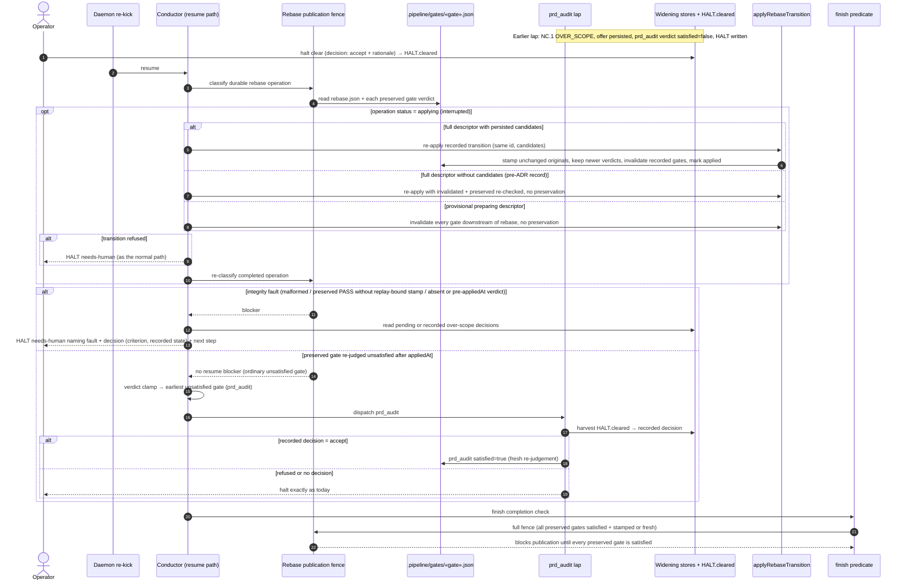

# Sequence: Over-scope accept survives the rebase publication fence

**Last updated:** 2026-10-04
**Scope:** Resume after a prd_audit over-scope halt on a feature whose applied rebase preserved
`prd_audit` (issue #2983). Shows the resume-time fence split (integrity faults vs. a fresh
unsatisfied re-judgement), the unchanged finish-time fence, resume-time completion of an interrupted (`applying`) operation, and the
HALT.cleared harvest it unblocks.

## Diagram

## Legend

- **Rebase publication fence** — `rebaseOperationPublicationBlocker` (`gate-code-validity.ts`). The
  feature splits its resume use from its finish use; finish keeps the full check.
- **prd_audit verdict reason** — the persisted unsatisfied reason reports the real classification
  (awaiting operator decision) rather than a pre-reconciliation `missing-relation`.
- **applyRebaseTransition** — the existing idempotent transition writer; it now persists
  preservation candidates on the operation record so resume can complete an interrupted operation
  (adr-2026-10-04-resume-completes-interrupted-rebase-operation).
- `«gate»` — any gate named in the rebase transition's `preserved` list.

## Change Log

| Date | Change | Reason |
|------|--------|--------|
| 2026-10-04 | Initial generation | #2983: operator accept stranded behind the resume-time rebase fence |
