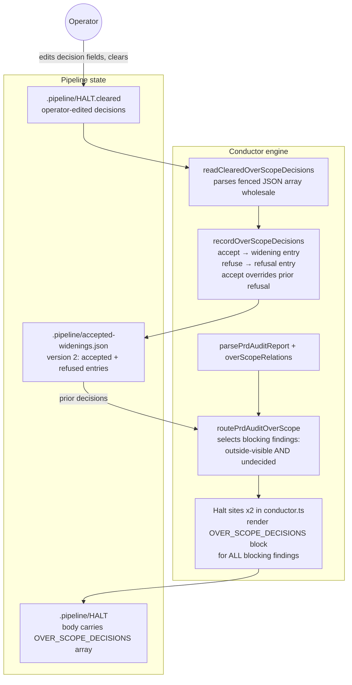
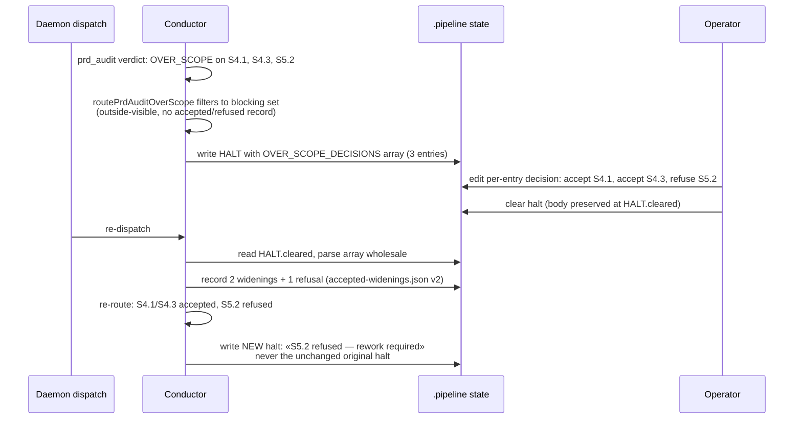

# Architecture: OVER_SCOPE multi-finding decision block

**Last updated:** 2026-08-24
**Scope:** Feature-scoped view of the OVER_SCOPE halt/clear path — candidate selection at the
conductor's two halt sites, the `OVER_SCOPE_DECISIONS` halt-body block, and the durable
accept/refuse record consumed on clear. Issue jstoup111/ai-conductor#1846.

## Components

## Sequence: multi-finding halt cleared in one pass

## Legend

- **Blocking finding:** grade OVER_SCOPE, intent relation `outside-visible`, and no durable
  accept/refuse decision for its criterion.
- **Durable refusal:** persists across laps; the next halt names the refusal instead of
  re-offering acceptance. A later `accept` decision for the same criterion overrides it. A
  refusal is moot once the audit no longer flags the criterion.
- The legacy single-line `OVER_SCOPE_ACCEPT:` marker and its single-match reader are removed
  (pre-v1 breaking change, operator-approved).

## Change Log

| Date | Change | Reason |
|------|--------|--------|
| 2026-08-24 | Initial generation | DECIDE for #1846 |
