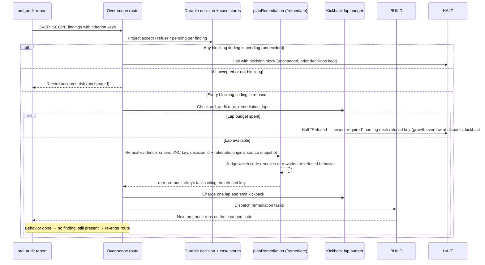

# Sequence: Over-scope refusal routes to BUILD rework

**Last updated:** 2026-10-03
**Scope:** How the SHIP `prd_audit` gate routes an outside-visible `OVER_SCOPE` finding that an operator has durably refused (#2931). The serial tail and the validation-group join share this route. This is a logical sequence; storage formats stay with the existing stores.

## Diagram

## Legend

- **Durable decision + case stores:** the existing `AcceptedWideningDecisionStore` and `RemediationCaseStore`. Refusal is read here and never written by this route.
- **planRemediation:** the existing SHIP-gate remediation planner. Refusal is a new kind of evidence for it, not a separate writer. The `rem-prd-audit-*` id scheme and upsert semantics are unchanged.
- **Kickback lap budget:** the existing `prd_audit.max_remediation_laps` (default 1). A refused finding that survives a spent budget halts with the existing refusal block.
- **Pending wins:** if any blocking finding is undecided, the feature halts as it does today, so an operator decision is never skipped. Refused findings are remediated only once nothing is pending.

## Change Log

| Date | Change | Reason |
|------|--------|--------|
| 2026-10-03 | Initial sequence | #2931: a durable refusal currently re-halts forever on unchanged code |
