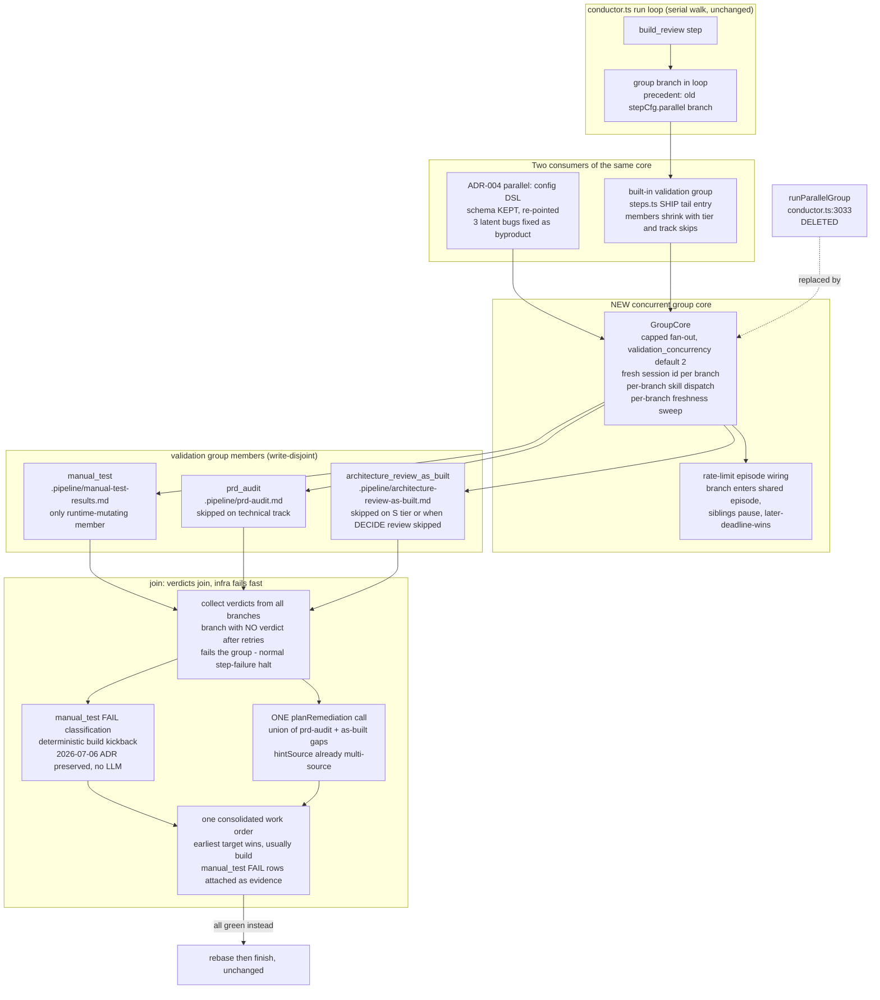

# Components: Parallel Validation Phase — one concurrent group core (#469)

**Last updated:** 2026-07-10
**Scope:** The SHIP-tail fan-out seam — a NEW concurrent group core replacing
`runParallelGroup`, the built-in validation group over
`manual_test` / `prd_audit` / `architecture_review_as_built`, the re-pointed
ADR-004 `parallel:` config DSL, and the union join into one `planRemediation`
call. Everything not marked NEW/DELETED is the existing engine.

## Diagram

## Legend

- **GroupCore** — the single new concurrency primitive. Both the built-in validation
  group and the config-DSL groups execute through it; there is no second executor.
- **DELETED** — `runParallelGroup` is removed, not deprecated. Its three latent bugs
  (dispatched the group name instead of each branch's skill, unbounded `Promise.all`,
  no rate-limit/retry wiring) die with it; the `when-parallel` tests are rewritten
  against the corrected semantics.
- **Write-disjoint members** — each validator writes its own stable `.pipeline/` file;
  none reads another's output (verified — only prose "after X" lines ordered them).
- **Join** — a FAIL *verdict* waits for siblings and joins the consolidated kickback;
  a branch that terminates with *no verdict* (the #385 failure shape) fails the group
  through the normal step-failure path so infra breakage stays loud.
- **manual_test FAIL classification** — stays deterministic per the APPROVED
  2026-07-06 manual-test-fail-routing ADR; remediate never re-classifies it.
- `«…»` — placeholder for a variable value.

## Change Log

| Date | Change | Reason |
|------|--------|--------|
| 2026-07-10 | Initial generation | DECIDE phase for #469 spec |
| 2026-07-10 | Confirmed against implementation plan (30 tasks); auto-mode-only scoping from conflict resolution noted | /plan step 8b |
