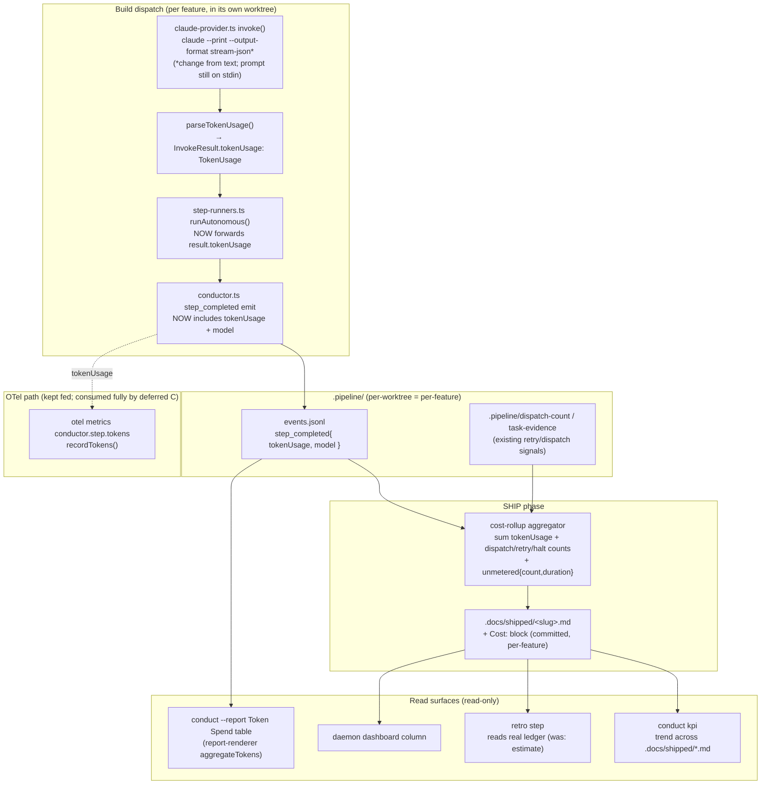

# Architecture: Per-feature token accounting

Component/data-flow view (C4 component level) of Approach A. Solid arrows = data flow added or
newly-wired by this feature; dashed arrows = existing paths kept fed for the deferred OTel (C) work.

## Capture → attribute → persist → report

## Key structural decisions (detailed in architecture-review / ADRs)

1. **Per-feature attribution comes from the worktree, not an event slug.** `.pipeline/events.jsonl`
   is per-worktree; each feature builds in its own worktree, so no feature dimension needs to be
   added to the shared event bus. The rollup reads the worktree-local ledger at ship.

2. **The committed rollup lives in `.docs/shipped/<slug>.md`.** It is the canonical per-slug
   shipped record, already committed at ship and merged atomically — so the KPI trend is computable
   by reading committed files, with no new database or daemon-shared store.

3. **"Unmetered" is a first-class field, never an omission.** Sessions the engine cannot meter
   (human operator sessions; any dispatch whose usage parse fails) increment an explicit
   `unmetered{count,duration}` so a partial total is visibly partial.

4. **The emit carries tokenUsage AND model** so the same event feeds both the ship rollup and the
   existing OTel counter — the deferred OTel (C) work becomes a consumer swap, not a re-wire.
