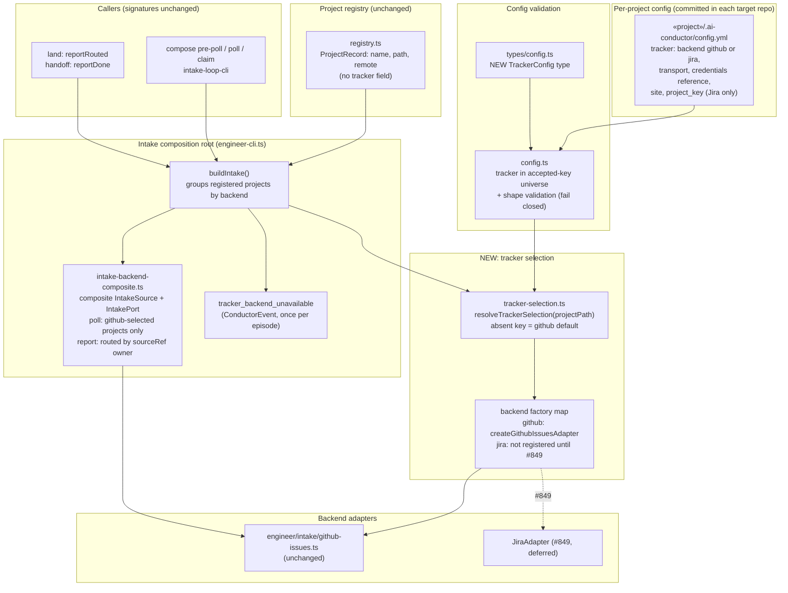

# Components: Per-Project Work-Tracker Backend Selection (#845)

**Last updated:** 2026-09-28
**Scope:** Target-state component view of per-project tracker backend selection at the intake
composition root. It covers the project `tracker` config key reserved by
adr-2026-07-22-canonical-tracker-client-seam, the single resolver that reads it, and the
`buildIntake()` backend factory. That factory assembles a composite intake source/port for poll,
claim, and the land/handoff write-backs. Daemon backlog (#851), close/linkage (#852), and
gate/halt write-backs (#853) are out of scope. Paths are relative to `src/conductor/src/engine/`.

## Diagram

## Legend

- **Registry (unchanged):** the machine-local registry keeps its record shape. Backend selection is
  committed project config, not registry state.
- **tracker-selection.ts (new):** the only reader of the `tracker` key. It returns a validated
  `TrackerSelection` and defaults to `github` when the key is absent.
- **Composite source/port:** polls each backend over its own projects and routes `report()` to the
  backend that owns the `sourceRef`. For an all-GitHub registry it delegates to exactly one GitHub
  adapter built as today, so the path stays byte-for-byte identical.
- **Dashed edge:** deferred integration. A `jira` project is excluded from polling and produces one
  diagnostic event until #849 registers an adapter.

## Change Log

| Date | Change | Reason |
|------|--------|--------|
| 2026-09-28 | Initial generation | #845 DECIDE: per-project tracker backend selection |
| 2026-09-28 | Named the composite module and the event | #845 plan update |
