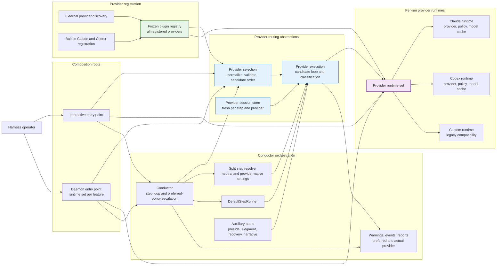
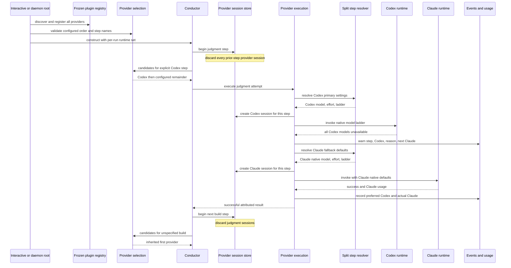
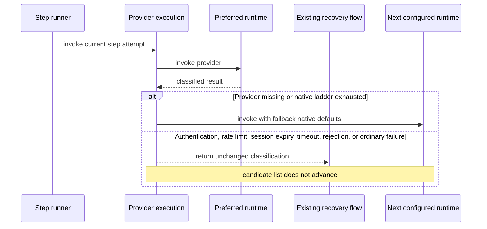

# Components + Sequence: Provider-Aware Step Execution

**Last updated:** 2026-07-24
**Scope:** Planned provider registration, per-step selection, provider-native
runtime state, ordered fallback, step/provider sessions, and attributed results
for issue #927.

## Component Diagram

## Sequence: Explicit Provider, Model Exhaustion, and Fallback

## Sequence: Failure Classification Boundary

## Planned Invariants

- The run-level scalar or ordered provider selection is normalized once; the
  first entry is inherited only when a step has no explicit provider.
- A step's explicit provider is attempted first, followed by the remaining
  run-level providers in declared order without duplicates.
- Provider-neutral settings are resolved separately from provider-native model,
  effort, escalation, and fallback-ladder settings.
- Each runtime owns its provider instance, native policy, model-availability
  cache, and deterministic run-wide-unavailability state.
- Sessions are fresh at every step boundary and isolated by provider. Only a
  retry within the same step and provider may resume.
- Authentication, rate limits, session expiry, timeouts, rejected work, and
  ordinary failures never advance the provider candidate list.
- Normal, grouped, prelude, judgment, attribution, recovery, narrative,
  interactive, and daemon paths use the same execution boundary.
- Warnings, events, usage, and reports distinguish preferred from actual
  provider.

## Diagram Impact Boundary

Issue #927 changes internal conductor components and invocation sequences. It
adds no database, datastore relationship, independently deployable container,
external user type, or new external provider integration. System-context,
container, and ERD diagrams therefore require no update.

## Legend

- **Green** marks the frozen registry containing every available integration.
- **Blue** marks the new provider-routing abstractions.
- **Purple** marks per-run provider-native runtime state.
- Solid arrows show runtime calls or construction dependencies.

## Change Log

| Date | Change | Reason |
|------|--------|--------|
| 2026-07-24 | Initial current-state diagram | DECIDE architecture input for issue #927 |
| 2026-07-24 | Replaced run-global flow with planned provider-aware components and sequences | Plan update for issue #927 |
