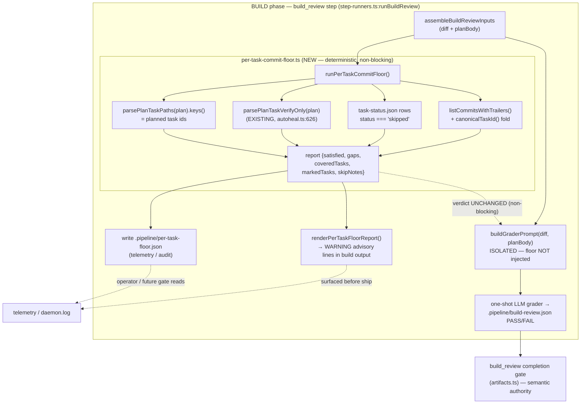

# Architecture — Per-task "work happened at all" floor

**Stem:** `per-task-work-happened-floor` · Tier M (lightweight diagram) · 2026-07-22

The floor is a **standalone deterministic advisory** computed inside the existing
`build_review` step, BEFORE the isolated LLM grader dispatch. It never mutates the
grader's inputs and never blocks — it writes a telemetry artifact and surfaces
advisory lines into the build output. The grader's holistic completeness rubric
remains the semantic authority; the floor is the cheap "did work happen at all"
first pass beneath it.

## Component / dataflow (C4 component level)

## Key architectural decisions (see ADR)

1. **Non-blocking, out-of-grader.** The floor does NOT inject into `buildGraderPrompt`
   (that prompt explicitly forbids per-task SHA/reachability reasoning — #773) and does
   NOT auto-kick-back. It composes "under" `build_review` by running first, in the same
   step, as an advisory. This is the wedge-free reading of the guardrail.
2. **Wedge-free inputs only.** Signal = `{ ≥1 Task:-trailered commit (canonical fold) }`
   OR `{ verify-only marker }` OR `{ task-status skipped }`. No `**Files:**` path
   corroboration, no dirname matching, no SHA reachability, no pinned stamps.
3. **Fail-soft.** Any git/parse error degrades to `skipNotes` with `satisfied: true`
   and zero gaps — the advisory never fabricates a flag from missing data
   (mirrors `overlap-scan.ts`).
4. **Reuse, don't reinvent.** Both marker halves (`parsePlanTaskVerifyOnly`) and the
   trailer read path (`listCommitsWithTrailers` / `canonicalTaskId`) already exist.

## Touched modules

- NEW `src/conductor/src/engine/per-task-commit-floor.ts`
- `src/conductor/src/engine/step-runners.ts` (`runBuildReview` — compute + surface)
- `src/conductor/src/types/config.ts` + `resolved-config.ts` (optional kill-switch)
- Docs: `CHANGELOG.md`, `README.md`, `src/conductor/README.md`, `skills/plan/SKILL.md`
