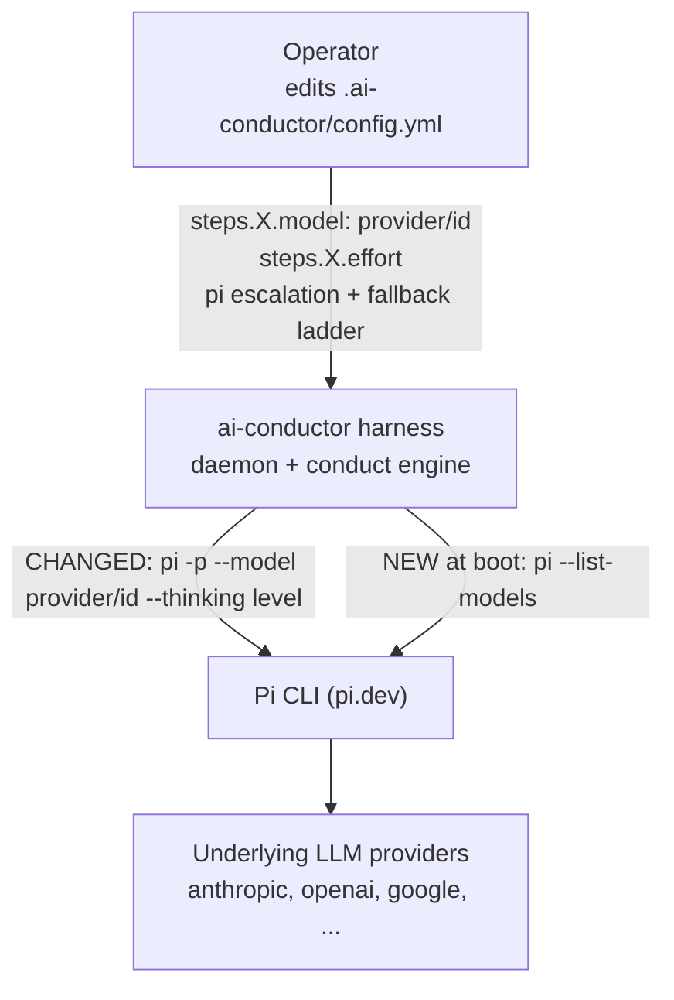
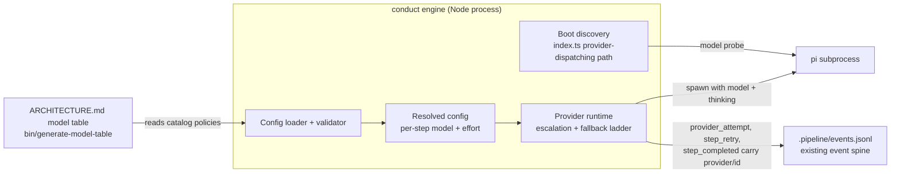
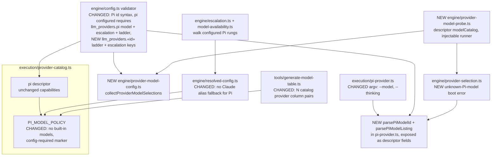
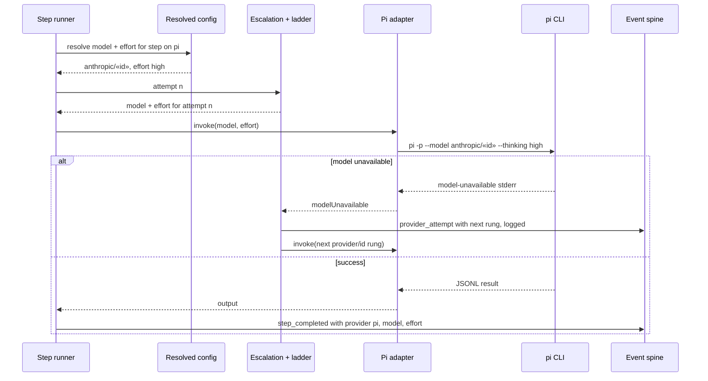
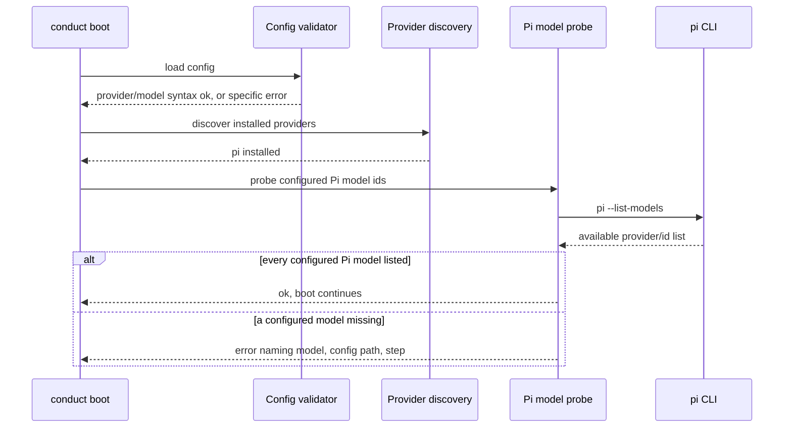

# Architecture: Pi per-step model selection via wrapped providers (#1885)

**Last updated:** 2026-09-29
**Scope:** Pi-dispatched steps run on an operator-chosen `provider/id` model at a `--thinking` level
mapped from the harness `effort`. Selection, tier promotion, retry escalation, and the availability
fallback ladder use the existing string-based model machinery. Config validation and a boot-time
`pi --list-models` probe reject unknown selections. The model table widens to N catalog-derived
provider column pairs.

## Current state (grounding)

- `execution/pi-provider.ts:129` spawns `pi -p --no-session --mode json` and passes no `--model`,
  `--provider`, or `--thinking`; `InvokeOptions.model`/`effort` are received and ignored.
- `execution/provider-catalog.ts:65-77`: `PI_MODEL_POLICY` sets every `stepModels` entry to `''`.
  It has a single `''` rung for `modelEscalationOrder` and `modelFallbackLadder`, and copies
  Claude's `effortOrder`. The pi descriptor declares `capabilities: {}`. `PROVIDER_CAPABILITY_OWNERS`
  has no #1885 entry.
- `engine/config.ts:737-738` only checks that a step `model` is a string. There is no
  provider-aware model validation and no configurable escalation order.
- `engine/resolved-config.ts:252-296` resolves the per-step model, and `FALLBACK_MODEL='sonnet'`
  (:95) is the last resort. For a Pi step that fallback is a meaningless Claude alias.
- `engine/escalation.ts:62-110` bumps effort, then the model, through the policy's orders.
- `src/conductor/src/tools/generate-model-table.ts:316-346,395` hardcodes two provider column pairs
  (`Claude model | Claude effort | Codex model | Codex effort`), spliced into ARCHITECTURE.md.
- `index.ts:505-532` runs boot discovery and `validateProviderInstallation` on
  provider-dispatching commands only. This spec adds the model probe at this seam.
- Events `provider_attempt`, `step_completed`, and `step_retry` already carry optional
  `model`/`effort`/`provider` (`types/events.ts:279,726,886`).

## System Context (L1)

## Containers (L2)

## Components (L3)

## Sequence: Pi step dispatch with escalation and fallback

## Sequence: Boot-time Pi model validation

## Legend

- **NEW**: component or call added by this spec. **CHANGED**: existing component whose behavior
  changes. Everything else is unchanged context.
- `provider/id` is Pi's canonical underlying-provider model id (for example
  `anthropic/claude-opus-4-5`). Thinking is never encoded as a `:suffix`; it is always derived
  from `effort`.
- «id» marks a variable part of a label.

## Change Log

| Date | Change | Reason |
|------|--------|--------|
| 2026-09-29 | Initial generation | DECIDE for #1885 (Pi per-step model selection) |
| 2026-09-29 | Plan update: named probe, selection enumerator, parser seams | /plan for #1885 |
| 2026-09-29 | Conflict check: llm_providers.pi model, escalation and ladder required; top ladder exempts Pi only | Operator decisions |
| 2026-09-29 | Dropped modelSelection flag; static check is syntax-only; added llm_providers block | Architecture review decisions |
