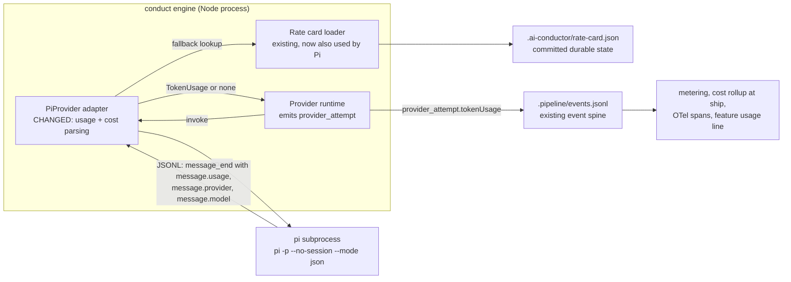
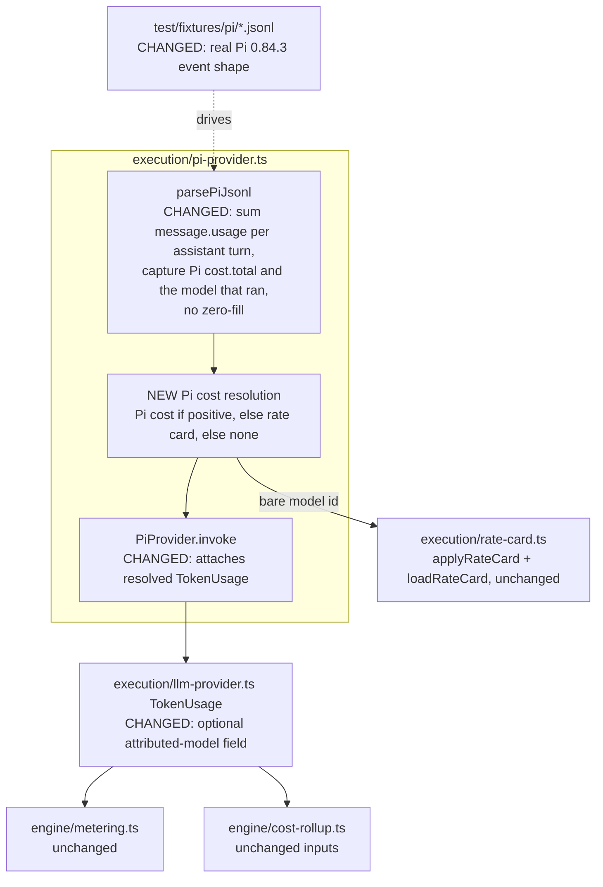
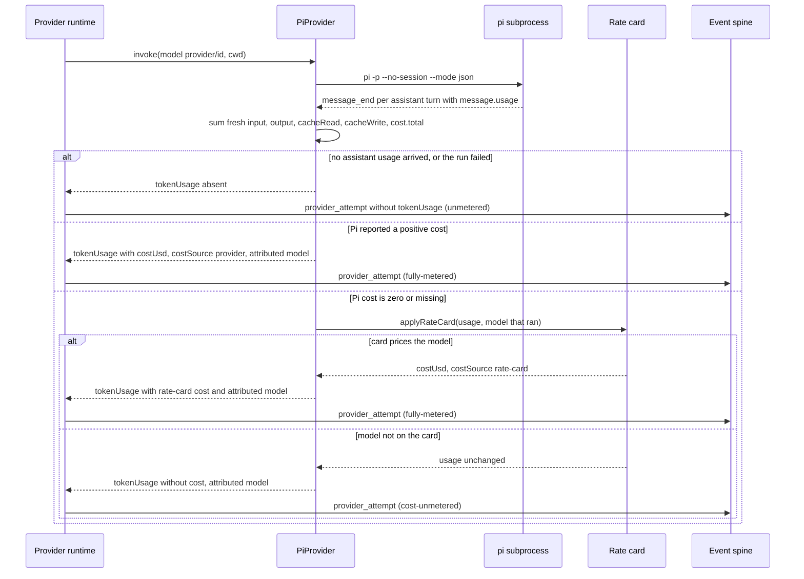

# Architecture: Pi runs report token usage and cost into harness telemetry (#1889)

**Last updated:** 2026-10-02
**Scope:** A completed Pi dispatch writes truthful token usage and a cost to the existing
`provider_attempt` event. Usage comes from Pi's per-turn assistant messages. Cost comes from Pi's
own figure when it reports one, falls back to the committed rate card for the model that ran, and
otherwise stays tokens-only. A run with no usage is recorded as unmetered and never zero-filled.
The model the cost was attributed to is recorded beside it. No new channel is introduced.

## Current state (grounding)

- `src/conductor/src/execution/pi-provider.ts:153-165` reads usage from a top-level `event.usage`
  on `message_update` / `message_end` lines. Pi 0.84.3 emits no such field: the
  `pi-agent-core` event union is `{ type: "message_end"; message: AgentMessage }`, and usage lives
  on `AssistantMessage.usage` (`pi-ai/dist/types.d.ts:265-286, 307-327`). The repository fixture
  `src/conductor/test/fixtures/pi/terminal-assistant.jsonl` is hand-authored in the non-existent
  shape.
- `pi-provider.ts:171-173` zero-fills `{ input: 0, output: 0 }` whenever an assistant turn was seen
  and no usage parsed. Every live Pi dispatch therefore records fabricated zero usage as
  `cost-unmetered`.
- Pi's `Usage` carries fresh-only `input` (Pi subtracts cached volume, e.g.
  `openai-responses-shared.js:444-445`), `output`, `cacheRead`, `cacheWrite`, optional
  `reasoning` (a subset of `output`), and `cost.total`, which Pi computes from its model registry
  (`pi-ai/dist/models.js:527`, tiered and 1h-cache aware). Each assistant message is one LLM call,
  so its usage is per-turn and a step total is the sum across turns.
- `AssistantMessage` carries `provider` and `model` (and optional `responseModel`): the model that
  actually ran.
- `execution/rate-card.ts:152` `applyRateCard(usage, model, card)` prices token-only usage and sets
  `costSource: 'rate-card'`; it leaves provider-reported cost untouched and fails closed on an
  unknown model. Only `codex-provider.ts:372,544` calls it today. The card is keyed by bare model
  id (`.ai-conductor/rate-card.json`).
- `engine/metering.ts` classifies `fully-metered` / `cost-unmetered` / `unmetered` from
  `TokenUsage` alone. `engine/cost-rollup.ts:78-142` is provider-agnostic and buckets cost by
  `step`, `event.model`, and `costSource`. `engine/otel/span-manager.ts:370` exports
  `costSource`.
- The pi descriptor declares `capabilities: {}` (`execution/provider-catalog.ts`), so Pi is outside
  `COST_SELF_REPORTING_PROVIDERS` (`engine/provider-model-policy.ts:68`).

## Containers (L2)

## Components (L3)

## Sequence: one Pi step's usage and cost

## Legend

- **CHANGED** marks an existing component whose behavior this spec alters; **NEW** marks a component
  added by this spec. Unmarked components are consumed unchanged.
- "Model that ran" is Pi's `message.provider` + `message.model` from the assistant messages, not the
  harness-requested model. When they differ, the cost is attributed to the model that ran.
- `costSource: 'provider'` is reused for Pi's own figure. A distinct label for Pi-computed estimates
  is out of scope (track scope boundary).

## Change Log

| Date | Change | Reason |
|------|--------|--------|
| 2026-10-02 | Initial generation | #1889 DECIDE, approach B |
