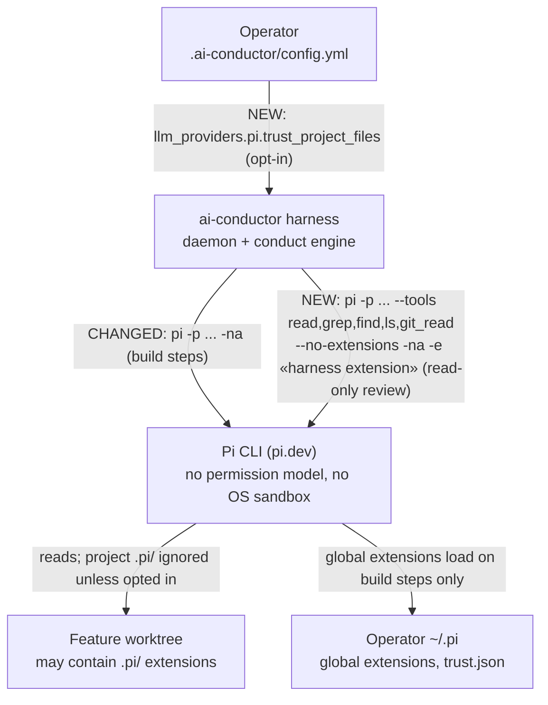
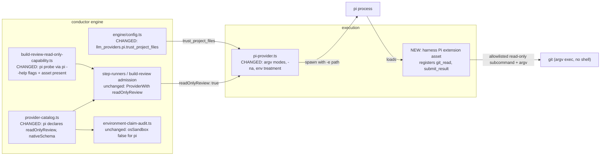
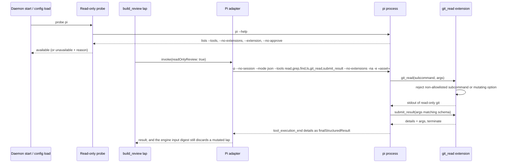

# Architecture: Pi runs stay contained despite Pi having no permission model (#1886)

**Last updated:** 2026-09-29
**Scope:** Two changes. First, Pi gains the catalog `readOnlyReview` and `nativeSchema` capabilities, so it can serve
custom-policy build_review laps. It runs with a tool allowlist and a harness-owned Pi extension
that registers a shell-free `git_read` tool. Second, every unattended Pi dispatch ignores
project-local `.pi/` files unless operator config opts in, and runs under the same daemon env
treatment as codex. The claim audit keeps treating Pi as having no OS sandbox. OS
write-containment is out of scope (#2851).

## Current state (grounding)

- `execution/pi-provider.ts:129` spawns `pi -p --no-session --mode json` with `cwd` only. It
  ignores `readOnlyReview`, passes no `-na`, no `--tools`, and no `--no-extensions`, and sets no
  `env`, so the raw daemon env is inherited.
- `execution/provider-catalog.ts:145-161`: the Pi descriptor has `osSandbox: false` and
  `capabilities: {}`. `PROVIDER_CAPABILITY_OWNERS.readOnlyReview = '#1886'` (:32).
- `engine/build-review-read-only-capability.ts:118-124`: `probeReadOnlyReviewCapability` checks
  codex (`codex sandbox -P :read-only` write probe) and claude (`--help` lists the restricted
  flags). Any other provider gets "provider has no read-only review mode".
- `engine/build-review-policy-contract.ts:28` types a lap member as `ProviderWith<'readOnlyReview'>`.
  An undeclared capability becomes `read-only-review-unavailable` (`step-runners.ts:855-884`).
- `execution/claude-provider.ts:40-50`: claude read-only review exposes `Read,Grep,Glob,Bash`,
  with Bash limited to `git show|diff|log|ls-tree|ls-files|cat-file|rev-parse|blame|grep`.
- `execution/codex-provider.ts:1041-1053`: codex gets a daemon-session marker and a tmux-env
  scrub. Pi gets neither.
- `engine/self-host/environment-claim-audit.ts:87-89` builds `PROVIDER_OS_SANDBOX` from catalog
  `osSandbox`, so Pi is already present as `false`.
- Pi 0.84.3 (verified locally): `--tools <allowlist>` applies to built-in and extension tools.
  `--no-extensions` disables discovery, but explicit `-e` paths still load. `-na` ignores
  project-local files, including a saved `~/.pi/agent/trust.json` decision. `pi.registerTool()`
  registers a custom tool (`docs/extensions.md:78`).

## System Context (L1)

## Components (L3)

## Sequence: Pi read-only review member

## Legend

- **CHANGED / NEW** mark the surfaces this feature touches. Everything else is context.
- `«asset»` is the absolute path of the shipped harness extension. The engine resolves it relative to
  its own install.
- `git_read` never goes through a shell. It takes a subcommand from a fixed read-only set plus an
  argv array.
- Out of scope: OS write-containment for any provider (#2851), Pi self-host (#1887), and Pi
  model selection (#1885, whose `llm_providers` block this feature extends).

## Change Log

| Date | Change | Reason |
|------|--------|--------|
| 2026-09-29 | Initial generation | #1886 DECIDE |
| 2026-09-29 | Added submit_result / nativeSchema | Architecture review: readOnlyReview is inert without nativeSchema |
