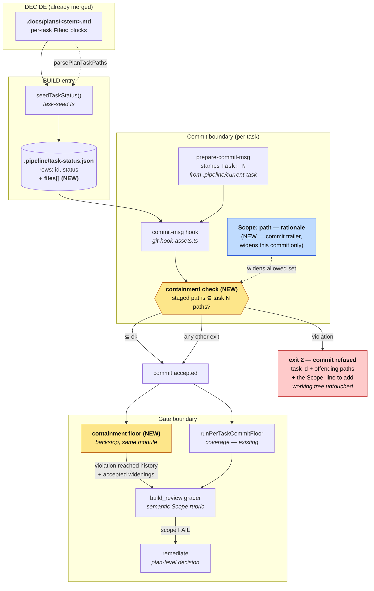

# Architecture: Plan-scope containment at the commit boundary

**Date:** 2026-08-02
**Track:** Technical
**Tier:** M
**Related:** `.docs/track/pipeline-commits-files-outside-the-active-plan-bef.md`

## Context

Today the only thing that notices a BUILD commit touching files outside the approved plan is
`build_review`, an LLM grader that runs after the entire build. This adds a deterministic
containment check at the commit boundary, and a non-LLM backstop at the build-step boundary,
without weakening the semantic reviewer.

## Component view (C4 level 3 — the BUILD commit path)



> **Amended 2026-08-09 by #1390:** the containment check no longer refuses a commit. The
> `exit 2 — commit refused` edge above is retired and the exit code reserved; a violation now exits
> 0 with an advisory and is recorded as an accepted widening for `build_review`. The refusal edge
> was never enabled in production — enforcement shipped `false` — and is withdrawn because the
> floor it would have enforced rejects adjacent test files and same-directory neighbors. The floor
> is correspondingly widened (test siblings, same-directory neighbors, docs/generated artifacts).
> See `adr-2026-08-09-non-blocking-plan-scope-containment`.

## Sequence — the #1074 shape, after this change

```mermaid
sequenceDiagram
    participant A as Build agent
    participant G as git
    participant H as commit-msg hook
    participant S as task-status.json

    Note over A: Plan Task 3 declares<br/>engine/config.ts + its test
    A->>G: git commit (config.ts, config.test.ts)
    G->>H: run hook, Task: 3
    H->>S: read task 3 files[]
    H-->>G: paths ⊆ declared → exit 0
    G-->>A: commit accepted

    Note over A: agent drifts into<br/>unrelated finish work
    A->>G: git commit (artifacts.ts,<br/>changelog-pr-finalizer-cli.ts)
    G->>H: run hook, Task: 3
    H->>S: read task 3 files[]
    H-->>G: NOT ⊆ declared → exit 2
    G-->>A: REFUSED — task 3, offending:<br/>artifacts.ts, changelog-pr-finalizer-cli.ts<br/>(working tree intact)
    Note over A: forward paths: narrow the commit,<br/>or add "Scope: &lt;path&gt; — &lt;rationale&gt;"<br/>to the message. Never "delete the work".
    A->>G: git commit, message + Scope: trailers
    G->>H: run hook, Task: 3
    H-->>G: trailers widen this commit → exit 0
    G-->>A: commit accepted; widening recorded<br/>by the containment floor for build_review
```

## Key decisions embodied here

**Per-task paths are seeded into `task-status.json`, not re-parsed in shell.**
`seedTaskStatus()` already receives `planPath` and already parses it to create one row per
task. Adding a `files: string[]` field there gives the hook an authoritative, cheap, local
lookup with no markdown parsing in bash and no plan-path resolution inside a git hook.
`TaskStatusRecord` carries an open index signature (`task-seed.ts:13-18`), so the field is
purely additive. It also revives the hook's existing-but-dead `t.files` read path rather than
inventing a parallel one.

**Matching reuses `fileMatchesPlanPath` semantics.** Plans write basenames or partial paths
while git reports repo-relative paths, so matching is segment-anchored suffix matching — the
rule already proven in `autoheal.ts:41` where `trail.ts` must not match `audit-trail.ts`.
The TypeScript function stays the single source of truth; the hook's inline `node -e` calls
into the built engine rather than re-implementing the rule in shell.

**The check refuses; it never deletes.** Per #989 and the `0bf9d809b` incident recorded in
`build-review-disposition.ts:255-274`, handing a scope finding to an unsupervised agent whose
only lever is deletion destroys legitimate work. Refusal at the commit boundary leaves the
working tree fully intact and names two non-destructive forward paths.

**The widening rides on the commit message, not on a committed file.** A file at
`.docs/scope-dispositions/<stem>.md` was the original design and is rejected: the file is
itself a staged path that no task's `Files:` block declares and that the machinery allowlist
does not cover, so the commit introducing the record that authorizes a widening is itself an
out-of-scope commit — the escape hatch deadlocks. A `Scope: <path> — <rationale>` trailer
cannot deadlock (a message is not a staged path), authorizes exactly the commit it rides on
rather than conferring standing permission for the rest of the build, and is read by the
`git interpret-trailers` call the hook already makes at `git-hook-assets.ts:100` — no markdown
parser, no docs-guard change.

**Reviewability is restored by the backstop, not by the author.** `build_review`'s inputs carry
a diff, not the commit log, and this repository squash- or rebase-merges, so a trailer alone
would not reach the grader. `runContainmentFloor` therefore records every accepted widening —
path, rationale, task id, sha — into `.pipeline/containment-floor.json` and supplies it as a
`build_review` input. Machinery-authored placement is correct for that record precisely because
it is engine-observed evidence rather than a self-granted permission.

**The check is three-valued, and ships report-only.** `COMMIT_MSG_HOOK` runs under `set -e`
(`git-hook-assets.ts:92`), so a two-valued "non-zero means violation" contract would make a
stale `dist`, an unregistered subcommand, and a node crash indistinguishable from a real
violation — every intended abstention would fail closed. `0` allows, `2` refuses, any other
code abstains, and the hook captures the status rather than letting errexit propagate it. The
feature ships report-only (print the refusal, exit 0) so the real refusal rate is measured on
live builds before enforcement is switched on.

**Standing allowlist follows existing precedent.** `build-review-inputs.ts:60` already
excludes `MACHINERY_AUTHORED_PATHS = ['.docs/shipped/', '.pipeline/']` from the graded diff.
The containment check reuses that same constant so machinery-authored files can never be
reported as an agent's out-of-scope edit.

**Fail-open on legacy and on missing data.** A plan where no task declares a `Files:` block
is not contract-bearing; the check abstains, exactly as `wiring-probe.ts:578` demotes
findings for pre-contract plans. A missing/malformed `task-status.json`, an unresolvable task
id, or any thrown error abstains too. The check only ever blocks on positive evidence of a
violation.

**Exemptions are inherited wholesale.** The containment check sits inside the existing
`commit-msg` guarded block and therefore inherits every current exemption: merge commits,
`--amend`, rebase replay, and `CONDUCT_ENGINE_COMMIT=1` engine bookkeeping commits.

## Why a backstop is required, not optional

`writeGitHooksAndWire()` (`worktree-prepare.ts:384`) is deliberately fail-open — a hook-wiring
failure never blocks worktree provisioning. #625 further documents worktrees running stale
engine assets. So there are real conditions under which the hook is simply not live. The
containment floor added alongside `runPerTaskCommitFloor` catches violations that reached
history anyway and surfaces them at the build-step boundary, still well before SHIP.

## Boundaries — what this does not change

- `build_review`'s prompt, rubric, and `remediate` routing are untouched.
- Nothing gains authority to mark a task `completed`; `build_review` remains completion authority.
- The advisory `checkCommitEvidence` path-fallback and the per-task coverage floor keep their
  current advisory status.
