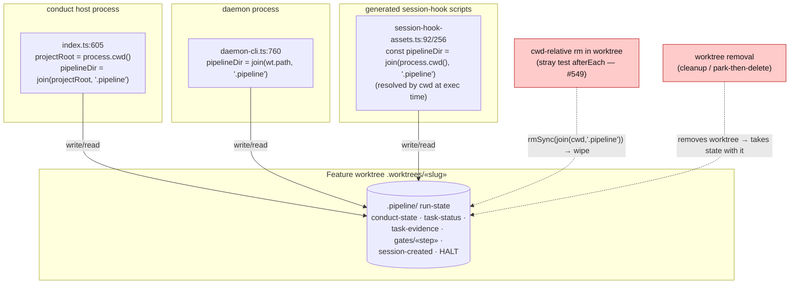
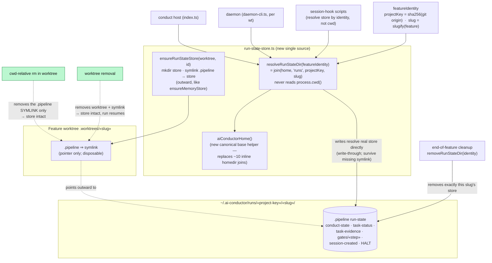

# Architecture: Relocate pipeline run-state to a home-dir store (#564)

**Last updated:** 2026-07-21
**Scope:** Where `.pipeline/` run-state (conduct-state.json, task-status.json,
task-evidence.json, gates/«step», session markers, HALT, and the other per-run
artifacts) is resolved, written, and read — across the host `conduct` path, the daemon
(running per feature worktree), and the generated session-hook scripts — **before**
(worktree-local, cwd-derived) and **after** (a canonical home-dir store keyed by feature
identity, with an outward symlink left in the worktree). Approach A of the DECIDE, tier L,
technical track. Mirrors the memory-store placement precedent (ADR-2026-06-29) and the
park-marker main-root anchoring (#486).

## Diagram — before (bug): run-state lives inside the worktree, addressed by cwd

## Diagram — after (fix): one canonical resolver, home-dir store, outward symlink

## Legend

- Cylinders are filesystem state; boxes are code paths; `⇒ symlink` is the outward
  pointer left in the worktree.
- `«slug»` / `«project-key»` / `«step»` are guillemet placeholders for variable path parts.
- **Before:** the three seams (`index.ts:605` cwd seed, `daemon-cli.ts:760` `wt.path`,
  `session-hook-assets.ts` literal `process.cwd()`) all address `.pipeline` at a
  worktree-local, cwd-derived path — so a cwd-relative `rm` (red, #549) or a worktree
  removal takes the live run-state with it.
- **After:** every seam resolves through `resolveRunStateDir(featureIdentity)`, whose
  location is the home-dir store namespaced by `projectKey` (cross-project collision-safe)
  and keyed by `slug`. The worktree keeps only a `.pipeline` **symlink**; removing it (or
  the whole worktree) leaves the store intact (green), so the run resumes. Writes resolve
  the real store directly (write-through), so they work even when the symlink is gone —
  the exact durability contract `recordMemoryEntry` already uses.
- **Precedents reused:** `projectKey()` (sha256 of git origin) from the memory store;
  the outward-symlink + write-through pattern from `ensureMemoryStore`/`recordMemoryEntry`;
  the "address by identity, not cwd" principle from the #486 park-marker fix.
- The state PRIMITIVES (`readState(path)`, `writeState(path)`, `gate-verdicts(dir)`,
  `halt-marker(projectRoot)`, `task-evidence(projectRoot)`) are already path-agnostic —
  this refactor changes only what root they are handed, plus the symlink/migration glue.

## Change Log

| Date | Change | Reason |
|------|--------|--------|
| 2026-07-21 | Initial generation | Engineer DECIDE for #564 (tier L, technical track, Approach A — home-dir store) |
