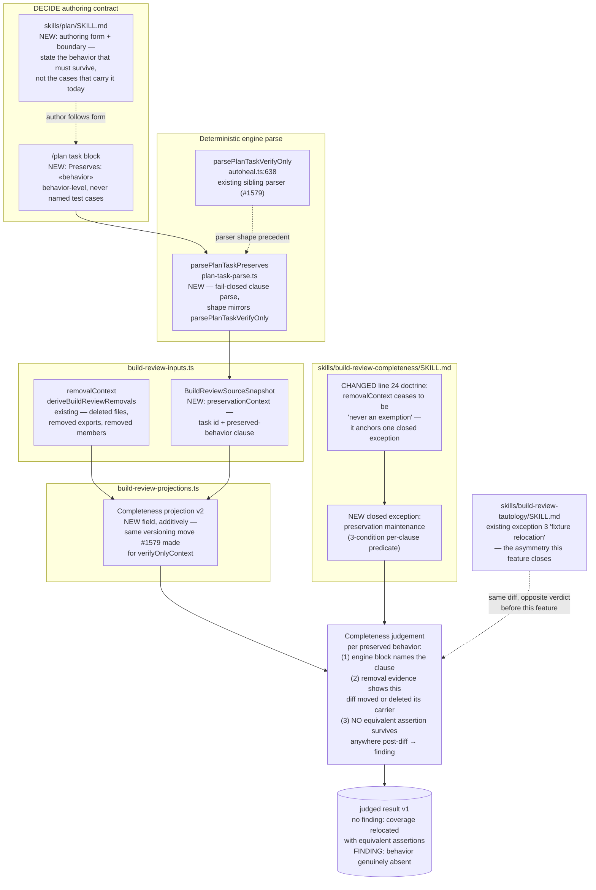

# Components: Preservation-Anchored Completeness Exception (#1580)

**Last updated:** 2026-08-16
**Scope:** The evidence flow for the first closed Completeness exception ("preservation
maintenance") — a plan-side behavior-level preservation form, its deterministic engine parse
(`plan-task-parse.ts`), the build_review source snapshot (`build-review-inputs.ts`), the
Completeness rubric's v2 projection (`build-review-projections.ts`), and the rubric judgement
contract in `skills/build-review-completeness/SKILL.md`.

Deliberately **not** in scope: `build-review-prompt.ts`. The rubric fan-out
(`build-review-registry.ts`) dispatches each rubric to its own SKILL.md against a versioned
projection; `buildGraderPrompt` is no longer on the live dispatch path (referenced only from
tests and comments), so the exception contract lands in the rubric skill, not the monolithic
prompt.

## Diagram

## Legend

- **NEW** / **CHANGED** — surfaces added or altered by this feature; everything else exists today.
- Solid arrows: data/evidence flow. Dotted arrows: contract, precedent, or the defect being closed.
- The engine block is *evidence, not exemption* — the same doctrine as the #1521 removal anchor and
  the #1579 verify-only anchor. The rubric still applies a closed per-clause predicate; a preserved
  behavior with no surviving equivalent assertion still produces a Completeness finding.
- The negative path is condition (3): relocation alone never exempts. A deleted carrier whose
  assertions were not re-established anywhere is exactly the case this rubric must keep failing.
- Excluded by operator scope decision: the task-count warning band (outcome 3) and a non-human
  resolution path for over-specified plans (outcome 4).

## Change Log

| Date | Change | Reason |
|------|--------|--------|
| 2026-08-16 | Initial generation | DECIDE phase for #1580 |
