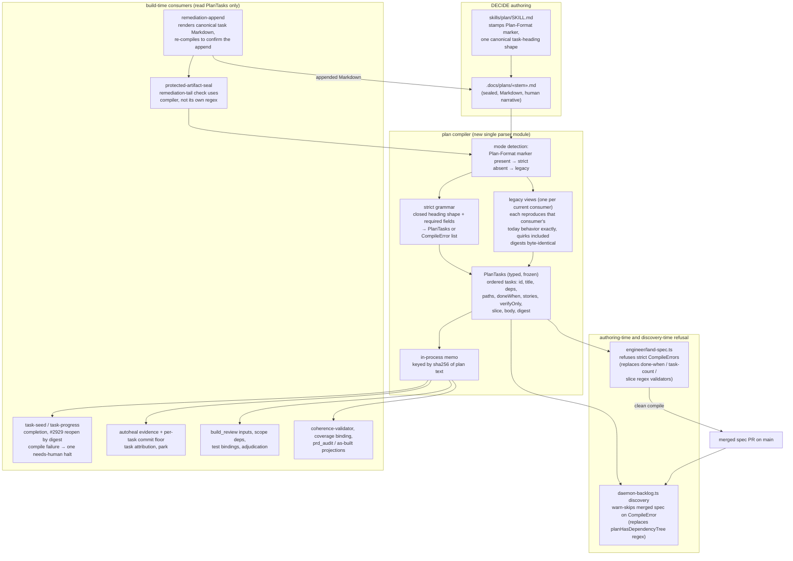
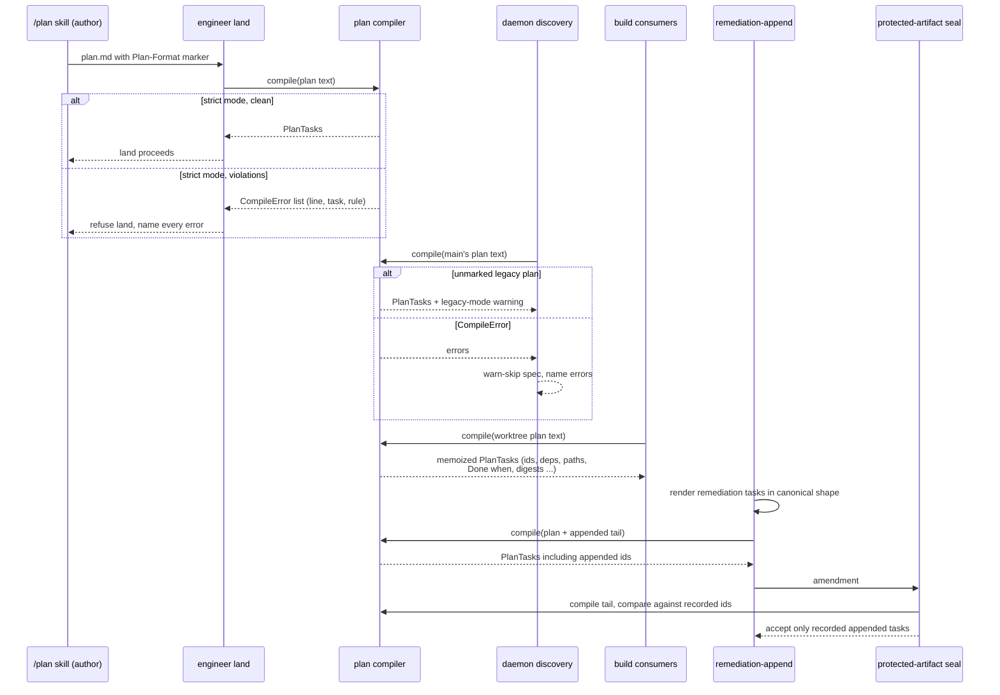

# Components + Sequence: one plan compiler as the only task-structure parser (#623)

**Last updated:** 2026-10-10
**Scope:** how a plan's task structure (ids, titles, dependency edges, declared paths,
`Done when`, story ids, verify-only, slices, bodies, digests) reaches every engine consumer.
Today ~51 call sites read it through `plan-task-parse.ts` / `autoheal.ts` parsers, and at least
six engine modules carry their own ad-hoc task-heading regexes. After this change one module,
the plan compiler, is the only code that recognizes a task heading. It has two modes, chosen by
a format marker the `/plan` skill stamps into new plans: **strict** (closed grammar, any
violation is a named compile error) and **legacy** (today's tolerant grammar, outputs identical
to today's parsers, including task digests). Plans stay authored Markdown; no JSON is committed.

## Diagram

## Legend

- **Plan compiler:** the new single module. No other engine module may match a task heading;
  every caller uses its typed `PlanTasks` (or `CompileError` list).
- **Strict / legacy:** the format marker (a plain non-heading line before the first task
  heading) selects the mode. Legacy mode exists only so plans authored before the marker
  (in-flight builds, merged-unbuilt specs, consumer plans) keep working unchanged: it is a set of
  named legacy views, one per current consumer interpretation, because today's parsers disagree
  with one another. Its removal is a later, separate feature.
- **Build-time halt:** a marked plan that stops compiling mid-build raises one `needs-human`
  halt at plan read naming every error; no consumer treats a compile failure as an empty plan.
- **Module layout (from the plan):** `src/conductor/src/engine/plan-compiler/` holds `compilePlan`,
  the marker, legacy views, strict grammar, dependencies, digests, and `checkPlan`. `checkPlan`
  applies the engine's appended-task record after compilation and enforces authored-task required
  fields. The existing `plan-task-parse.ts` and `autoheal.ts` exports become adapters over
  `compilePlan` that throw `PlanCompileFailure` on a failed compile.
- **In-process memo:** a pure cache keyed by the plan text's sha256. Nothing is written to disk,
  so no derived artifact can go stale or trip the `.docs/plans` seal.
- **Digest identity:** for an unchanged legacy plan, the compiler's task digests equal today's
  `planTaskDigests` output byte for byte, so the #2929 reopen flow does not fire on upgrade.

## Change Log

| Date | Change | Reason |
|------|--------|--------|
| 2026-10-10 | Initial generation | #623 — replace drifting task-heading regexes with one two-mode plan compiler |
