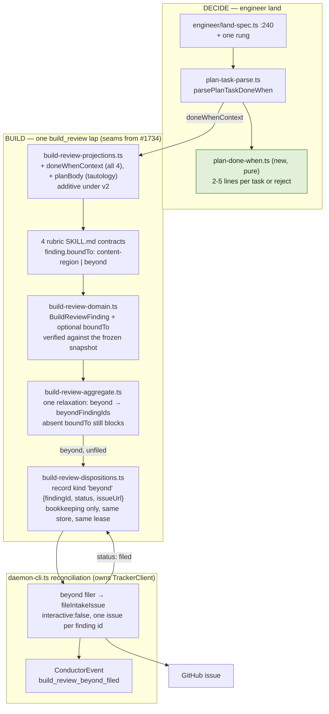
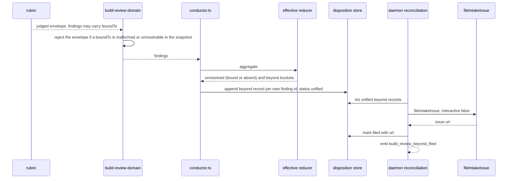

# Architecture: Done-when bound plan gate and build_review

**Last updated:** 2026-08-21
**Scope:** A land-time shape gate for the plan `**Done when:**` block (parser in
`plan-task-parse.ts`, validator in a pure module); an optional `boundTo` per finding (`content-region`
over a criterion line, or `beyond`); one reducer relaxation so `beyond` findings never block; a
`beyond` record kind in the existing disposition store as filing bookkeeping; daemon-side filing.
Covers jstoup111/ai-conductor#1763 and absorbs the shrink-or-file outcome of #1718.
**Builds on #1629's in-flight implementation (PR #1734)** — its reducer relaxation (ADR
2026-08-18 D8), second-record-kind-in-the-same-store pattern (D6), closed-identity rule (D7), and
spine event (D10) are reused verbatim; this feature must build after #1734 merges.
Builds after PR #1750 too (shares `plan-task-parse.ts`). Line references at `dae009a66`. Governing
ADR: `adr-2026-08-21-review-bound-by-plan-done-when-criteria`.

## Diagram: components (L3)

## Diagram: a lap with a beyond-criteria finding

## Legend

- **Green** — the only new module. Everything else is a field, a branch, or a record kind added at
  a seam #1734 already reshapes.
- `boundTo` is a `content-region` reference whose hash is one `Done when:` line's text, or the
  literal `beyond`; it is optional — absent means blocking, as today — and excluded from the
  finding id. Emitting it is the rubric's judgement; the engine only validates that a bound
  reference resolves in the lap's frozen plan snapshot, and never reclassifies.
- A `beyond` finding is identified by the existing closed finding id (#1692 identity), so a later
  lap re-raising the same substance finds the record and files nothing — the blocking set after
  lap 1 can only shrink. Cumulative cap, #1692 short-circuit, and reduced-coverage decisions are
  untouched backstops.
- Filing failure (no `gh`, no network) is recorded on the record as unfiled and surfaced in the
  findings report; it never blocks the lap and never silently drops the finding.

## Change Log

| Date | Change | Reason |
|------|--------|--------|
| 2026-08-21 | Initial generation | DECIDE for #1763 / #1718 (Approach B) |
| 2026-08-21 | Collapsed to one new module; reuse #1734 seams | Operator direction: minimal changes, read #1629 first |
| 2026-08-21 | content-region binding, optional field, daemon-side filing, parser in plan-task-parse.ts | Architecture review against 504 decisions; operator calls on Tautology/parser/tier |
