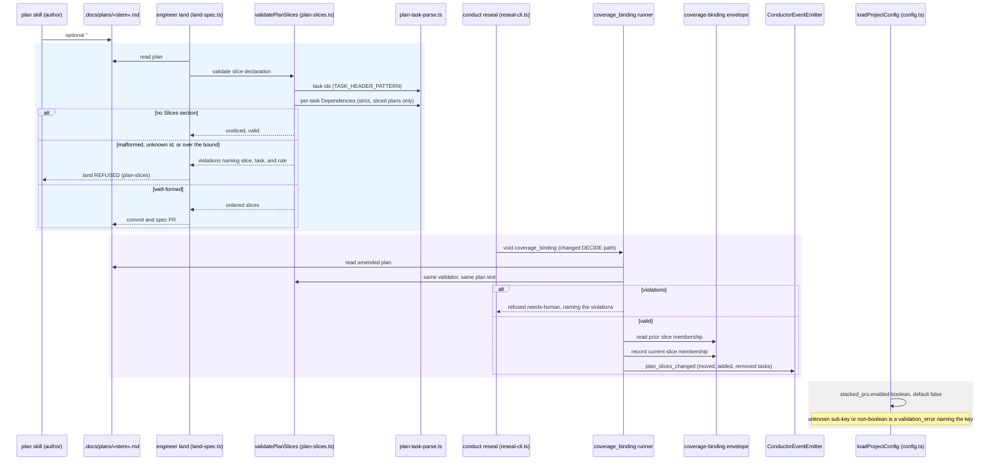

# Sequence: Plan slice manifest — declared, validated at land, re-validated on reseal

**Last updated:** 2026-09-29
**Scope:** How a plan declares ordered slices (#2723), which single component judges a slice
declaration, the two points that call it (engineer land, and `coverage_binding` after an operator
reseal of an amended plan), and how the default-off `stacked_prs.enabled` config key is loaded.
No build, FINISH, or publication behavior changes here — those consume the manifest in #2724+.

## Diagram

## Legend

- **`validatePlanSlices`** (new `plan-slices.ts`) is the single owner of "is this slice
  declaration well-formed". Land and `coverage_binding` call the same function on the same plan
  text, so the two can never disagree (the #1744 shared-predicate precedent).
- **`plan-task-parse.ts`** stays the source of task ids. The validator reuses
  `TASK_HEADER_PATTERN` and the shared task-reference resolver rather than a second task grammar.
  Strict `**Dependencies:**` parsing is new, and it runs only when a plan declares slices, so
  existing plans with free-form dependency prose are untouched.
- The **blue band** is the land refusal, which fires before a spec PR exists. It runs whether or
  not `stacked_prs.enabled` is on, so a plan that lands can never become invalid when the flag is
  later turned on.
- The **purple band** is the #1700 path. An operator reseal of an amended plan voids
  `coverage_binding`, and its runner re-validates the slices before the build continues. Slice
  membership is recorded in the envelope, and a change (including a dropped manifest) is emitted
  on the event spine, never silently accepted.
- The **grey band** is config load only. The key has no runtime reader in this feature; the
  consumer registry records it as reserved for #2724.

## Change Log

| Date | Change | Reason |
|---|---|---|
| 2026-09-29 | Initial diagram. | Make the single slice validator and its two call sites explicit before implementation (#2723). |
