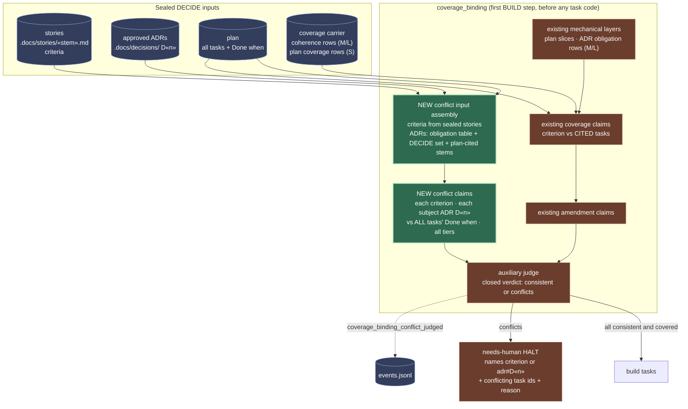
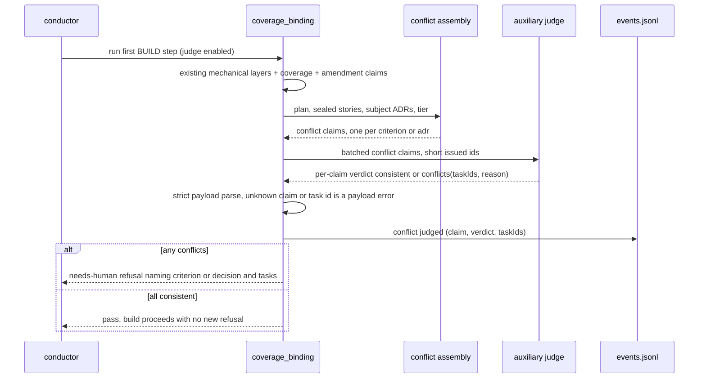

# Architecture: coverage_binding refuses plans that contradict sealed criteria or ADR decisions

**Last updated:** 2026-10-03
**Scope:** The new conflict-claim class inside `coverage_binding` (the first BUILD step): every
sealed story criterion and every approved ADR decision the plan is subject to is judged against
**all** plan tasks' `Done when` checks, on every tier, and a conflict halts before any task code.
**Tier:** M, technical track. Source: intake #2750 (plus the 2026-10-02 ADR-conflict comment).

## Problem in one line

A coverage claim only shows the judge the `Done when` of the tasks its row cites
(`coverage-binding-inputs.ts` `assembleCoverageBindingClaims`), so an uncited task that requires
the opposite outcome is invisible. All three 2026-09-25 evidence features passed coverage_binding
(enabled here since 2026-09-19) and halted in SHIP. The ADR layer is a mechanical row check that is
skipped for Tier S (`step-runners.ts` ADR layer guard), so the reporting_app ADR conflicts were never read.

## Diagram 1 — where the conflict class sits

## Diagram 2 — conflict judgement sequence

## Legend

- **Green** — new behavior this feature adds. **Brown** — existing gate machinery reused unchanged.
  **Blue** — inputs and the event spine.
- The conflict verdict is a judgement (two outcomes can or cannot hold together), so it is an LLM
  claim with a closed, strictly parsed verdict; the bookkeeping (which criteria, which ADRs, which
  tasks, payload validation, halt) is machinery.
- It rides the existing `coverage_binding.judge.enabled` flag and the existing needs-human refusal;
  it never routes to plan and never appends tasks (adr-2026-08-31-coverage-binding-judge-step D6).
- Outcomes are emitted on the existing `ConductorEvent` spine; no sidecar channel.

## Change Log

| Date | Change | Reason |
|------|--------|--------|
| 2026-10-03 | Initial generation | Intake #2750 DECIDE |
| 2026-10-03 | Plan update: conflict inputs live in `coverage-binding-conflict-inputs.ts`; refusal is evaluated before the D19 reopen; no structural change to the diagrams | /plan |
