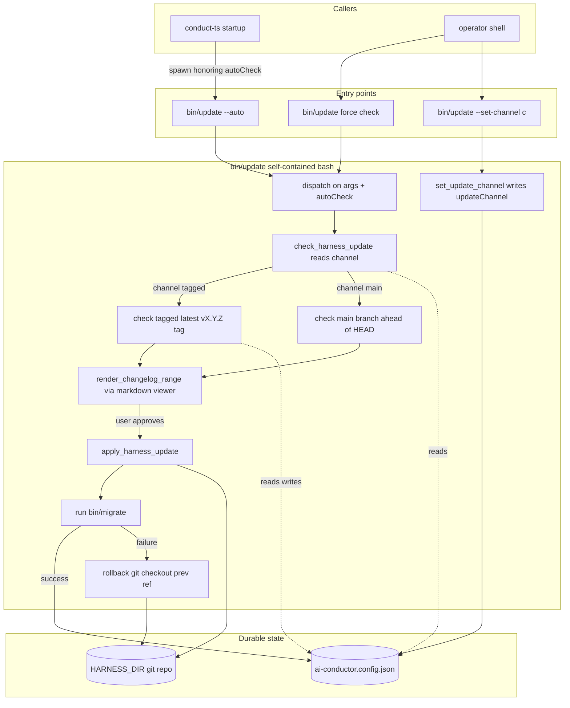

# Architecture: port-self-update-flow

Standalone `bin/update` bash script that owns the consumer self-update / channel
flow, extracted verbatim (behavior-preserving) from `bin/conduct` 327–470. Zero
engine dependency so it runs even when the `conduct-ts` bundle is stale or broken —
the exact situation in which a consumer needs to update.

## Component / flow (C4 component level)

## Notes on the diagram

- **`bin/update --auto`** is the replacement for the current line-2894 auto-check.
  `conduct-ts` (the v1.0 entry point) spawns it at startup; it honors `autoCheck`
  and is a silent no-op when disabled or when no update is available. This keeps
  the git/file plumbing in engine-independent bash while preserving the
  "check on every run" behavior.
- **`bin/update`** (no flag) forces a check now — the replacement for `--update`.
- **`bin/update --set-channel <tagged|main>`** replaces `--set-channel`.
- The internal functions (`check_harness_update`, `check_harness_update_tagged`,
  `check_harness_update_main`, `set_update_channel`, `render_changelog_range`,
  `semver_lt`, `apply_harness_update`) move over **unchanged** except for the
  helper dependencies they share with the rest of `bin/conduct`
  (`conductor_cfg_get/set`, `render_md`, `log/warn/ok/fail`, `HARNESS_DIR`,
  `ORIGINAL_ARGS`), which are copied into or sourced by the new script.
- `apply_harness_update`'s `exec "$0" "${ORIGINAL_ARGS[@]}"` re-launch semantics
  change: `bin/update` is not the pipeline entry, so on success it returns 0 and
  lets the caller (`conduct-ts`) proceed on the freshly-checked-out harness rather
  than re-exec'ing itself. See ADR for the resolution.
