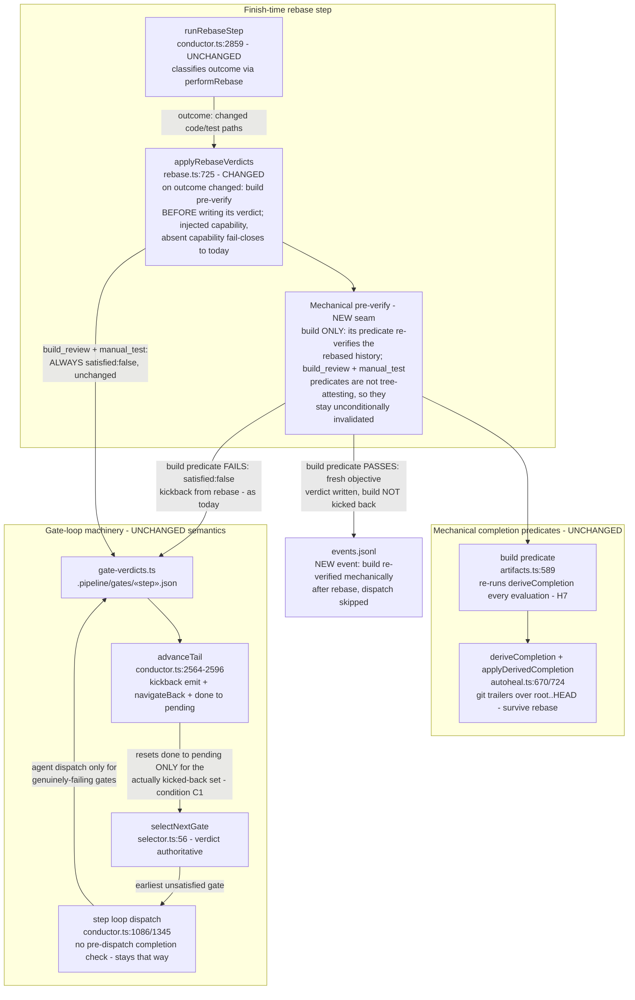

# Components: Post-rebase gate-first re-verify (#420)

**Last updated:** 2026-07-08
**Scope:** The rebase-invalidation path of the daemon gate loop, modified so a file-changing
finish-time rebase re-verifies the **build** gate's mechanical completion predicate before
writing its `satisfied:false` kickback verdict. Build is invalidated and re-dispatched only if
the predicate fails; a pass is confirmed in place with a fresh objective verdict + event.
`build_review` and `manual_test` stay unconditionally invalidated (their predicates do not
attest the rebased tree — see the ADR). Review-kickback rework (`kickback.from` ≠ `rebase`)
is untouched.
**Source track/complexity:** `.docs/track/post-rebase-build-invalidation-dispatches-a-full-b.md`,
`.docs/complexity/post-rebase-build-invalidation-dispatches-a-full-b.md`

## Diagram

## Legend

- **CHANGED** — modified by this feature; **NEW seam** — the added pre-verify call path;
  **UNCHANGED** — load-bearing context.
- Pre-verify eligibility bar (ADR): a gate qualifies iff its predicate mechanically re-verifies
  the current tree/history. Today that set is exactly `{build}` (git-evidence derive).
  `build_review` (artifact-presence glob) and `manual_test` (session-freshness + FAIL scan)
  would falsely pass on same-session pre-rebase artifacts, so they stay invalidated as today.
- Fail-closed invariant preserved: a rebased tree is never trusted without re-verification —
  build's re-verification is its mechanical predicate, run first; agent dispatch happens only
  when that predicate fails (genuine pending work). A pre-verify error → invalidate.
- Oscillation guard: review kickbacks (`kickback.from` = `build_review` etc.) never pass
  through the pre-verify — a mechanical pass must not swallow requested rework.

## Change Log

| Date | Change | Reason |
|------|--------|--------|
| 2026-07-08 | Initial generation | DECIDE phase for issue jstoup111/ai-conductor#420 |
| 2026-07-08 | Narrowed pre-verify to build only | Architecture review: manual_test/build_review predicates are not tree-attesting (false-pass risk) |
