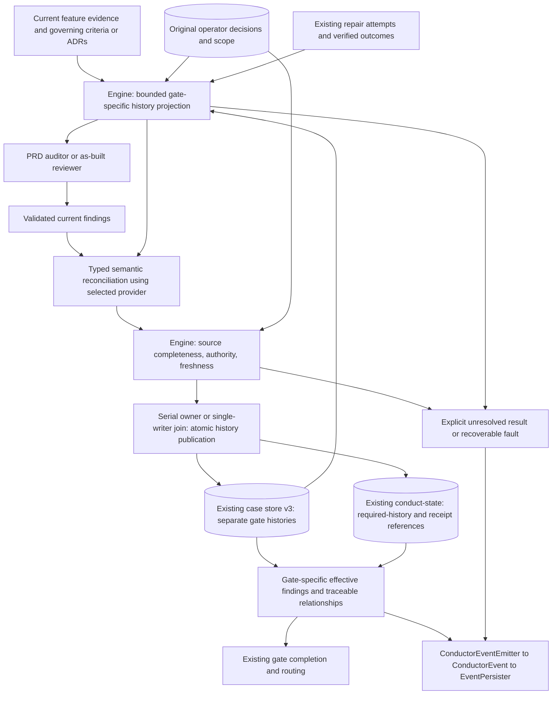
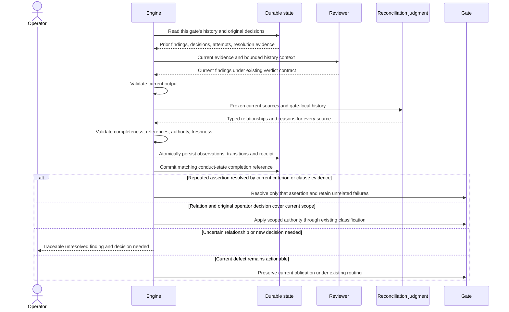
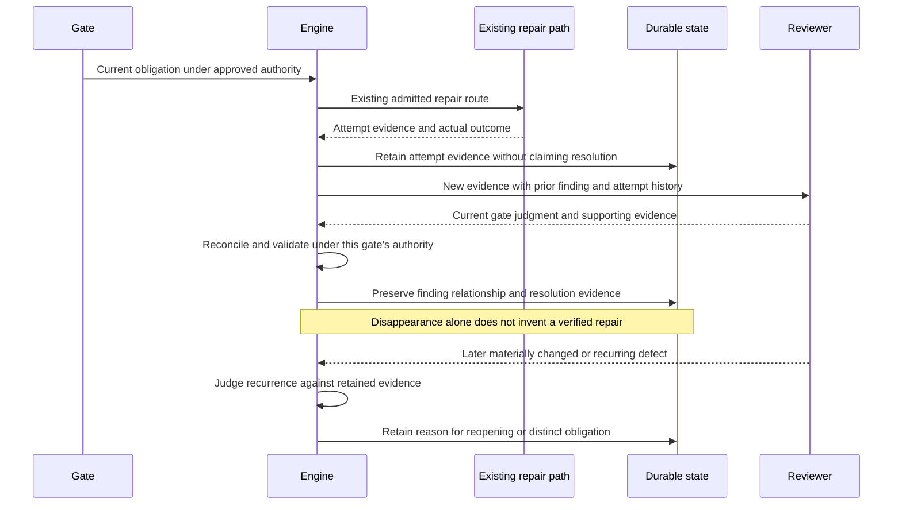
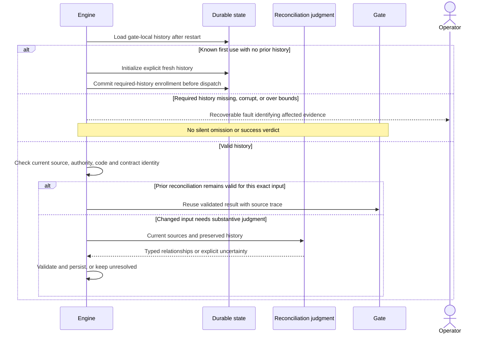
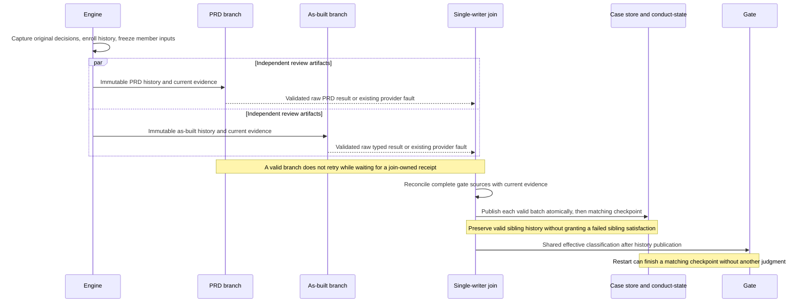

# Components and sequences: PRD and as-built finding continuity

**Last updated:** 2026-09-30
**Diagram approval:** Initial flow and plan-aligned publication/checkpoint and join detail approved by the operator on 2026-09-30.

**Scope:** Approved #2440 flow, following accepted technical approach A. Each gate receives its own complete relevant history and reconciles current findings without borrowing another gate's approval. Concrete contracts, v3 migration, transition semantics, and bounds follow approved adr-2026-09-30-gate-local-review-finding-continuity D1-D12.

## Components

## Sequence: current finding and earlier decision

## Sequence: attempted repair and recurrence

## Sequence: restart and unusable history

## Sequence: concurrent review reaches its history-owning join

## Boundaries and integration constraints

- The boxes are logical responsibilities, not new lifecycle steps or a commitment to an additional provider call. Approved D5/D7 puts reconciliation after raw review, at the serial owner or single-writer join. This diagram does not authorize consolidated routing or budget redesign.
- PRD audit remains governed by story criteria and requirement/plan intent. As-built remains governed by approved ADR and plan authority. A prior autonomous dismissal or sibling-gate success cannot grant operator approval or force a gate pass.
- Preserve the shipped #2429 original-decision capture, scoped accept/refuse authority, and NC reconciliation. Include criterion findings as history without semantically widening criterion-keyed approvals.
- Consume #2188's typed as-built contract. Integrate with the existing PRD parsed representation on this baseline; #2521 owns its verdict/parser migration. New reconciliation results use the existing provider-native schema seam, not a new Markdown parser.
- Current findings remain individually traceable even when several relate to one case or require a human decision. Rewording, reordering, and report-local identifier changes are evidence changes to judge, not automatic new obligations.
- Persist history as state using the existing state-artifact pattern (event-spine exception C). Publish reconciliation occurrences through the existing event spine; add no parallel telemetry schema.
- Both serial and concurrent review execution must reach the same history/validation boundary. No lease is held across model judgment. Changed evidence or operator authority invalidates stale results before publication.
- Existing build-review and widening histories survive the extension. Overflow and missing required history are explicit recovery conditions; no truncation, guessed continuity, or fabricated resolution.

## Verified basis

At current GitHub main 99d077d837f6b5cbeb2a3fcbde21ed1a036a50c4, the shared store supports build_review and prd_widening. `buildPrdWideningContext` filters to no-owner OVER_SCOPE sources. `buildAsBuiltProjection` reads pending REMEDIABLE findings through `readPendingAsBuiltRemediationFindings`. Successful as-built review projects pending repair outcomes into the current typed verdict and clears the pending set; this is not a full persistent review-history input. See the current-main validation in the track artifact and the exploration evidence ledger in `.pipeline/`.

## Legend

Rectangles denote logical processing responsibilities. Cylinders denote durable feature-local state. The selected provider supplies review and semantic judgment through the existing Claude/Codex seams. Gate authority and original operator decisions remain distinct from case relationships. Storage/versioning and allowed transitions follow the approved continuity ADR.

## Change Log

| Date | Change | Reason |
| --- | --- | --- |
| 2026-09-30 | Initial component flow and three sequences | Operator selected durable cases; current-main validation confirms remaining #2440 gap |
| 2026-09-30 | Plan update: explicit v3/checkpoint publisher, current resolution, enrollment, and group join sequence | Reflect approved D2/D6/D7/D9 and tasks 1–40; no new architectural decision |

## Plan integration map

| Diagram responsibility | Plan tasks |
| --- | --- |
| v3 case store and required checkpoint | 1–10 |
| Immutable review history inputs | 11–13 |
| Current sources, semantic relationships, preserved authority | 14–22 |
| Atomic publication and restart/sibling handling | 23–26 |
| Actual admitted/executed repair facts | 27–30 |
| Effective completion and raw branch/join boundary | 31–33 |
| Bounded native-schema dispatch | 34–37 |
| Views, existing events, actionable recovery | 38–40 |
