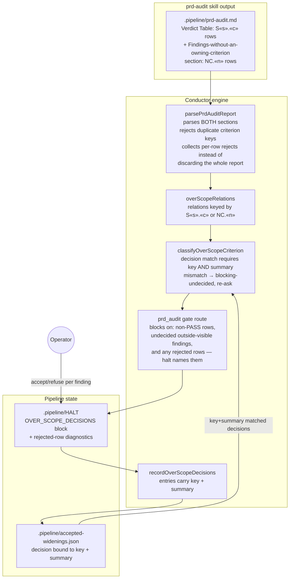
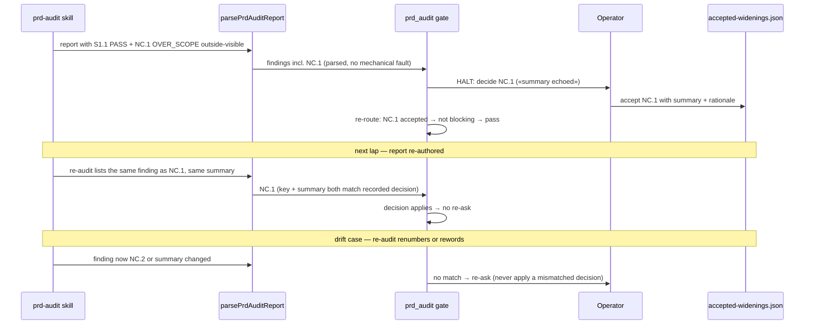

# Architecture: PRD-audit no-owner OVER_SCOPE findings

**Last updated:** 2026-08-25
**Scope:** Feature-scoped view of parsing and routing OVER_SCOPE findings that own no story
criterion — the `## Findings without an owning criterion` section the prd-audit skill already
teaches, its `NC.«n»` ordinal keys, duplicate-criterion rejection, per-row rejection
diagnostics, and decisions bound to key + summary. Issue jstoup111/ai-conductor#1848.

## Components

## Sequence: no-owner finding parsed, decided, and re-matched next lap

## Legend

- **NC.«n» key:** report-scoped ordinal assigned by the audit author in the
  `## Findings without an owning criterion` section (row headed `Finding`); valid only
  together with its summary.
- **Rejected row:** a table row whose key matches neither `S«s».«c»` nor `NC.«n»`, or a
  duplicate criterion key. Correctly-parsed rows are kept; rejected rows are named in the
  halt with the reason — salvage is for visibility, and rejected rows still block.
- **Decision match:** key AND summary equal → decision applies (last-write-wins);
  any mismatch → blocking-undecided, operator re-asked. Never wrong, occasionally re-asks.

## Change Log

| Date | Change | Reason |
|------|--------|--------|
| 2026-08-25 | Initial generation | DECIDE for #1848 |
