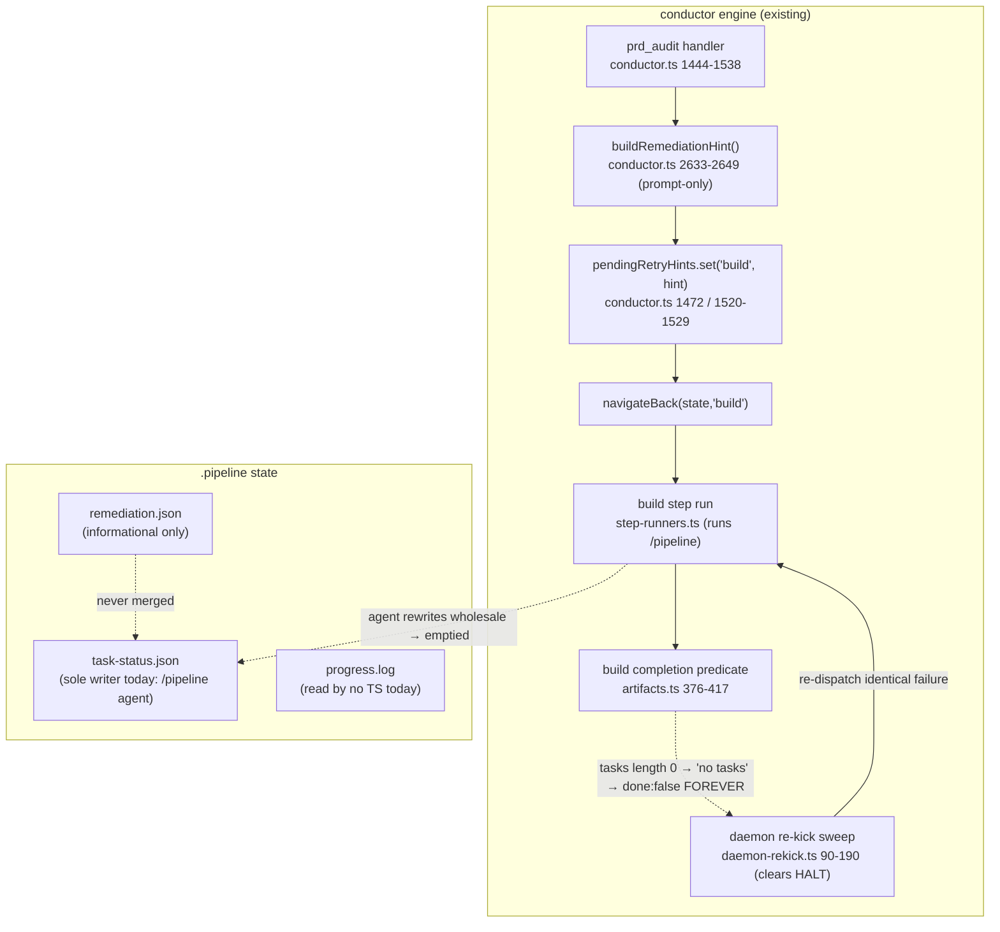
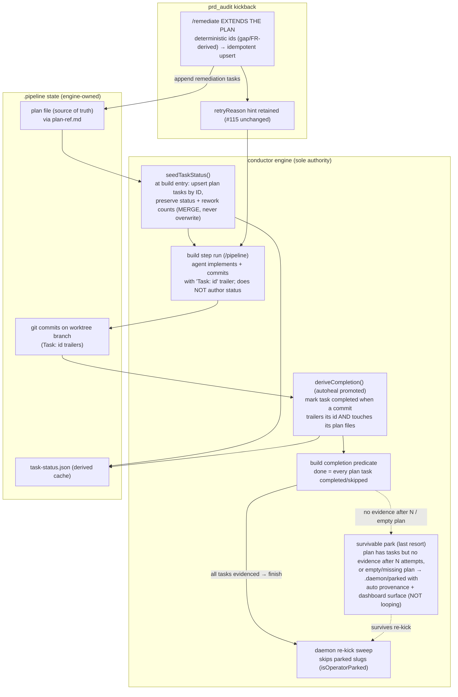

# Architecture: prd-audit kickback preserves task-status.json

**Last updated:** 2026-07-05
**Scope:** The daemon `prd_audit → build` kickback path and the `build` completion gate, plus the
`task-status.json` lifecycle they share. Modification to existing internal engine machinery — not a
new system. Consumed by `/architecture-review` to lock the fix mechanism.
**Source:** jstoup111/ai-conductor#302. Stories: `.docs/stories/prd-audit-kickback-preserves-task-status.md`.

---

## Today — the wipe-and-loop (bug)

The remediation tasks reach the build agent only as **prompt text**; nothing in the engine writes
them into `task-status.json`. The agent is the sole writer and can rewrite the file wholesale
(emptying prior completed rows). An empty `tasks: []` makes the gate return `'no tasks'`
permanently, and the re-kick sweep re-dispatches the identical failure — the infinite loop.

## Fix — invert ownership: the engine owns task-status.json, derived from plan + git

The build agent stops being the authority on completion. The engine **seeds** `task-status.json`
from the plan (merge, never overwrite), the agent only **implements + commits with a task-ID
trailer**, and the engine **derives** completion by matching those commits (promoting `autoheal`).
A wipe is structurally impossible — the agent can't erase what it does not own — and it works for
any build skill, not just `/pipeline`.

## Key seams

- **Seed (merge, never overwrite):** new engine step at build entry reads the plan via
  `readPlanPaths(projectRoot, planRef)` (`autoheal.ts:208`) and upserts one entry per plan task by
  **id**, preserving any existing `status`/`in_progress`/rework-count rows. This is the migration-safe
  path for in-flight features whose `task-status.json` the agent already wrote.
- **Derive (authoritative autoheal):** promote `attemptAutoHeal` (`autoheal.ts:58-104`) from a
  best-effort rescue to *the* completion source. The evidence read is **trailer-first** (ADR H5): the
  `Task: <id>` trailer lives in the commit *body*, so `listCommits` must read trailers/full messages,
  not subjects; legacy `T<id>`/`#<id>` subject forms are migration-only fallback. Runs at build entry
  and before **every** gate evaluation (once-per-run guard removed, ADR H7); range anchored to the
  current plan, fail-closed on merge-base failure. Completion is recomputed each evaluation — the
  gate never trusts file rows (ADR H6); durable engine state (evidence stamps, attempt counters)
  lives in an engine-only sidecar the agent never writes.
- **Agent contract change:** the trailer lands at BOTH layers (ADR H2): `/tdd`'s commit checklist
  (the subagent that actually commits) gains the `Task: <id>` trailer gate, and `/pipeline`'s
  dispatch template injects the id. The write partition is **field-level** (ADR H4/H6): the agent
  keeps advisory scheduling writes (`pending`/`in_progress` — the user-exit contract consumes them);
  `completed`/`skipped` are engine-only, and commit-less completions use a no-op evidence commit
  (`Evidence: skipped <reason>` / `satisfied-by <sha>`). The `post-commit-pipeline-sync.sh` hook and
  `finish`'s task-status write are removed. The Entry Guard's `all([]) === true` "empty = done"
  semantics is removed — an empty list is a seed-and-run state, never completion.
- **Remediation extends the plan:** `/remediate` SKILL.md — emit remediation tasks **into the plan**
  with deterministic, gap/FR-derived ids so re-runs upsert (idempotent) rather than duplicate. The
  engine re-seeds and re-derives; already-done tasks re-mark complete from their id-stamped commits.
- **Survivable park (last resort):** when the plan has tasks but no evidence accrues after N attempts,
  or the plan is empty/missing, write a park marker (`park-marker.ts` family) the re-kick sweep skips
  (`daemon-rekick.ts` `isOperatorParked`) — with a **distinct auto-park provenance** (not "parked by
  operator") and a dashboard/halt-monitor surface, reconciled with #280. This replaces the infinite
  auto-re-kick with a visible, actionable stop.
