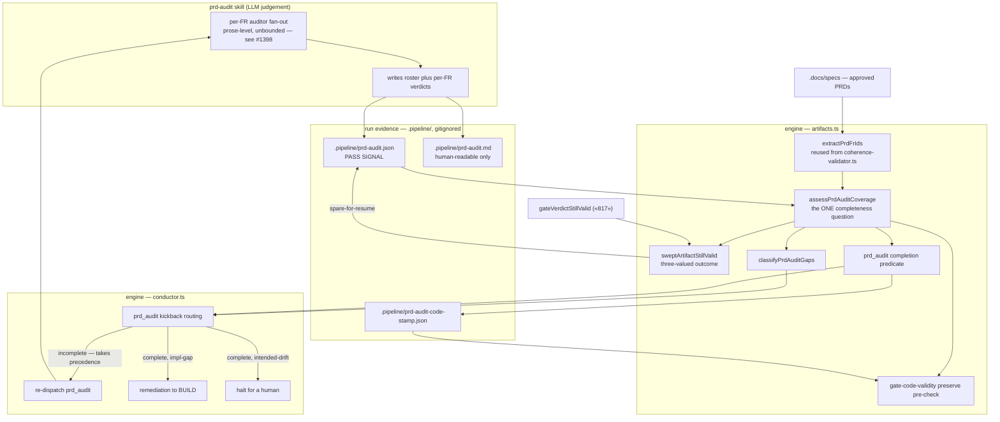

# Components: prd_audit coverage-complete gate

**Last updated:** 2026-08-09
**Scope:** Component view of the `prd_audit` gate after the pass signal moves to a
coverage-complete manifest. Shows the one shared completeness assessor and its four consumers —
the structural point of the change. The step-by-step decision flow lives in
[`sequences/prd-audit-partial-report-false-pass.md`](sequences/prd-audit-partial-report-false-pass.md).

## Diagram

## Legend

- **The one seam that matters.** `assessPrdAuditCoverage` is written once and consumed by all four
  reader components. Before this change each of the four asked its own blocking-rows-only question,
  and a partial audit read as clean at every one of them. Any future reader must consume the same
  assessor rather than re-deriving the question.
- **`extractPrdFrIds` is reused, not reimplemented.** It already lives in
  `src/conductor/src/engine/engineer/coherence-validator.ts` and serves the coherence gate. A second
  parser would be free to drift, letting `prd_audit` and the coherence gate disagree about what a
  PRD requires.
- **Manifest vs report.** Only `.pipeline/prd-audit.json` is on the trust path. `.pipeline/prd-audit.md`
  is presentation, deliberately removed from the pass decision so markdown parsing cannot fool the
  gate. Both are gitignored run evidence, not committed design artifacts.
- **The sweep edge back to the manifest** is `spare-for-resume` — the file is retained purely as
  resume input for the next dispatch and never asserts that the audit is valid. Keeping the file and
  trusting the verdict are separate answers; collapsing them into one boolean is unsatisfiable
  (resolved Conflict 1).
- **Routing precedence.** Incompleteness outranks a co-occurring blocking verdict: a gap picture
  drawn from a partial audit is not trustworthy enough to route on, and BUILD cannot close an
  unfinished-audit gap regardless.
- **Dashed responsibility boundary.** The fan-out inside the skill subgraph remains prose-level and
  unbounded by the engine. This change makes its incompleteness *detectable*, not impossible;
  #1398 moves the dispatch itself into the engine.

## Change Log

| Date | Change | Reason |
|------|--------|--------|
| 2026-08-09 | Initial generation | New component structure for the coverage-complete `prd_audit` gate (scoped stopgap for #1398) |
