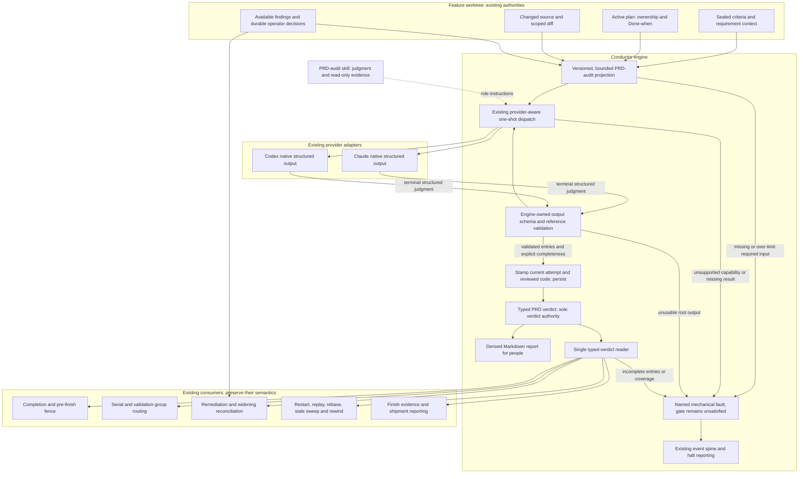

# Components: PRD audit on bounded inputs and a typed verdict

**Last updated:** 2026-09-30
**Scope:** Proposed PRD-audit contract migration for #2521, including the outcomes carried from
closed #2875. This is the target design for operator review; current PRD-audit production still
reads a reviewer-authored Markdown report. The already-shipped as-built migration (#2188) is
the local architectural precedent.

## Diagram

## Ownership and boundaries

- The engine owns the input projection, schema, validation, persistence, and rendered report.
  The reviewer returns judgment through the existing native-schema seam. It does not author an
  authoritative report or grant scope approval.
- The projection carries the applicable PRD as intent context when present; sealed story criteria
  remain acceptance authority. Technical-track absence of a PRD is a normal explicit input.
- Required context is bounded and validated before dispatch. Required context is never silently
  dropped. Bounded diff excerpts identify omitted source for permitted read-only inspection,
  following the as-built pattern; the exact dimensions and limits belong to architecture review.
- One typed reader supplies every verdict consumer. Markdown remains a view for humans and carries
  no completion, routing, approval, or replay authority.
- Existing operator decisions remain separate authoritative durable state. Findings may refer to
  them; the reviewer cannot create, rewrite, accept, or refuse an operator decision.
- A missing current-dispatch result produces an explicit mechanical diagnostic. Prior verdict
  files and their modification times cannot substitute for a result from the attempted dispatch.
  Intentional reuse before a new dispatch remains governed by existing code-validity rules.
- Validator evidence collection remains read-only, with no project-code execution. Engine writes
  stay confined to their existing worktree-owned state/output responsibilities.
- Standalone interactive use retains human-readable judgments without manufacturing an
  engine-stamped result.
- No new finding-history store, cross-gate policy, provider adapter, daemon channel, or general
  step-contract registry is introduced. Only history already available is projected.

## Related flows

- [Successful audit](sequences/prd-audit-typed-verdict-success.md)
- [Missing or invalid output](sequences/prd-audit-typed-verdict-fault.md)
- [Restart and legacy report handling](sequences/prd-audit-typed-verdict-restart.md)

## Legend

Solid arrows carry existing input authority, structured judgments, or typed evidence. The dotted
arrow supplies judgment guidance. The Markdown report has no outgoing machine-authority edge.
The diagram groups components inside the existing engine process; it adds no deployable service.

Event-spine verdict: no new telemetry channel. Verdicts and operator decisions are durable state
(exception C); fault occurrences use the existing ConductorEvent spine and halt path.

## Change Log

| Date | Change | Reason |
|------|--------|--------|
| 2026-09-30 | Initial target component diagram | Operator selected the full #2521 migration |
| 2026-09-30 | Plan update: make incomplete typed evidence explicit | Tasks 8–13 and 19 retain valid siblings without allowing a pass |
