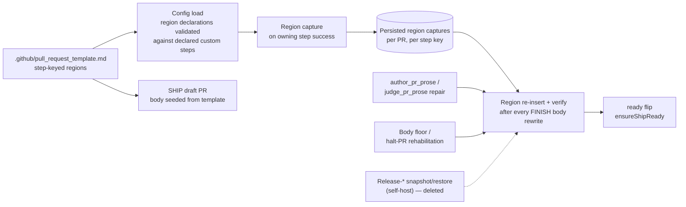
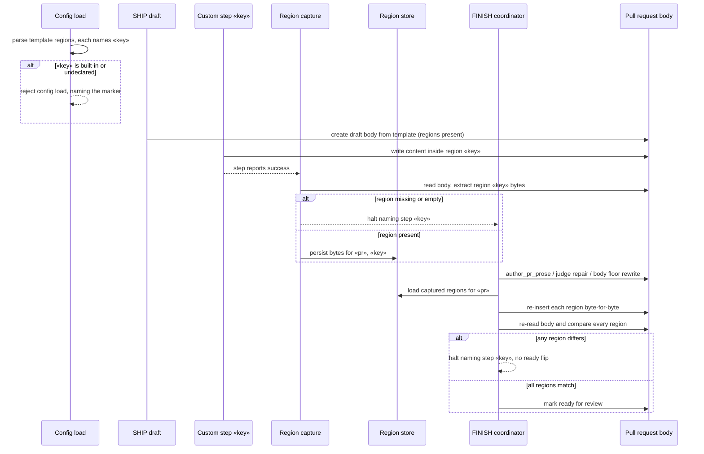

# Sequence: Project-owned PR body regions survive FINISH (issue #2616)

**Last updated:** 2026-09-24
**Scope:** how a custom step's pull request body contribution, declared by a step-keyed region
in the project's pull request template, travels from the SHIP draft through FINISH to the ready
flip — replacing the self-host-only `Release-*` snapshot/restore.

## Components

## Diagram — region lifecycle

## Legend

- «key» — a `steps.«key»` entry in `.ai-conductor/config.yml` that is not a built-in step.
- «pr» — the retained draft pull request URL; captures are keyed by it so a re-dispatch in a
  fresh process reuses them, as the deleted `.pipeline/release-metadata-snapshot.json` did.
- Engine-owned regions (reduced build-review coverage, accepted risk, plan declaration line,
  closing reference) keep their own upsert paths and can never be named by a template region.
- A template with no step regions leaves every path above inert: today's draft body (when no
  template exists) and today's FINISH body are unchanged.
- The dashed edge marks the self-host `Release-*` snapshot/restore this change removes; this
  repository's `release-disposition` step becomes an ordinary region owner.

## Change Log

| Date | Change | Reason |
|------|--------|--------|
| 2026-09-24 | Initial generation | DECIDE for issue #2616 (spec authoring) |
