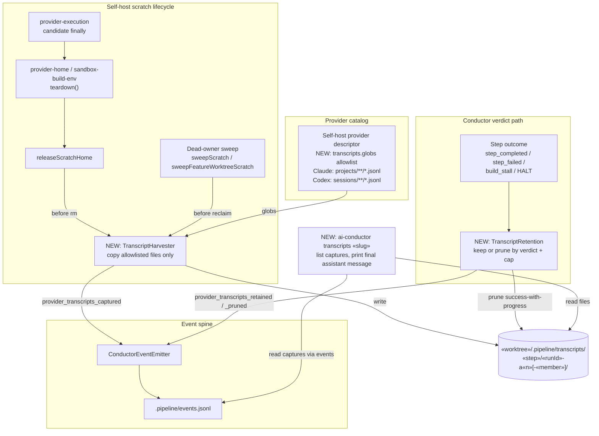

# Components: Preserve self-host provider transcripts

**Last updated:** 2026-10-10
**Scope:** Conductor components that capture, retain, prune, announce, and read self-host
provider transcripts (#611). Every self-host step and auxiliary member; Claude and Codex.

## Diagram

## Legend

- **NEW** marks components this feature adds; everything else exists today.
- The harvester runs inside the existing release/sweep paths; it never extends a scratch home's
  lifetime and never copies outside the descriptor's allowlist (scratch homes hold seeded
  credentials).
- Retention runs after the conductor's verdict, which is the only point where zero-progress
  (`build_stall` reason `no_task_progress`) is known.
- `«placeholders»` are variable path segments.

## Change Log

| Date | Change | Reason |
|------|--------|--------|
| 2026-10-10 | Initial generation | #611 — self-build transcripts deleted on teardown |
