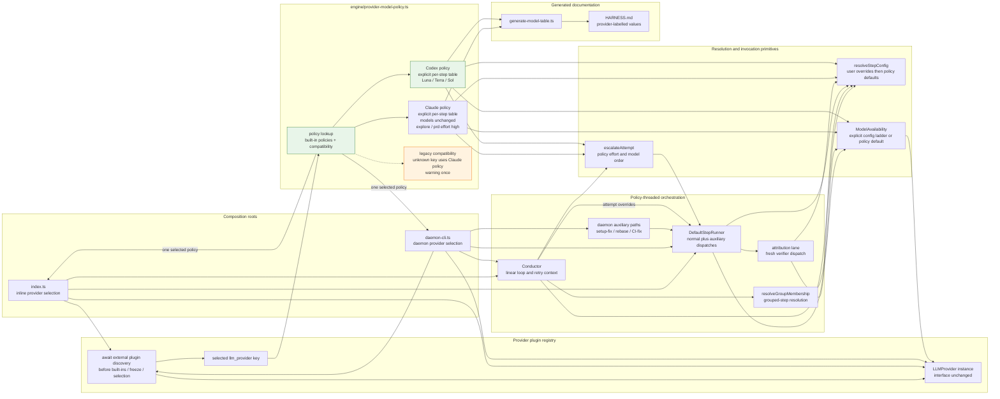
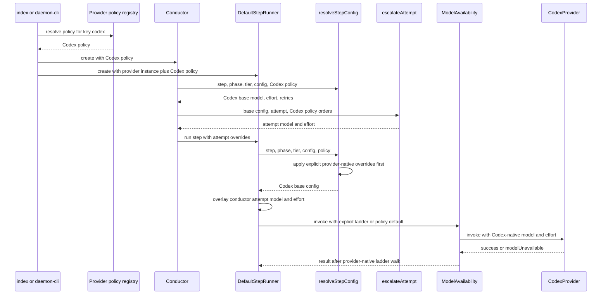

# Components + Sequence: Provider Model Policy Registry

**Last updated:** 2026-07-23
**Scope:** Provider-native step defaults, effort ordering, retry escalation,
model-unavailability fallback, and generated documentation for the built-in
Claude and Codex providers (issue #902).

## Component Diagram

## Sequence: Resolve and invoke a Codex step

## Policy Shape

Each built-in policy owns:

- An explicit `Record<StepName, model>` and `Record<StepName, effort>`.
- Provider-native complexity-tier overrides.
- Its effort escalation order and model escalation order.
- Its default model-unavailability fallback ladder.

The initial Codex assignments mirror the existing per-step intent while remaining
an independent table:

- `gpt-5.6-luna`: `memory`, `worktree`, `finish`.
- `gpt-5.6-terra`: the current standard Sonnet-class steps.
- `gpt-5.6-sol`: the current Opus/Fable-class deep-reasoning and review steps.
- Complexity overrides can promote a specific Codex step to Sol without referring
  to a Claude alias.
- Both built-in policies use `high` for normal M/L `explore` and for `prd`;
  the explicit `explore.S` override remains `low`.

## Legend

- **Green** — the new built-in policy boundary and Codex policy.
- **Orange** — compatibility handling for plugin provider keys that do not yet
  have a policy contract.
- Solid arrows are production data/control flow.
- The selected provider key and policy travel separately from `LLMProvider`; no
  identity member is added to the plugin interface.
- Explicit user model, effort, and fallback-ladder overrides remain opaque,
  provider-native values and keep their existing precedence.

## Change Log

| Date | Change | Reason |
|------|--------|--------|
| 2026-07-24 | Added awaited plugin discovery before provider selection and compatibility-policy lookup | As-built verification after issue #902 Task 20 |
| 2026-07-23 | Added conductor/group/attribution and daemon auxiliary wiring; corrected escalation ownership | Plan-update pass for issue #902 |
| 2026-07-23 | Raised normal explore/PRD effort to high; retained explore.S low | Operator-approved effort amendment for issue #902 |
| 2026-07-23 | Initial generation | DECIDE architecture for issue #902 |
