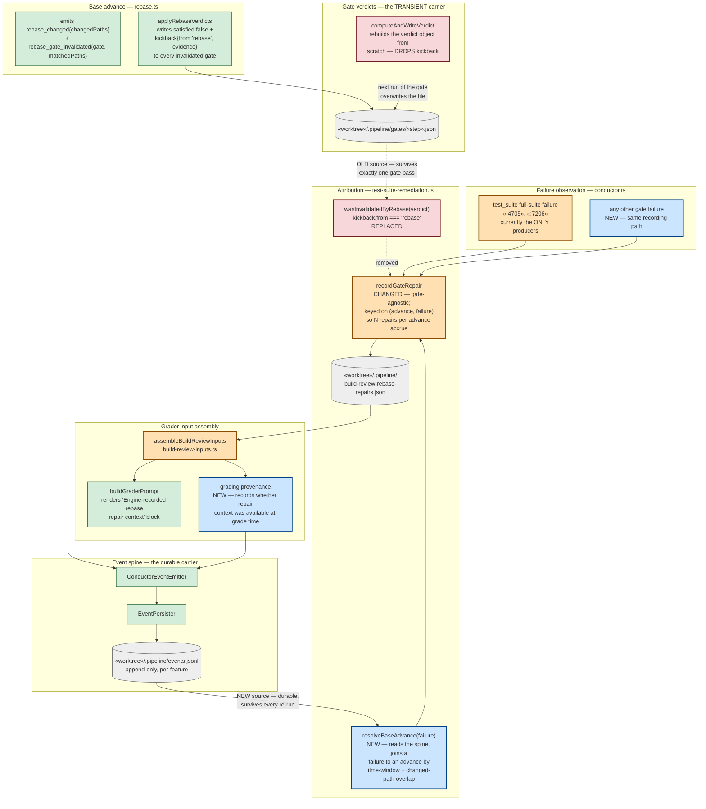

# Components (L3): Base-Advance Repair Attribution

**Last updated:** 2026-08-13
**Scope:** The path by which the fact "a base advance invalidated branch work" reaches the
`build_review` grader as repair context — `rebase.ts`, `gate-verdicts.ts`,
`test-suite-remediation.ts`, `conductor.ts`, `build-review-inputs.ts`,
`build-review-prompt.ts` (intake #1535). Extends
[2026-07-20-post-rebase-delta-aware-invalidation.md](2026-07-20-post-rebase-delta-aware-invalidation.md),
which shows gate invalidation but stops before the repair-context channel.

## Diagram

## Legend

| Style | Meaning |
|-------|---------|
| Blue, bold | New in this change |
| Orange, bold | Existing component whose behavior changes |
| Red, bold | The defective element being removed or replaced |
| Green | Unchanged existing component |
| Grey cylinder | On-disk store |
| Dashed edge | Relationship being removed |

**The central move.** The fact "the base moved and invalidated branch work" is *durable* — it
stays true for the remainder of the feature's build. Its current carrier, the `kickback` field
on a gate verdict file, is *transient*: `computeAndWriteVerdict` rebuilds the verdict object
from `{satisfied, reason, checkedAt}` alone, so the attribution is erased the next time that
gate runs. The change re-sources attribution from `.pipeline/events.jsonl`, which is
append-only, per-feature, and already co-located with the repair ledger in the same worktree.

**Why not a new store.** Per this repository's event-spine principle, `rebase_changed` and
`rebase_gate_invalidated` already carry the advance and the paths it touched. No new channel is
introduced; the join reads what the spine already records.

**Anti-goal guard.** The join requires changed-path overlap, not just a time window. A bare
time-window join would attribute *any* post-rebase failure to the rebase and would launder
genuinely unplanned deletions — the explicit anti-goal in the intake's desired outcomes.

## Change Log

| Date | Change | Reason |
|------|--------|--------|
| 2026-08-13 | Initial generation | DECIDE for intake #1535 — base-advance repair attribution never reaches the grader |
