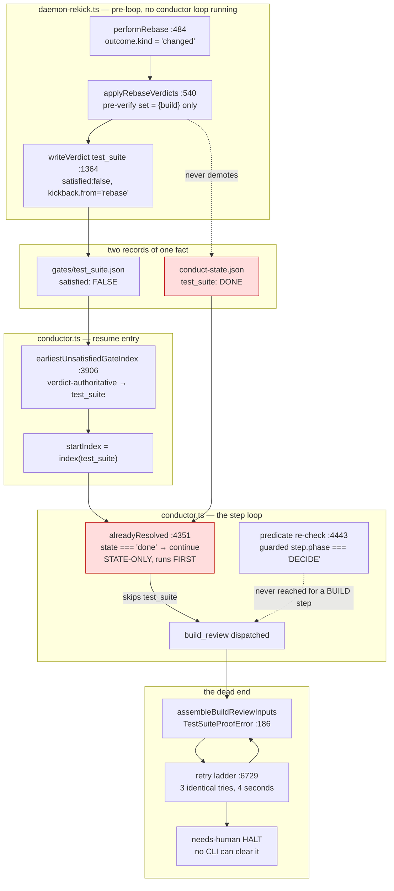
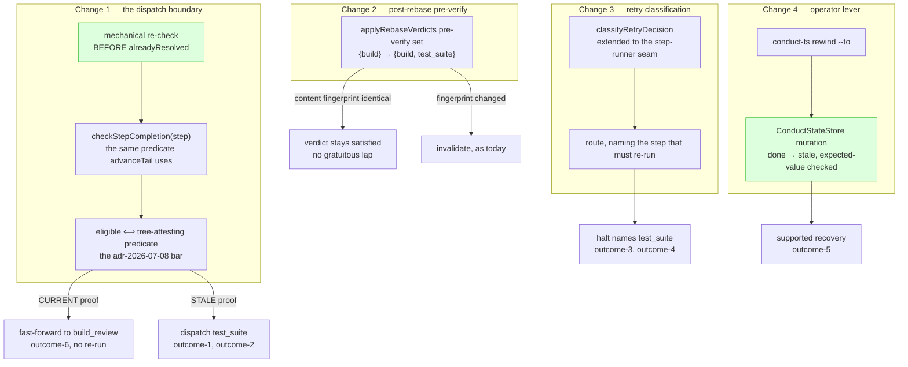

# Architecture: the gate loop re-checks before it skips

**Last updated:** 2026-08-19
**Scope:** the BUILD gate loop's dispatch boundary in `conductor.ts`, the post-rebase pre-verify in
`rebase.ts` / `daemon-rekick.ts`, the step-runner retry ladder in `conductor.ts`, and a new operator
verb over the existing `ConductStateStore` port. Covers jstoup111/ai-conductor#1729.
All line references are at worktree base `0b71bec78`.

## Diagram 1: how a feature gets stranded today (L3)

The clamp is not broken — it lands `startIndex` exactly on `test_suite`. The strand is the very next
statement: `alreadyResolved` consults `conduct-state.json` alone and skips the step the clamp
selected. `scanKickbackVerdicts`, the sole owner of verdict-driven state demotion
(`adr-2026-07-11`), matches only `kickback.from === <a step that just completed in-loop>`, and no
in-loop `rebase` step runs on the re-kick path — so the red node on the right never turns.

The second observed feature inverts the ledger disagreement (`gates/test_suite.json` read
`satisfied: true` while the proof inspection returned STALE) and arrives at the identical dead end,
because `gateSatisfied` (`selector.ts:56-64`) trusts a cached verdict without re-deriving it.

## Diagram 2: the four changes (L3)

Changes 1 and 2 are complementary, not redundant. Change 2 keeps the *verdict* honest at the moment
of invalidation, which is where the knowledge lives and which preserves the fast path for an
unchanged tree. Change 1 keeps the *dispatch* honest regardless of how either ledger came to
disagree — including the second variant, where no rebase kickback verdict was ever written. Either
alone leaves one observed failure live.

## Component map

| Component | File | Responsibility after this change |
|---|---|---|
| Gate dispatch boundary | `conductor.ts` step loop (`:4327-4356`) | Re-check an eligible gate's mechanical predicate before honoring a `done`/`skipped` status |
| Eligibility rule | `steps.ts` `StepDefinition` | Declare which gates are tree-attesting; the set is a property of the step, not a list at the call site |
| Post-rebase pre-verify | `rebase.ts` `applyRebaseVerdicts`, `daemon-rekick.ts` `makeRekickBuildPreVerify` | Pre-verify every eligible gate, not only `build` |
| Retry classification | `retry-classify.ts`, `conductor.ts` (`:6729`) | Decide `rerun` vs `route` for a step-runner failure whose inputs cannot change |
| Operator navigation | new `rewind` CLI verb → `ConductStateStore` | Return a feature to a named earlier step as an authorized mutation |

## Boundaries this change does not cross

- The aggregate suite's execution, fingerprint, or evidence format — `adr-2026-07-25`, untouched.
- The preserve/invalidate partition — `adr-2026-07-20`, consumed and never recomputed.
- `checkGate`'s prerequisite semantics — `adr-2026-07-11` Decision item 4, still state-only.
- `build`'s retry and progress accounting — #280, and the classifier still never runs on `build`.
- Which gates a rebase invalidates — unchanged; only whether an eligible one is pre-verified first.
