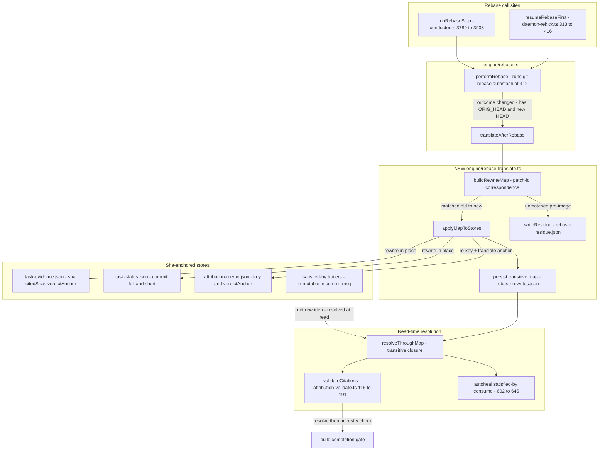

# Architecture: rebase-orphans-every-sha-anchored-evidence-citatio

**Source:** jstoup111/ai-conductor#535 · **Track:** technical · **Tier:** L

C4 component view of the sha-translation subsystem. One capture/translate step is inserted
inside `performRebase`, so both rebase call sites are covered by construction. File-backed
stores are rewritten in place; immutable trailer citations are resolved at read time through
the persisted map.

## Component diagram

## Key architectural decisions (see ADR)

- **Single insertion point.** Translation runs inside `performRebase` after a `changed`
  outcome, using the already-captured `ORIG_HEAD` (rebase.ts:592) and new HEAD. Both call
  sites inherit it; no per-caller wiring, no third-call-site gap.
- **Map source is patch-id correspondence** (`git patch-id --stable` over `{onto}..ORIG_HEAD`
  vs `{onto}..HEAD`). No new git hook, backend-independent. Unmatched pre-image commits
  (dropped or conflict-modified) are **residue**, not silent dangles.
- **Two translation modes.** File-backed stores (`task-evidence.json`, `task-status.json`,
  `attribution-memo.json`) are rewritten in place for self-consistent, diffable contents.
  Immutable satisfied-by trailer *targets* are resolved at read time through the persisted,
  transitively-closed map (`.pipeline/rebase-rewrites.json`).
- **No-laundering invariant.** `resolveThroughMap` substitutes only SHAs that are keys in
  git's authoritative pre-image→post-image map. An unknown SHA passes through unchanged and
  then fails the existing `merge-base --is-ancestor` ancestry check in `validateCitations` —
  refused, never repointed onto a live commit.
- **Residue is loud.** Unmappable citations are written to `.pipeline/rebase-residue.json`
  and emitted as a structured event, mirroring the `rebase_gate_reverified` precedent.
- **Reuse.** `GitRunner` (`makeGitRunner`, rebase.ts:22-59) for all git calls (test-injectable);
  atomic temp+rename write discipline from `task-evidence.ts` for every store write.
