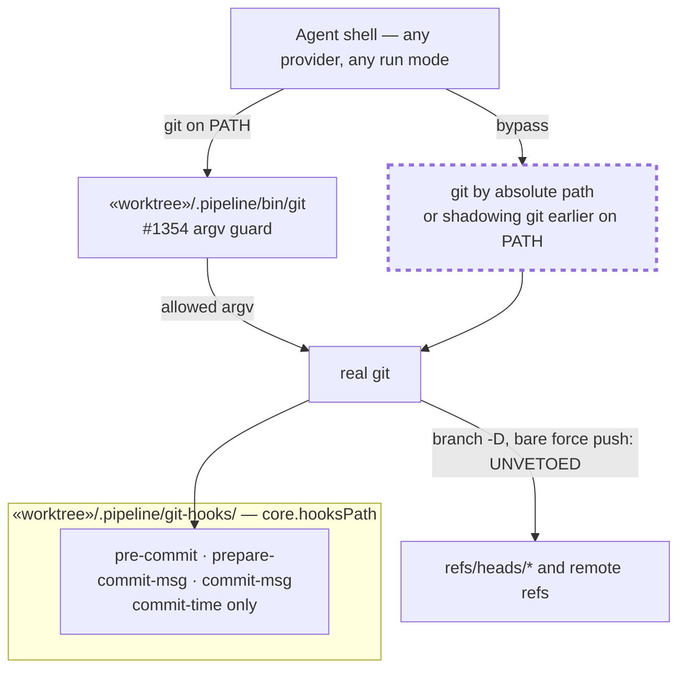
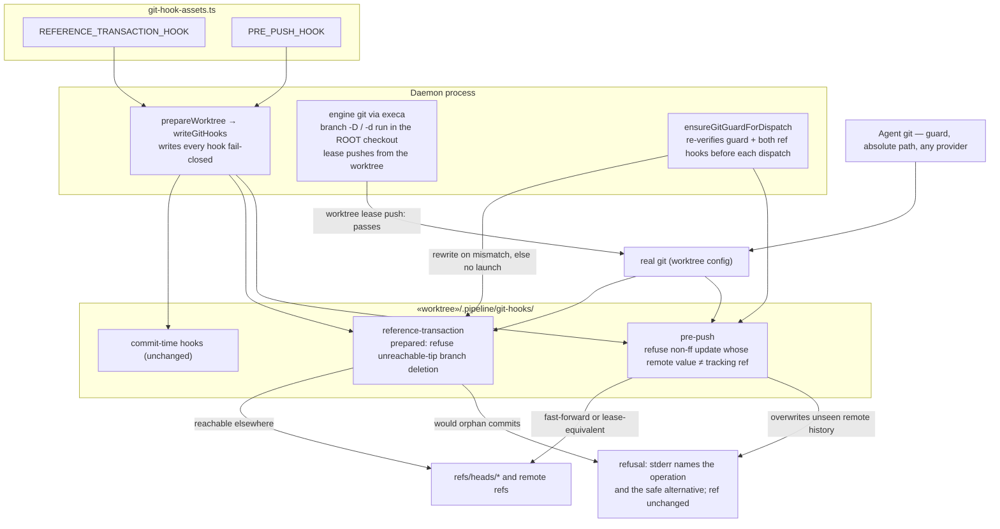
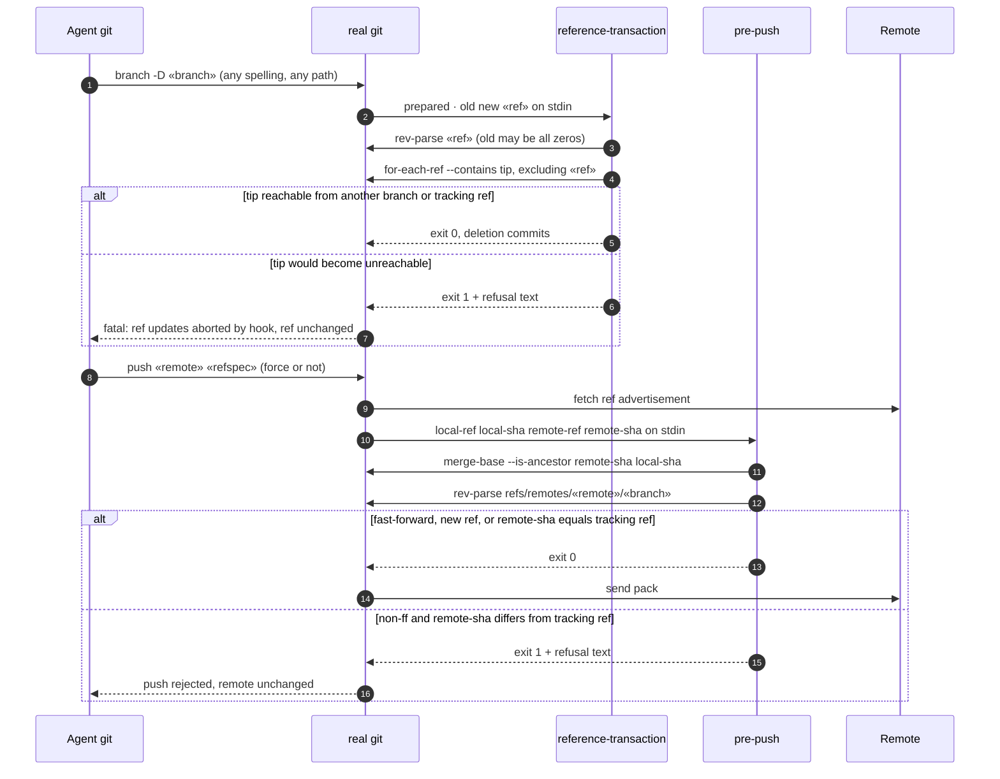

# Architecture: git-side veto for ref-moving destructive git that bypasses the build guard (#2693)

**Stem:** `ref-moving-destructive-git-that-bypasses-the-build`
**Tier:** M
**Last updated:** 2026-10-03

## Scope

The #1354 guard (`«worktree»/.pipeline/bin/git`, adr-2026-09-23-engine-git-guard-on-agent-path)
stops destructive git at argv time, but only for a `git` resolved through the agent's `PATH`. This
feature adds a git-side backstop on the engine's existing worktree-scoped hook channel,
`«worktree»/.pipeline/git-hooks/` (wired by `core.hooksPath` in the worktree config,
`worktree-prepare.ts:702`). Git runs these hooks for every caller of the worktree's config, so the
backstop does not depend on `PATH`, argv spelling, or which provider launched the command.

Two ref-moving classes are vetoed:

| Class | Hook | Refused when | Safe alternative named |
|---|---|---|---|
| Local branch deletion | `reference-transaction`, `prepared` stage | a `refs/heads/*` ref is deleted and its current tip is not reachable from any other local branch or remote-tracking ref | push or merge it first, or `git branch -d`; for a rename, create the new branch then `-d` the old one |
| Remote history overwrite | `pre-push` | an update is not a fast-forward of the remote's current value and that value differs from the local remote-tracking ref (a lease-equivalent check) | `git fetch`, then `git push --force-with-lease` |

Out of scope:

| Deferred | Where |
|---|---|
| Local non-fast-forward branch moves (amend, rebase, `reset`) | operator scope decision 2026-10-03: legitimate agent and engine flows |
| Forced clean and path discards (no ref transaction) | #1354 guard |
| Remote branch deletion (`push --delete`) | already gated by explicit approval in `github-operations-cli.ts` |
| GitHub rulesets on `feat/*`/`spec/*` | needs an engine-only GitHub App push identity |
| `git -c core.hooksPath=…`, git run from the root checkout or another worktree | recorded limits; #1352 |

## Current state — the guard is the only layer

## Target state — a git-side veto behind the guard

Each hook chains to `$GIT_COMMON_DIR/hooks/«name»` after its own allow (ADR D11). No bypass variable is added. The engine's branch deletions run in the root checkout
(`worktree.ts:112`, `park-reconciliation.ts:1100`), which does not read the feature worktree's
`core.hooksPath`. Its pushes from a feature worktree are plain or bare `--force-with-lease`
(`autoresolve.ts:772`, `ship-draft-pr.ts:397`), and a successful bare lease always has a tracking
ref equal to the remote value.

## Sequence — the two vetoes

## Legend

- Dashed node: a path that reaches the real `git` without any destructive-git veto today.
- `«worktree»`, `«ref»`, `«branch»`, `«remote»`: placeholders.
- "Lease-equivalent": the remote's advertised value equals the local remote-tracking ref, so the
  push only overwrites history this worktree has already fetched. Verified 2026-10-03 on git
  2.53.0: `pre-push` receives the remote's real current value per ref.

## Change Log

| Date | Change | Reason |
|------|--------|--------|
| 2026-10-03 | Initial generation | DECIDE for #2693 |
| 2026-10-03 | Added pre-dispatch hook re-verification and repository-hook chaining note | Plan update (ADR D11, D14) |
